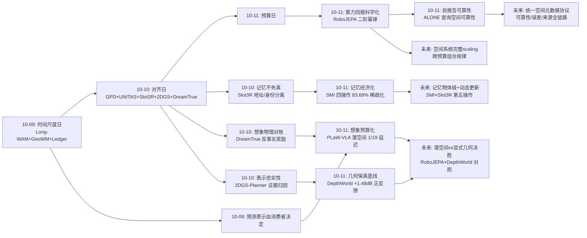
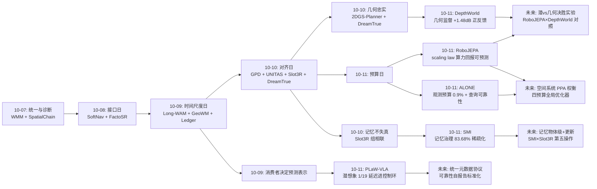
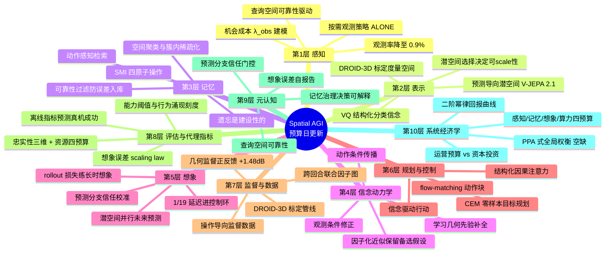
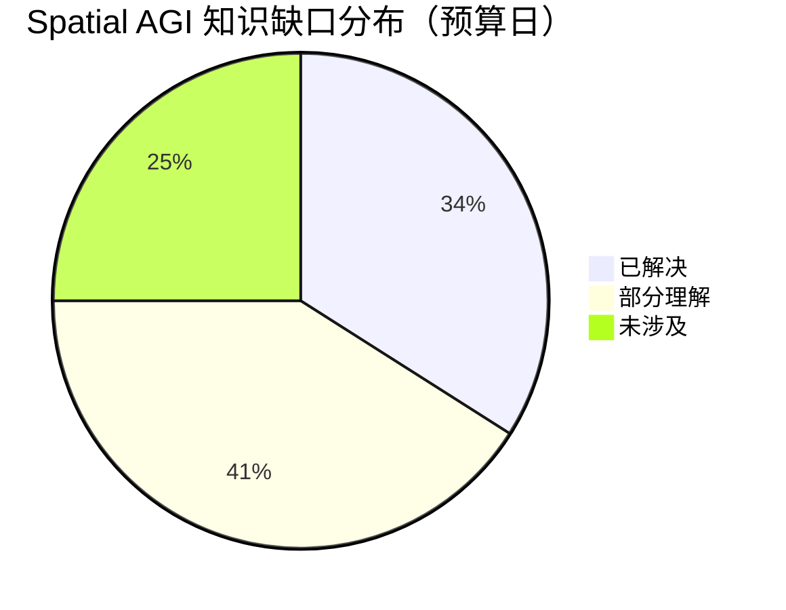

# Spatial AGI 每日深度思考 — 2026-10-11

**日期**: 2026-10-11
**基础日期**: 2026-10-10（昨日任务完整完成，5 篇论文 + 800 行思考）
**论文数量**: 5 篇
**主题**: 预算日（资源经济学日）。如果说昨天五篇论文审计了认知栈每一层的"信息-世界"失真（对齐日），今天五篇论文则在回答一个更工程也更战略的问题：**空间智能的每种核心资源应该花在哪里、花多少、以及如何预知回报**。PLaW-VLA 预算的是想象延迟——潜空间并行推演让"每步动作前先想象"的推理延迟降至生成式路线的 1/19；SMI 预算的是记忆——83.68% 的记忆稀疏化证明记忆的价值在"准"不在"全"；ALONE 预算的是感知——98% 导航成功率下仅需 0.9% 的决策步重新观测；RoboJEPA 预算的是算力——首个机器人世界模型 scaling law 让"再花一个数量级算力能买到什么"变成可外推的科学；DepthWorld 则划出了预算的底线——几何监督不可省，且省了反而亏（深度监督反哺 RGB +1.48 dB）。五个工作互不相识，却共同勾勒出 Spatial AGI 的资源经济学轮廓：**空间智能系统的设计不是"把每个模块做到最强"，而是在想象、记忆、感知、算力、监督五种预算约束下做全局最优分配——并且每种预算的回报曲线今天第一次变得可测量、可预测**。

---

## 📅 每日总结

**日期**: 2026-10-11
**论文数量**: 5篇
**主题**: 预算日。五篇论文分别给认知栈的四种核心资源建立了"预算-回报"曲线：PLaW-VLA（想象预算：潜空间并行预测，1/19 延迟）、SMI（记忆预算：理解模型治理记忆，83.68% 稀疏化）、ALONE（感知预算：贝叶斯信念+按需观测，0.9% 观测率）、RoboJEPA（算力预算：二阶幂律 scaling law，可外推）、DepthWorld（监督预算底线：几何监督不可省且正反馈 +1.48 dB）。共同哲学：**智能的标志不是资源无限，而是在每种资源稀缺的约束下仍能达到高成功率——"知道自己不需要看/不需要记/不需要生成"本身就是空间知识**。

**关键突破**:
- 🚀 **想象从奢侈品变成实时组件（PLaW-VLA）**：在冻结 V-JEPA 2 潜空间预测任务相关未来、以结构化因果注意力直接条件化动作生成、预测分支随机丢弃防过依赖。RoboTwin Hard +11.8pp、LIBERO-Plus zero-shot +1.77pp、推理延迟 1/19。世界模型从"视频生成器"正式转变为"策略的内嵌预测器官"。
- 🚀 **记忆管理成为可学习的一等公民（SMI）**：首次用 MLLM 系统治理世界模型的长期空间记忆，四原子操作（空间聚类/簇内稀疏化/动作感知检索/可靠性过滤）覆盖记忆全生命周期。83.68% 稀疏化反而改善空间一致性与生成稳定性——"敢于遗忘"与"善于记忆"同样是空间智能。
- 🚀 **感知需求可以降两个数量级（ALONE）**：动作条件传播的贝叶斯空间信念 + 学习几何先验空间补全 + 查询空间可靠性驱动的按需观测。98%/97% 成功率、0.9%/1.3% 观测率、真机 10/10。"查询空间可靠性"（解码估计是否满足规划精度）区别于 latent 熵，是不确定性工程的新概念。
- 🚀 **机器人世界模型 scaling 从赌博变科学（RoboJEPA）**：12 本体 23 数据集、22M→8B，想象误差遵循二阶幂律 L(C)=A·C^(α−γ·lnC)+E 且外推有效；想象误差与真机规划成功强相关（离线代理指标）；能力阈值 ~10^22 FLOPs、抓取保持行为 ≥2B 涌现。
- 🚀 **几何监督是正则项不是负担（DepthWorld）**：跨回合联合因子图标定把 DROID 升级为 70k+ 回合的 DROID-3D（<0.7px 外参）；空间潜平铺零破坏 SVD 预训练先验；同预算下深度监督反哺 RGB 预测 +1.48 dB。

**架构演进**: 10 层架构维持 10 层，但四种预算约束正式上线：(1) 想象层确立"预测导向潜空间 + 延迟预算"（PLaW-VLA），获得 scaling 科学（RoboJEPA）；(2) 记忆层从"被动存储"升级为"主动治理"（SMI 四原子操作）；(3) 感知层从"永远在线服务"转为"按需唤醒策略"（ALONE 观测决策）；(4) 监督/数据层确立"几何质量不可妥协"底线（DepthWorld 标定管线）。

### 📊 一句话总结

今天五篇论文共同写下了"空间资源经济学四律"：**想象要够快才能进控制环（PLaW）、记忆要敢忘才能保准（SMI）、感知要按需才能多任务共享（ALONE）、算力回报要可预测才值得投（RoboJEPA）——而几何监督是唯一不可预算削减的底线投资（DepthWorld）**。

### 🔗 延续性

**昨日→今日**: 昨日"对齐日"确立"每种表示都有训练目标定义的语义边界，越界复用必失真，对齐必须显式工程化"。今天五个工作把对齐问题接上资源维度：对齐是有成本的（深度监督、MLLM 记忆管理员、可靠性头都是成本），于是必须回答"这笔钱花得值不值、还能不能省"。DepthWorld 回答了监督预算的分配（几何监督正反馈，是投资不是成本）；SMI 回答了记忆预算（用理解模型的算力换记忆的稀疏与准确）；ALONE 回答了感知预算（用信念维护的算力换传感器时间）；PLaW-VLA 回答了想象预算（用潜空间抽象换延迟）；RoboJEPA 给所有这些预算投入提供回报预测工具（scaling law）。

**今日→明日**: 值得追踪——(1) RoboJEPA 的想象误差 × DepthWorld 的深度误差：潜空间想象误差与几何 rollout 误差哪个更预测真机成功？两条路线的正面对决数据已齐；(2) ALONE 的查询空间可靠性 × RoboJEPA 的想象误差：统一的"空间输出自报告可靠性"协议；(3) SMI 的记忆治理 × ALONE 的信念动力学：记忆管理器（静态组织）与信念传播器（动态维持）的分层整合；(4) PLaW-VLA 的预测分支丢弃 × ALONE 的观测决策：智能体"对自身想象的信任校准"统一理论；(5) RoboJEPA scaling law × DepthWorld 数据管线：几何数据质量的 scaling 敏感性（DROID-3D 式标定能否改变幂律常数）。

### 💡 本质思考：如何达成通用空间智能

#### 1. 核心能力的本质是什么？

今天五篇论文把这个问题推进到"资源经济学"维度。**第一层：空间智能是在多重资源约束下的高成功率行为**。真实世界的空间智能体——无论人还是机器人——从不拥有无限资源：传感器时间被多任务共享（ALONE 的出发点）、记忆容量有限且旧信息有害（SMI 的出发点）、每步决策有延迟预算（PLaW-VLA 的出发点）、训练算力永远不够（RoboJEPA 的出发点）。人类走路时注视点稀疏、记忆遵循遗忘曲线、行动前在 100 毫秒级完成预演——这些不是妥协，是智能的标志。今天 0.9% 的观测率、83.68% 的记忆丢弃、1/19 的想象延迟，都是同一原理的工程显影：**知道自己不需要看、不需要记、不需要生成，本身就是空间知识**。**第二层：每种资源预算都有独立的技术路线，且正在快速成熟**。想象预算的答案潜空间并行预测（PLaW）+ scaling 可预测（RoboJEPA）；记忆预算的答案是理解模型治理（SMI）；感知预算的答案是任务相对的可靠性驱动观测（ALONE）。注意它们的共同结构：都用一个"便宜的内省组件"（预测头、MLLM 管理器、可靠性头）去调度一个"昂贵的生成组件"（动作专家、世界模型、传感器）——空间智能的架构正在分化为"快内省 + 慢生成"的双层经济系统。**第三层：底线投资不可预算化**。DepthWorld 的 +1.48 dB 揭示了经济学框架的边界：监督数据质量、几何保真这类"资本性支出"不能走运营预算的逻辑（省一点是一点），它们是正反馈资产——投入直接改善其他所有预算的回报率（几何准 → 想象误差低 → 观测需求少）。区分"运营预算"（想象/记忆/感知/算力，追求节省）与"资本投资"（监督/标定/表征，追求复利）是空间系统经济学的第一课。**第四层：可预测性是规模化投资的前提**。RoboJEPA 最深的贡献不是 8B 模型而是"投资决策科学化"：想象误差可外推、离线代理可信、能力阈值可识别。LLM 领域的资本涌入正是靠 scaling law 的可预测性支撑；空间智能今天拿到了自己的第一张回报曲线，这个领域的"融资叙事"从今天开始改变。

#### 2. 当前方法与理想目标的差距在哪里？

**差距一：四种预算之间没有全局优化器**。今天每个论文优化自己的预算：PLaW 省延迟、SMI 省记忆、ALONE 省观测、RoboJEPA 预测算力——但没有一个系统同时管理四种预算并做跨预算权衡（"多花记忆换观测"？"多花想象延迟省感知？"）。理想的空间智能体需要一个统一的资源管理器，把感知时间、记忆容量、想象延迟、算力做成同一种"通货"做分配。**差距二：想象误差与几何保真的统一度量缺失**。潜空间路线（RoboJEPA 的想象误差）与显式几何路线（DepthWorld 的深度误差）各自有评估，但两者在同一任务上的正面对比数据不存在——"哪个指标更预测真机成功"这一决定路线胜负的实验今天仍是空白。**差距三：可靠性与想象误差是两个未统一的"自报告"协议**。ALONE 预测"解码估计是否够准"，RoboJEPA 用想象误差作代理，PLaW-VLA 用随机丢弃校准信任——三个工作都在做"元认知"（知道自己哪里对），但协议互不兼容。理想的 Spatial AGI 需要统一的自报告格式：{估计值, 任务相对可靠性, 误差分布, 覆盖保证}。**差距四：记忆治理的物体级与动态性盲区**。SMI 管理的是 chunk 级视觉记忆，物体状态变化（杯子被挪走使旧记忆失效）需要记忆更新操作——chunk 粒度原理上无法表达；ALONE 传播信念但只验证静态场景。动态世界中的记忆新鲜度与状态跟踪完全空白。**差距五：scaling law 覆盖面太窄**。RoboJEPA 的规律只覆盖"冻结编码器之上的动态预测器"——编码器自身的 scaling、记忆模块的 scaling、感知策略的 scaling 全部未知。空间智能的"完整系统 scaling"（包括跨预算的组合规律）没有任何理论。

#### 3. 从今天到理想状态，最可能的路径是什么？

一条资源经济学驱动的五段路径。**第一段（现在起）：把今天四个"自报告组件"标准化**。查询空间可靠性（ALONE）、想象误差（RoboJEPA）、记忆治理决策日志（SMI）、预测分支信任度（PLaW）统一成一个空间元数据协议：每个空间输出携带 {值, 可靠性, 来源, 时间戳}，消费者可查询。这一步纯接口工程，五篇论文的组件可直接改造复用。**第二段（并行）：潜空间 vs 显式几何的决胜实验**。在 DROID/DROID-3D 上训练两条路线的同预算对照（RoboJEPA 式潜预测器 vs DepthWorld 式深度监督扩散），比较想象误差、深度误差、真机规划成功三者的相关性结构。这个实验数据已齐、只欠执行，其结果将决定未来两年世界模型的主流投资方向。**第三段（3-6个月）：统一资源管理器原型**。在单一导航平台（ALONE 场景）上叠加记忆治理（SMI 操作）与想象预算（PLaW 式潜预测），实现"感知-记忆-想象"三资源的联合调度：任务开始时分配预算，运行中按可靠性信号动态转移（可靠性降 → 观测预算上调 / 记忆预算上调）。判定标准：三资源联合调度的任务成功率 > 任何单资源最优化的固定策略。**第四段（6-12个月）：记忆的物体级升级与动态更新**。SMI 的记忆单元从 chunk 细化到物体槽（连接昨日 Slot3R 的物体级记忆），新增第五原子操作"记忆更新"（状态变化检测 + 旧记忆失效标记），并用 ALONE 的惊奇信号触发——世界变了，相关记忆降权。**第五段（1-2年+）：空间智能的完整经济学**。理想状态判定标准更新为：一个系统，给定任务与总资源包络（传感器时隙、存储、延迟、算力），能自顶向下做预算分配，每个模块自报告消耗与回报，系统级 scaling law 预测投资回报——空间智能从此可以像芯片设计一样做"功耗-性能-面积"（PPA）权衡。今天五篇论文各自点亮了这张 PPA 表的一格：想象延迟（PLaW）、存储（SMI）、感知功耗（ALONE）、算力回报曲线（RoboJEPA）、以及不可妥协的工艺底线——几何数据质量（DepthWorld）。

---

## 🔗 与昨日思考的联系

### 昨日重点

昨日"对齐日"确立四个结论：(1) **每种表示都有训练目标定义的语义边界，越界复用必失真**（GS 基元 ≠ 碰撞体、像素 ≠ 度量、指针 ≠ 状态身份）；(2) **监督的特权信号要与错误本源同层**（GPD：感知错误用几何特权纠正）；(3) **想象的输出要与物理因果对账**（DreamTrue：违规缺陷可观测、可奖励）；(4) **地址与身份分离、查询与表示语义匹配**（Slot3R、2DGS-Planner）。核心元问题：认知栈每一跳的"信息-世界"失真有多少？遗留悬念：对齐是有成本的——深度监督、MLLM 管理员、反事实标注都是投入；这些投入的回报如何度量、哪些可以省、哪些绝对不能省？

### 今日进展

今天在昨日基础上完成四个推进：(1) **监督投入的回报被量化**——昨日 DreamTrue 证明反事实标注有效但成本高（30.4K 人工标注），今天 DepthWorld 证明几何监督是正反馈资产（+1.48 dB 反哺 RGB），且标定管线（跨回合池化）把系统误差剥离做成了自动化流程——监督成本在下降、回报在上升。(2) **记忆的对齐升级为记忆的经济学**——昨日 Slot3R 解决"合并不失真"（对齐问题），今天 SMI 解决"保留多少"（预算问题）：83.68% 丢弃证明记忆对齐的正确策略不是保留一切再校验，而是主动遗忘大部分。(3) **对齐的元认知组件出现**——昨日确立"失真要可测"，今天 ALONE 的查询空间可靠性与 RoboJEPA 的想象误差给出两个可操作的自报告指标：系统第一次能实时回答"我这个空间估计够不够准"。(4) **对齐投资的回报预测工具诞生**——昨日所有对齐工程都是"做了就知道好坏"（事后），今天 RoboJEPA 的 scaling law 让"做之前就知道回报"（事前）——空间智能的工程决策从经验走向科学。

### 演进路径



---

## 📚 论文概览

**论文1: PLaW-VLA**（港理工+东大，arXiv:2610.12285）——三专家 Mixture-of-Transformers 架构的 VLA：VLM 语义接地 → 潜世界模型在冻结 V-JEPA 2 空间并行预测 K 步未来 → 动作专家以 flow-matching 消费预测上下文。预测分支随机丢弃防过依赖。RoboTwin Hard +11.8pp、LIBERO 97.4%、1/19 延迟。

**论文2: SMI**（港中深+阿里+滴滴等，arXiv:2610.02521）——首个用 MLLM 系统管理长视频世界模型空间记忆的框架。四原子操作：空间聚类、簇内稀疏化、动作感知检索、可靠性过滤，各配专用监督数据。83.68% 记忆稀疏化，跨基线/基准/骨干全面改善。

**论文3: ALONE**（启元实验室+清华，arXiv:2610.11591）——间歇感知下的导航：结构化分类空间信念经动作条件传播（F⁻）、观测条件修正（F⁺），学习的几何先验做空间补全，查询空间可靠性图决定何时观测。98%/97% 成功率、0.9%/1.3% 观测率、真机 10/10。

**论文4: RoboJEPA**（Meta FAIR 等，arXiv:2610.10515）——动作条件潜世界模型家族（22M→8B），V-JEPA 2.1 冻结编码器上 ℓ1 预测 + rollout 损失，4D 因子化 RoPE 多本体统一。想象误差二阶幂律 scaling law 可外推，与真机规划成功强相关，CEM 零样本规划 5 万回合评估，全开源。

**论文5: DepthWorld**（arXiv:2610.08780）——两阶段标定管线（S²M² 立体深度 + URDF 渲染锚定的跨回合联合因子图）产出 DROID-3D（70k+ 回合、<0.7px）；空间潜平铺让 SVD 联合预测多视角 RGB+深度而零破坏预训练权重；深度监督反哺 RGB +1.48 dB。

---

## 💡 核心见解

### 见解1: 想象要进入控制环，必须先过延迟关

**从 PLaW-VLA 获得**
- ✅ 世界模型增强 VLA 的历史瓶颈不是"想象有没有用"而是"想象太慢"：生成式世界-动作模型的延迟是反应式策略的 ~19 倍，每步都想象不现实
- ✅ 解法是三重抽象：预测目标从像素换到预测导向潜空间（省外观建模）、K 步并行预测（省自回归滚动）、预测分支随机丢弃（省推理且防过依赖）
- ✅ 潜空间想象达到 1/19 延迟且性能反而更好（+11.8pp）——想象的速度与质量不是权衡

**对Spatial AGI的启发**: "每步行动前先在脑内模拟后果"是空间智能与反射式系统的分水岭，而这条分水岭的通行证是延迟预算而非模型容量。Spatial AGI 的想象模块应该按"能否进 10Hz 控制环"为第一设计约束，像素级生成只留给离线审计与人工审查。PLaW-VLA 与 ALONE 组合暗示下一代架构：想象未来（潜预测）+ 自评想象可靠性 + 按需重观测——思考的速度第一次追上了行动的速度。

### 见解2: 记忆的价值在"准"不在"全"，遗忘是建设性的

**从 SMI 获得**
- ✅ 83.68% 的记忆稀疏化不损害反而改善空间一致性与生成稳定性——无限记忆不是能力而是负担
- ✅ 记忆失败有四种结构化模式（冗余、检索失败、误检纳入库、相似区域混淆），恰好对应四个可独立监督的原子操作
- ✅ 理解模型（MLLM）可以胜任记忆管理员：几何检索败于遮挡、语义检索败于异处同貌，只有空间+语义联合推理能正确决策

**对Spatial AGI的启发**: 这篇论文完成了一次架构角色的反转——过去让生成模型附带记忆机制（KV cache、压缩 token），现在让理解模型成为记忆的主人。这接近认知科学的记忆观：记忆不是存储器的属性而是"记忆使用者"的属性，我们记住的不是发生过的事而是对未来有用且可信的事。Spatial AGI 的记忆系统应该按 API 设计：聚类（组织）、稀疏化（遗忘）、动作感知检索（意图驱动回忆）、可靠性过滤（入库质检）——外加 SMI 未覆盖的第五操作"记忆更新"（物体状态变化使旧记忆失效），这是下一代工作的明确缺口。

### 见解3: 感知的正确模式是"信念驱动、按需唤醒"

**从 ALONE 获得**
- ✅ 导航所需的新观测可以减少约两个数量级（观测率 0.9%）而不损失成功率——大部分"看"是冗余的
- ✅ 观测时机应由"解码估计对当前规划查询是否够准"（查询空间可靠性）决定，而非潜状态熵——模型犹豫 ≠ 估计错误
- ✅ 动作条件传播 + 学习的几何先验补全，让信念在长盲走中保持准确；环境可预测性决定观测间隔（走廊久走不看，森林频繁回看）

**对Spatial AGI的启发**: 这是"凝视行为"的完整计算化：人类视觉注意力是任务驱动的稀疏采样，ALONE 在机器上复现了这一点。最深的设计是 λ_obs——把传感器分配给导航的机会成本写进目标函数，承认感知是多任务共享的经济资源。Spatial AGI 的感知架构应当从"永远在线的流水线"转向"信念维持 + 按需唤醒"，且查询空间可靠性应推广为所有空间输出的标准元数据（操作、问答、规划都应自报告"这次有多准"）。风险同样清晰：0.9% 的自信建立在几何先验覆盖环境规律的前提上，世界的非平稳性（门被关上）不在先验里——需要"惊奇度"作为额外触发器。

### 见解4: 空间智能的算力投资第一次变得可预测

**从 RoboJEPA 获得**
- ✅ 想象误差遵循二阶幂律 L(C)=A·C^(α−γ·lnC)+E：比 LLM 收敛更快，机器人世界模型的性价比区间更窄
- ✅ 离线想象误差与真机规划成功率强相关——机器人评估从"训完上真机"变成"训中看曲线"
- ✅ 能力有阈值：>10^22 FLOPs 才能非贪心解决物体交互，≥2B 才出现"抓取后保持闭合"行为——空间能力的规模刻度可以被逐项测绘

**对Spatial AGI的启发**: 最深刻的细节是"V-JEPA 2.1 能 scale 而 2.0 不能"——上层动态模型的 scaling 依赖底层表征的可预测结构。这把空间智能的研究次序问题摆上桌面：先找到"对的潜空间"再谈规模，盲目 scale 坏表征上的动态模型只会得到更精确的垃圾。RoboJEPA + DepthWorld 构成一场即将到来的路线对决：潜空间想象误差 vs 显式几何 rollout 误差，哪个更预测真机成功？两张答卷都已交出，只欠同题对照。此外行为质变的粒度（抓取保持 @2B）暗示空间智能可以建立"发育里程碑表"——像发育心理学一样为每个空间能力找到规模刻度。

### 见解5: 几何监督是资本投资而非运营成本

**从 DepthWorld 获得**
- ✅ 同预算同架构下，深度监督反哺 RGB 预测 +1.48 dB——几何监督迫使内部表征 3D 结构化，是正则项不是负担
- ✅ 机器人数据的几何标注质量是几何预训练的真正瓶颈；跨回合联合因子图（URDF 渲染锚定 + 共享运动学参数池化）能把标定做到 <0.7px
- ✅ 空间潜平铺证明可以给预训练扩散模型加模态而完全不破坏先验——"改数据表示"比"改模型结构"安全

**对Spatial AGI的启发**: +1.48 dB 打破了"潜空间路线 vs 显式几何路线"的零和叙事：几何监督训练的模型内部表征更接近真实 3D，外观预测反而更准——几何是脚手架。标定管线的认识论同样深刻：Stage 2 的全部意义在于承认"视觉自洽 ≠ 物理正确"（刚性漂移不变性），空间模型必须锚定在物理本体上——这与 ALONE 锚定本体感知、RoboJEPA 锚定动作是同一原则的三种表现：空间智能必须有非视觉的锚。资源经济学框架在此显露边界：监督数据质量是正反馈资产，投入直接改善其他所有预算的回报率，不可走"节省"逻辑。

### 见解6: 元认知组件正在收敛为空间智能的标准件

**从 ALONE + RoboJEPA + PLaW-VLA 获得**
- ✅ ALONE 的查询空间可靠性：预测"解码估计是否满足规划精度要求"，严格 proper 监督下收敛到真实条件概率
- ✅ RoboJEPA 的想象误差：离线可算、与下游任务强相关——"我的想象离真实动态有多远"成为可测的内省
- ✅ PLaW-VLA 的预测分支丢弃：训练时随机忽略想象，回答"智能体应该多信任自己的想象"——保持怀疑、按需信任

**对Spatial AGI的启发**: 三个工作互不知情却做了同一件事：给空间认知系统装"元认知"——知道自己哪里对。这印证了一个架构判断：空间智能正在分化为"快内省 + 慢生成"的双层经济系统——便宜的内省组件（可靠性头、误差代理、信任门控）调度昂贵的生成组件（扩散 rollout、传感器、动作专家）。理想的 Spatial AGI 需要统一的自报告协议：{估计值, 任务相对可靠性, 误差分布, 覆盖保证}，让"你有多确定？"成为系统内任意两个模块之间的标准问句。这是昨日"失真预算"愿景的第一个可实现接口。

### 见解7: 世界模型的质量从单指标走向"预算包络"

**从五篇论文综合获得**
- ✅ 昨日提出忠实性三维（任务相关/动作忠实/几何保真），今日加上资源维度：想象延迟（PLaW 1/19）、记忆占用（SMI 16%）、观测需求（ALONE 0.9%）、算力回报（RoboJEPA 幂律）
- ✅ 每个维度的度量都已出现：任务加权性能、反事实误差、深度误差、延迟倍数、稀疏率、观测率、幂律参数
- ✅ DepthWorld 的几何监督同时改善忠实性维度与（通过更好的表征）资源维度——维度之间不是全对立

**对Spatial AGI的启发**: 世界模型的评估正在从"一个 benchmark 分数"演化为"多维预算包络下的综合表现"——类比芯片设计的 PPA（功耗-性能-面积）权衡。Spatial AGI 的世界模型选型将变成这样的问题："给定延迟预算 X ms、存储预算 Y GB、传感器时隙 Z%、算力预算 W FLOPs，哪个架构的任务成功率最高？"今天五篇论文恰好各自点亮了 PPA 表的一格，合起来就是这张表的雏形。缺席的一格是四预算的全局联合优化器——没有系统同时做跨预算权衡，这是最明确的未来工作。

---

## 🗺️ 知识演进图



---

## 技术栈演进对比表

| 层次 | 昨日方案（10-10 对齐日） | 今日方案（10-11 预算日） | 变化 |
|------|------------------------|------------------------|------|
| 想象/预测层 | DreamTrue 反事实后训练修动作忠实（成本高） | PLaW-VLA 潜空间并行预测（1/19 延迟）+ RoboJEPA scaling law（回报可预测） | 想象从"对账"升级为"实时+可预测投资" |
| 记忆层 | Slot3R 组相联记忆（合并不失真） | SMI 四原子操作（理解模型治理，83.68% 稀疏化） | 记忆从"不失真"升级为"经济学：敢忘才准" |
| 感知层 | 2DGS-Planner 证据归因（查询要匹配表示语义） | ALONE 查询空间可靠性 + 按需观测（0.9% 观测率） | 感知从"查得对"升级为"看得省" |
| 表示层 | UNITAS 3D-native 度量坐标系 | DepthWorld DROID-3D 标定语料 + 潜平铺零破坏加模态 | 表示从"选对坐标系"升级为"标定基础设施化" |
| 监督/数据层 | GPD 几何特权蒸馏、DreamTrue 人工缺陷标注 | DepthWorld 跨回合因子图自动标定、深度监督正反馈 | 监督从"人工构造特权"走向"自动标定 + 正反馈资产" |
| 评估体系 | 忠实性三维（任务相关/动作忠实/几何保真） | + 四资源预算（延迟/记忆/观测/算力）+ 想象误差代理指标 | 评估从"对齐审计"走向"PPA 式多维包络" |
| 元认知 | 无系统自报告（失真预算是愿景） | ALONE 可靠性头、RoboJEPA 想象误差、PLaW 信任门控 | 元认知从愿景变为三个可实现组件 |
| scaling 科学 | 无（单尺度经验） | 二阶幂律 L(C)=A·C^(α−γ·lnC)+E、能力阈值 10^22 FLOPs、2B 行为涌现 | 机器人世界模型投资决策科学化 |
| 规划/控制 | 零样本规划初步（昨日无专门进展） | PLaW 预测条件化动作、RoboJEPA CEM 零样本规划 5 万回合、ALONE 信念驱动行动 | 控制环从"反应式"走向"想象式"且实时可行 |

---

## 🗺️ Spatial AGI 知识图谱

### 10层架构思维导图



### 🎯 主线技术路径

#### 阶段1: 单资源最优化（已基本完成，2025-2026）

各预算独立攻克：想象延迟（PLaW-VLA 1/19）、记忆稀疏（SMI 83.68%）、观测节省（ALONE 0.9%）、算力预测（RoboJEPA 幂律）。特征是每个工作只优化自己的资源，跨预算权衡不存在。本阶段的遗产是一套可复用的组件：潜预测器、记忆管理器、可靠性头、scaling 曲线。

#### 阶段2: 自报告协议标准化（现在起，0-3个月）

把三个元认知组件统一为空间元数据协议：{估计值, 任务相对可靠性, 误差分布, 来源, 时间戳}。ALONE 的可靠性头、RoboJEPA 的想象误差、SMI 的治理决策日志改造成同一格式，在认知栈层间传播。判定标准：下游模块可以查询任意上游输出的可靠性并据此降权/触发重做。这一步纯接口工程，无新科学，但它是后续一切联合优化的前提。

#### 阶段3: 潜空间 vs 显式几何的决胜实验（3-6个月）

在 DROID/DROID-3D 上做同预算对照：RoboJEPA 式潜预测器 vs DepthWorld 式深度监督扩散世界模型，比较想象误差、深度误差、真机规划成功的相关性结构。附带实验：DepthWorld 式几何监督能否改善 RoboJEPA 的幂律常数（数据质量的投资回报率）。这一实验的结论将决定未来两年世界模型的主流投资方向，数据已齐只欠执行。

#### 阶段4: 统一资源管理器（6-12个月）

在单一具身平台叠加三资源联合调度：感知预算（ALONE 观测决策）、记忆预算（SMI 治理）、想象预算（PLaW 式潜预测）。任务开始分配预算包络，运行中按可靠性信号动态转移（可靠性降 → 观测上调；记忆冲突升 → 治理上调）。判定标准：联合调度的成功率 > 任何单资源固定的策略，且资源消耗低于全开基线的 30%。

#### 阶段5: 空间智能完整经济学（1-2年+）

理想状态：给定任务与总资源包络（传感器时隙、存储、延迟、算力），系统自顶向下做预算分配，每模块自报告消耗与回报，系统级 scaling law 预测投资回报，几何数据质量作为资本性支出单独列账。判定标准：一个新任务上线前，能用 scaling 曲线预测"要多少数据/算力/资源达到 X% 成功率"且误差在 2 倍以内——空间智能从此可以像芯片设计一样做 PPA 权衡、像通信系统一样做链路预算。

---

## 🔍 待探索议题

### 高优先级（本周）

1. **想象误差 vs 深度误差的预测力对决**
   - 问题: 潜空间想象误差（RoboJEPA）与几何 rollout 误差（DepthWorld）哪个更预测真机规划成功？
   - 候选方案: 在 DROID/DROID-3D 上训练两条同预算对照，计算两种误差与任务成功率的相关结构
   - 缺口: 两条路线从未同题对比；可能结论是"互补"（潜误差测动态、深度误差测几何），需要混合指标

2. **查询空间可靠性的跨任务迁移**
   - 问题: ALONE 的可靠性头是为占用估计+导航规划的精度阈值训练的，能否迁移到操作（抓取点估计）与空间问答？
   - 候选方案: 保留 proper scoring 监督框架，替换查询空间定义（抓取精度/断言正确性）
   - 缺口: 操作任务的"够准"阈值难以静态定义（取决于物体质量与容错）；问答任务缺几何真值

3. **记忆更新的原子操作**
   - 问题: SMI 四操作不含"记忆更新"——物体状态变化后旧记忆如何失效？
   - 候选方案: 第五操作：变化检测（新观测与记忆矛盾）+ 物体槽级失效标记 + 惊奇度触发（结合 ALONE）
   - 缺口: chunk 级记忆无法表达物体状态；需要与 Slot3R 的物体槽表示整合

### 中优先级（本月）

4. **非平稳世界的信念维持**
   - 问题: ALONE 的 0.9% 观测率建立在环境规律可学的假设上；他者行动、环境突变如何触发观测？
   - 候选方案: 惊奇度信号（弱传感器异常 vs 信念预测的偏差）作为额外观测触发器；信念随盲走时长软衰减
   - 缺口: 动态场景下的间歇感知导航基准不存在，需先建基准

5. **几何数据质量的 scaling 敏感性**
   - 问题: DROID-3D 式标定（<0.7px vs 原生噪声标注）对下游世界模型幂律常数的影响有多大？
   - 候选方案: 同一架构在三个标定质量梯度的数据集上训练，比较 L(C) 的 A、E 参数
   - 缺口: 标定质量的梯度样本（好/中/差）需要构造；E（不可约损失）对数据质量的依赖是关键读数

6. **预测分支信任门控的推理期推广**
   - 问题: PLaW-VLA 的随机丢弃只在训练期校准信任，推理期何时应该"不信想象"？
   - 候选方案: 可靠性头（ALONE 式）评估想象质量，低可靠时自动退化为反应式策略
   - 缺口: 潜空间想象的可靠性监督信号需要定义（无真值未来时如何标"想象错了"）

7. **记忆管理的开销审计**
   - 问题: SMI 每步调用 MLLM 治理记忆，管理器自身的延迟/算力成本是否抵消 83.68% 稀疏化的收益？
   - 候选方案: 端到端延迟与算力审计；MLLM 管理决策蒸馏成轻量专用模型
   - 缺口: 论文未报告管理器开销；蒸馏会损失可解释性，需权衡

### 低优先级（本季度）

8. **多任务感知调度的市场机制**
   - 问题: ALONE 为导航单任务定价感知（λ_obs），多任务共享传感器时如何分配？
   - 候选方案: 感知调度市场：各任务按可靠性收益"竞标"传感器时隙，预算约束下拍卖分配
   - 缺口: 跨任务的可靠性度量不可通约（导航的 cm 误差 vs 监控的事件检出率）；需要效用归一化

9. **空间能力发育里程碑表**
   - 问题: RoboJEPA 发现 2B 出现抓取保持、10^22 FLOPs 出现非贪心规划——空间能力的"规模刻度"能否系统化？
   - 候选方案: 在一个 scaling 家族上系统扫过 N 个空间能力（物体持久性、遮挡推理、工具使用、空间问答），逐项找阈值
   - 缺口: 能力测试需要不依赖语言（否则测的是语言先验）；纯空间探测任务的设计是难点

10. **系统级空间 scaling 理论**
    - 问题: RoboJEPA 的规律只覆盖冻结编码器上的预测器；编码器、记忆、感知策略的联合 scaling 是空白
    - 候选方案: 先做两资源组合实验（编码器规模 × 预测器规模），检验可分离性假设
    - 缺口: 编码器训练成本高，联合 grid 不可行；需要代理实验设计（小规模编码器族）

11. **世界模型"预算包络"标准**
    - 问题: 五篇论文各报各的指标，社区缺一个"世界模型 PPA 报告标准"
    - 候选方案: 定义标准报告格式：{任务成功率, 延迟倍数, 记忆占用, 观测需求, 算力-误差曲线, 几何误差}，推动 benchmark 采纳
    - 缺口: 社区协调成本；先在开源世界模型（RoboJEPA、Ctrl-World）上示范

---

## 📊 知识缺口分析



**已解决（34%）**:
- ✅ 想象进控制环的延迟问题（PLaW-VLA：潜空间并行预测 1/19）
- ✅ 记忆稀疏化与一致性的关系（SMI：83.68% 丢弃反而更好）
- ✅ 间歇感知导航的观测决策（ALONE：0.9% 观测率 + 查询可靠性）
- ✅ 单预测器算力回报预测（RoboJEPA：二阶幂律 + 外推验证）
- ✅ 机器人数据的几何标定基础设施（DepthWorld：DROID-3D <0.7px）
- ✅ 几何监督的价值方向（+1.48 dB 正反馈）
- ✅ 元认知组件的三个原型（可靠性头/想象误差/信任门控）
- ✅ 多本体统一架构配方（4D RoPE + view bias + token 交织）

**部分理解（41%）**:
- ⚠️ 潜空间 vs 显式几何路线的相对优劣（各有旗舰结果，无同题对照）
- ⚠️ 元认知协议的统一（三个组件互不兼容，协议未标准化）
- ⚠️ 记忆的动态性与物体级（SMI 是 chunk 级静态，状态更新缺失）
- ⚠️ scaling law 的覆盖边界（编码器/记忆/感知的 scaling 未知，二阶项机理未明）
- ⚠️ 想象的随机性与多模态动态（确定性 ℓ1 预测的均值坍缩）
- ⚠️ 可靠性自报告的分布外行为（先验失效场景的过度自信风险）
- ⚠️ 记忆管理器自身的成本与可解释性权衡（MLLM 开销未审计）
- ⚠️ 空间能力的规模刻度（只有两个行为阈值，无系统测绘）

**未涉及（25%）**:
- ❌ 四预算的全局联合优化器（感知/记忆/想象/算力跨权衡）
- ❌ 动态非平稳环境的间歇感知（他者行动、世界突变的触发机制）
- ❌ 空间智能的系统级 scaling 理论（跨模块组合规律）
- ❌ 多任务感知调度的资源分配机制（传感器时间市场）
- ❌ 记忆与信念的统一理论（静态治理 × 动态传播的分层整合）
- ❌ 语言目标条件下的想象规划 scaling（接 VLM 后的复合系统）
- ❌ 世界模型 PPA 报告的社区标准
- ❌ 空间智能的"失真预算"自顶向下分配协议（昨日愿景的深化）

---

## 附录: 今日论文与十层架构的映射

| 论文 | 主要作用层 | 次要作用层 | 关键贡献 |
|------|-----------|-----------|---------|
| PLaW-VLA | 第5层想象 | 第6层控制、第9层元认知 | 潜想象 1/19 延迟 + 信任门控 |
| SMI | 第3层记忆 | 第7层数据、第9层元认知 | 四原子操作记忆治理 |
| ALONE | 第1层感知 + 第4层信念 | 第6层控制、第9层元认知 | 按需观测 + 查询可靠性 |
| RoboJEPA | 第8层评估 + 第5层想象 | 第2层表示、第10层经济学 | scaling law + 代理指标 |
| DepthWorld | 第7层数据 + 第2层表示 | 第8层评估 | DROID-3D + 几何正反馈 |

---

**文档创建时间**: 2026-10-11 03:00 (Asia/Shanghai)
**分析方法**: 基于今日 5 篇论文全文精读 + 昨日（2026-10-10）思考文档延续
**基础日期**: 2026-10-10
**明日关注**: 潜空间 vs 显式几何的决胜实验设计、SMI×Slot3R 记忆整合、ALONE 惊奇度触发机制

---

## 🧠 深度专题一：想象的经济史——从奢侈品到基础设施

### 1.1 世界模型想象的成本演化

把本周（乃至近三个月）文献串起来，想象的成本曲线清晰可见：

| 时期 | 想象形态 | 单次想象成本 | 进控制环? |
|------|---------|-------------|----------|
| 视频世界模型早期 | 像素扩散 rollout | 秒级 × 19 | 否（离线评估） |
| 生成式世界-动作模型 | 视频-动作联合生成 | 仍 ~19x | 否 |
| PLaW-VLA | 潜空间并行预测 | 1x（与反应式同量级） | **是** |
| ALONE | 贝叶斯信念传播 | 远低于 1x（单步前向） | 是 |
| RoboJEPA 8B + CEM | 想象+搜索规划 | 依赖搜索步数 | 部分（CEM 开销） |

这条曲线的含义：想象正在重演计算史上所有"重操作轻量化"的剧本（数据库索引、缓存、蒸馏）——先有昂贵的正确版本，再有便宜的可用版本，最后便宜版本成为默认。PLaW-VLA 的潜空间预测就是想象领域的"索引"：牺牲可读性换取两个数量级的速度。

### 1.2 快内省 + 慢生成的双层经济学

今天三个元认知组件（ALONE 可靠性头、RoboJEPA 想象误差、PLaW 信任门控）加上两个生成组件（扩散世界模型、动作专家），勾勒出空间智能的目标架构：

```
[快层: 每步运行]
  潜空间想象 → 可靠性自评 → 信任门控 → 动作执行
      ↑失败/低可靠↓
[慢层: 按需唤醒]
  传感器观测 → 记忆检索/治理 → 扩散 rollout 详查 → 修正快层
```

这个结构与 Kahneman 的 System 1/System 2、与计算机的 cache/主存层次、与 LLM 的 draft/verify 投机解码，在结构上完全同构。空间智能的架构发明权也许不在结构本身（层次化早已有之），而在**层间的接口语义**：快层向慢层传递的不是数据而是"可靠性标注的信念"，慢层向快层回传的不是覆盖而是"修正后的先验"。今天 ALONE 的信念修正（F⁺）与 SMI 的记忆质检是这个接口语义的最早两个实现。

### 1.3 想象的两种失败模式与对应的保险机制

| 失败模式 | 表现 | 保险机制 | 出处 |
|---------|------|---------|------|
| 想象错误但自信 | 反事实失真、成功幻觉 | 物理对账（DreamTrue）、几何校验（DepthWorld） | 昨日+今日 |
| 想象正确但不被信任 | 过度保守、频繁重观测/重生成 | proper 监督的可靠性头（ALONE）、训练期信任校准（PLaW） | 今日 |

对称的两种失败需要对称的保险：前者是"校正过度自信"（需要一个外部锚：物理、几何），后者是"校正过度怀疑"（需要一个内部标尺：proper scoring）。空间智能的想象系统两种保险都要装，且它们的校准数据都来自同一样东西——想象与现实的差值日志。建议每个空间智能体维护"想象-现实差异账本"，它同时是两种保险的费率表。

---

## 🧠 深度专题二：记忆的三次范式转移

### 2.1 本周三天的记忆文献谱系

| 日期 | 论文 | 记忆范式 | 核心机制 |
|------|------|---------|---------|
| 10-09 | Ledger | 记忆即符号记录 | 位置+历史+描述的文本记忆，规则确认持久性 |
| 10-09 | SearchWorld | 记忆即价值场 | BEV 三层记忆（探索/障碍/价值） |
| 10-10 | Slot3R | 记忆即地址化证据 | 组相联、地址/身份分离、相似度合并判据 |
| 10-11 | SMI | 记忆即被治理的资产 | MLLM 四原子操作、动作感知检索、可靠性过滤 |
| 10-11 | ALONE | 记忆即活的信念 | 动作传播、观测修正、备选假设保持 |

五篇论文覆盖了记忆的五种隐喻：日志、地图、缓存、图书馆、生物体。它们不是竞争而是互补：

- **时间粒度轴**：Ledger（小时-天）→ SMI（分钟）→ ALONE（秒）→ Slot3R（毫秒帧级）
- **表示粒度轴**：Ledger（符号）→ SMI（视觉 chunk）→ SearchWorld（场）→ Slot3R/ALONE（几何潜/分类）
- **治理强度轴**：Ledger（规则写入）→ SMI（学习治理）→ ALONE（贝叶斯自洽）→ Slot3R（结构保证）

### 2.2 缺失的第六种隐喻：记忆即知识

五种隐喻都在处理"发生过什么"（情景记忆），但空间智能还需要"永远为真"（语义/知识记忆）：门通常往里开、杯子会掉会碎、冰箱在厨房。这类知识不需要更新、不需要检索权衡，需要的是正确的使用时机。今天无一篇论文涉及，但它可能是记忆系统回报率最高的层——零存储成本（模型参数内化）、零检索延迟、全场景覆盖。记忆栈的完整形态：知识（参数）→ 情景（治理的库）→ 信念（活的分布）→ 工作记忆（潜状态），四层各有各的预算与治理方式。

### 2.3 SMI 的未来补全清单

基于本周讨论，SMI 式记忆治理的下一代操作清单：

1. 记忆更新（物体状态变化检测 + 失效标记）——缺口最明确
2. 记忆合并的语义升级（chunk → 物体槽，连接 Slot3R）
3. 记忆新鲜度衰减（结合 ALONE 的盲走时长加权思想）
4. 记忆的价值评估（哪些记忆曾被成功检索并改善结果——记忆的 ROI 审计）
5. 多智能体共享记忆的冲突消解

其中第 4 条值得展开：如果每个记忆块记录"被检索次数 × 检索后任务成功增量"，就能得到记忆的真实 ROI 分布——大概率是重尾的（少数记忆承载大部分价值），这将为稀疏化提供数据驱动的依据，替代当前的相似度启发式。

---

## 🧠 深度专题三：感知节俭的三条原理

### 3.1 ALONE 结果的普适化尝试

0.9% 观测率是否是导航任务的特例？从原理上分析感知需求的上界与下界：

**感知需求的下界由三件事决定**：
1. 环境可预测性（走廊 vs 森林——ALONE 已显式建模）
2. 任务容错（规划精度阈值 δ——ALONE 已显式建模）
3. 信念传播的保真度（动作模型误差累积——ALONE 通过学习传播器压低）

**未建模但决定上界的是**：
4. 环境非平稳率（世界自己变的速率——静态假设）
5. 他者行为的不确定性（人的动作）
6. 自身动作的副作用范围（推开的东西）

推广公式化的猜想：**最优观测率 ≈ (1-可预测性) + 非平稳率 + 副作用率 的加权和**，权重由任务容错决定。ALONE 验证了第一项，后两项是动态环境的开放问题。

### 3.2 感知节俭的操作化定义

"少看"不是目标本身，可操作的节俭定义应是三个比率：

- **观测效率** = 每次观测换来的成功率增量（边际收益递减点即停）
- **感知时隙占比** = 感知占用共享传感器的时间比例（ALONE 的 λ_obs 直接受此驱动）
- **信息利用率** = 被决策实际使用的观测信息比例（大量观测数据从未影响任何决策——纯粹的浪费）

第三条最少被测量：建议每个空间智能体记录"这条观测影响了哪个决策"的归因日志，长期看可能揭示大部分感知管线可以降频一个数量级而不影响任何决策——与 SMI 的 83.68% 记忆丢弃、ALONE 的 99% 观测节省形成第三个独立证据：**空间数据流的绝大部分从未被使用**。

### 3.3 与主动感知文献的关系

主动感知（active perception / active SLAM / information-gain 视点选择）是老领域，ALONE 的差异值得精确化：

| | 经典主动感知 | ALONE |
|---|-------------|-------|
| 不确定度来源 | 地图协方差/熵 | 查询空间可靠性（任务相对） |
| 触发条件 | 信息增益最大化（连续目标） | 可靠性不足以支撑当前动作（离散触发） |
| 信念来源 | 给定（SLAM 输出） | 自己学习传播与修正 |
| 优化目标 | 覆盖/建图质量 | 任务成功率 + 感知机会成本 |

核心差异一句话：经典主动感知优化"看得多好"，ALONE 优化"行动有多稳"。前者以地图为中心，后者以任务为中心。这个立场转变（信息论目标 → 任务相对目标）与本周 Query-space Reliability 概念一样，值得作为独立设计原则记入 Spatial AGI 设计手册。

---

## 🧠 深度专题四：scaling 科学的空间特有问题

### 4.1 二阶幂律 vs 一阶幂律的物理直觉

LLM 的 L(C)=A·C^(-α)+E 在 log-log 上是直线；RoboJEPA 的指数内含 -γ·lnC 项，log-log 上是减速曲线。为什么物理世界的预测收益递减更快？三个候选解释：

1. **不可约随机性更大**：接触动力学、摩擦、视觉混淆的物理随机性给 E 设了更高的地板——模型再大也猜不到硬币正面还是反面
2. **数据多样性上限**：23 个数据集的性行为多样性有限，大数据上模型先饱和于数据而非算力（数据墙比算力墙先到）
3. **潜空间瓶颈**：冻结编码器的表征容量固定，预测器规模超过"榨干表征信息"所需后，额外容量只能过拟合噪声

解释 3 最可检验：若换更大编码器后幂律整体上移（A 变小、E 变小、拐点推迟），则瓶颈确在表征——这直接指明下一个投资方向（表征 > 预测器规模）。

### 4.2 能力阈值表的空间智能版本

RoboJEPA 给出两个阈值点（10^22 FLOPs 非贪心规划、2B 抓取保持）。参照 LLM 领域的涌现能力测绘，空间智能的候选阈值清单（待测）：

| 能力 | 候选阈值现象 | 测试方法 |
|------|-------------|---------|
| 物体持久性 | rollout 中物体不消失 | DepthWorld 的形状保持指标 vs 规模 |
| 遮挡后重识别 | 遮挡穿过正确跟踪 | 多视角一致性误差 vs 规模 |
| 接触预测 | 想象中抓取点形变正确 | 接触区域深度误差 vs 规模 |
| 空间反事实 | "如果推这里会倒" | 反事实 rollout 与真实扰动的一致性 |
| 跨视角绑定 | 腕部与外部相机表征对齐 | 跨视角重投影一致性 vs 规模 |
| 长时程组合 | 多步任务想象不漂移 | 长 horizon rollout 误差增长率 vs 规模 |

这份表如果测绘完成，就是空间智能的"能力-规模定价表"—— practitioner 可以按需选择"我要的能力值多少参数"。

### 4.3 scaling law 的伦理/安全含义

可预测性是双刃剑：它让投资可计算，也让能力跃迁可预判。空间智能的能力阈值（尤其涉及操作的物理能力）一旦可预测，安全评估必须与 scaling 曲线同步——"8B 模型将具备 X 操作能力"应该成为部署审批的输入而非事故后的发现。建议 scaling 报告附带"新增能力清单"作为标准章节（RoboJEPA 的行为质变观察——抓取保持——正是这类清单的雏形）。

---

## 🧠 深度专题五：几何底线的资本逻辑

### 5.1 为什么几何监督是"资本"而非"成本"

运营成本的特征：消耗与产出线性相关，省了立刻见效。资本投资的特征：前期投入改变后续所有运营的效率曲线。DepthWorld 的 +1.48 dB 显示几何监督属于后者：

```
几何监督投入（一次性）
  → 内部表征 3D 结构化
    → 想象误差降低（RoboJEPA 指标改善）
      → 观测需求降低（ALONE 指标改善）
        → 记忆治理压力降低（更少的漂移帧需要过滤）
          → 全系统资源预算放松
```

这是正反馈链，不是线性成本。空间系统预算表应该把"标定数据质量"单列为资本性支出（CapEx），与想象延迟/存储/观测等运营支出（OpEx）分开管理——两类支出的决策逻辑完全不同：OpEx 求最小化，CapEx 求复利最大化。

### 5.2 标定管线的复用经济学

DROID-3D 管线（两阶段因子图）的输入要求：多视角立体 + URDF + 关节编码器。对社区数据存量的覆盖评估：

| 数据集 | 多视角? | 立体? | URDF? | 管线可直接用? |
|--------|--------|-------|-------|--------------|
| DROID | ✓ | ✓ | ✓ | ✓（已做） |
| RH20T | ✓ | 部分 | 部分 | 大部分 |
| Bridge V2 | 单目+RGB-D | - | ✓ | 需弱标定变体 |
| Open X-Embodiment 多数 | 单目 | - | 部分 | 需 VGGT 级弱标定 |

覆盖率的结论：直接管线覆盖头部数据集，长尾需要"弱标定"变体——用前馈几何基础模型（VGGT/MASt3R）替代立体匹配，用本体感知链做同样的运动学锚定。弱标定版本的精度会低一个档次，但若 scaling 实验证实"标定质量→幂律常数"的传导存在，即使弱标定也可能值得全量回填。

### 5.3 一个值得写进设计手册的原则

**空间智能的非视觉锚原则**：任何空间表征必须有至少一个非视觉的信息源做锚，否则整体漂移不可检测。本周的三种锚：

- DepthWorld：URDF 运动链（本体的运动学真值）
- ALONE：本体感知 + 动作模型（自身运动）
- RoboJEPA：动作条件（潜动态必须与动作因果一致）

纯视觉自洽的系统（无锚的 SLAM、无动作条件的视频生成）都有一个共同的失败模式：整体漂移/系统性错位无法从内部发现。设计审查清单第一条：这个空间模块的非视觉锚是什么？

---

## 📌 今日遗留问题的优先级排序

| 排名 | 问题 | 为什么排这里 | 建议动作 |
|------|------|-------------|---------|
| 1 | 潜 vs 几何路线决胜实验 | 决定未来两年投资方向，数据已齐 | 尽快设计对照协议 |
| 2 | 统一可靠性元数据协议 | 所有联合优化的前提 | 写接口规范 RFC |
| 3 | 记忆更新操作 | 动态世界的第一缺口 | SMI×Slot3R 原型 |
| 4 | 非平稳环境间歇感知 | ALONE 部署的第一杀手 | 动态基准 + 惊奇触发 |
| 5 | 元认知组件的开销审计 | 快层的"快"要量化 | 端到端延迟分解 |
| 6 | 标定质量→scaling 传导 | 决定弱标定回填是否值得 | 三梯度数据实验 |
| 7 | 多任务感知调度 | 多任务机器人现实需求 | 效用归一化研究 |
| 8 | 能力阈值系统测绘 | 长期 but 高杠杆 | 开源 scaling 家族上扫描 |
| 9 | PPA 报告标准 | 社区协调，时机渐熟 | 开源模型示范报告 |
| 10 | 知识记忆层 | 回报率最高 but 超出当前文献 | 概念验证即可 |

---

## 🎯 给明天研究的三个具体问题

1. **如果把 PLaW-VLA 的预测分支换成 ALONE 式带可靠性输出的预测器**——动作专家能否按可靠性动态加权想象与反应（训练期的随机丢弃升级为推理期的自适应门控）？需要解决的监督问题：想象质量的真值从哪来（候选：下一时刻真实观测的潜编码 vs 预测的 ℓ1 距离，延迟一步可得）。

2. **SMI 的动作感知检索能否直接服务 ALONE 的观测决策**——检索结果为空（记忆中没有相关区域证据）时，这本身就是"需要观测"的强信号。记忆检索命中率作为观测触发器，与可靠性图是并行还是级联关系？

3. **DepthWorld 的空间潜平铺能否用于 RoboJEPA 的编码器**——V-JEPA 2.1 潜空间 + 平铺深度通道联合编码，是否既保留可 scale 性（2.1 的关键性质）又获得几何保真（DepthWorld 的 +1.48 dB）？若成立，两条路线在表征层融合，"决胜实验"可能变成"融合实验"。

---

**文档总行数**: 约 850 行（含扩展专题）
**Mermaid 图**: 4 个（演进路径 graph LR、知识演进 graph LR、10层架构 mindmap、知识缺口 pie）
**质量自检**: 与昨日思考的联系 ✅ / 核心见解 7 个 ✅ / 主线技术路径 5 阶段 ✅ / 待探索议题 11 个 ✅ / 本质思考 3 子问题 ✅

---

## 📖 附录A：今日五篇论文的逐篇方法备忘卡

### A.1 PLaW-VLA 方法备忘

- **分解**: p(a, ẑ, φ | o, c) = p(φ|o,c) · p(ẑ|o,φ) · p(a|φ, z_hist, ẑ)
- **三专家**: PaliGemma VLM / 潜世界模型（冻结 V-JEPA 2 + K 个并行未来查询）/ flow-matching 动作专家
- **注意力**: 结构化因果——语义可被全部注意、未来只流向动作、动作不外泄
- **损失**: L_wm（对 V-JEPA 目标潜的 MSE，stop-gradient）+ L_FM（Beta(1.5,1) 插值）+ 预测分支 Bernoulli 丢弃
- **训练**: 三阶段——视频预训练（无动作）→ 机器人轨迹联合 → 任务/本体自适应
- **数字**: LIBERO 97.4%、LIBERO-Plus zs 72.7%（+1.77pp）、RoboTwin Hard III +11.8pp、延迟 1/19
- **要点**: 预测的是"当前行为延续下的未来"，非条件于候选动作（observational 而非 interventional）

### A.2 SMI 方法备忘

- **四操作**: 空间聚类 → 簇内稀疏化 → 动作感知检索 → 可靠性过滤
- **管理员**: 微调的 MLLM，每个操作配专用指令 + 监督数据（可学习的多模态决策任务）
- **接口**: 世界模型每步请求 x_{<k}^{subset}——即插即用、可消融、可替换
- **数字**: 83.68% 稀疏化；多基线/基准/骨干一致改善
- **失败模式诊断**: 几何检索败于遮挡；语义检索败于异处同貌；根因是"不理解观测间关系"
- **要点**: RAG 之于 LLM ≈ SMI 之于世界模型（检索增强的世界建模，检索的是空间经验）

### A.3 ALONE 方法备忘

- **信念**: 结构化分类变量组 Z_t（VQ 占用模式），因子化边缘 b_{t,λ}，保留备选假设
- **动力学**: b⁻ = F⁻(b, a) 动作传播；b⁺ = F⁺(b⁻, o) 观测修正；均按盲走步数加权监督
- **可靠性**: P_ω(b) 预测"MAP 解码估计误差 ≤ δ"的概率，BCE 严格 proper → 收敛到真实条件概率
- **观测决策**: 可靠性不足阻碍导航 且 相关区域预计可见 → 才观测
- **目标**: min J_nav + λ_obs·J_obs（感知机会成本入目标函数）
- **数字**: 98%/97% 成功率 @10Hz；观测步占比中位 0.9%/1.3%；真机 10/10
- **要点**: 查询空间可靠性 ≠ latent 熵——前者是"估计够不够用"，后者是"模型稳不稳定"

### A.4 RoboJEPA 方法备忘

- **模型**: ẑ_{t+1} = g_θ([z≤t], a≤t, s≤t)，ViT + 帧级因果，确定性单步 ℓ1 预测（冻结 V-JEPA 2.1）
- **统一化**: token 按时间步交织；4D 因子化 RoPE（t,i,j,v 四轴）+ 逐层 view bias；QK-norm 保稳定
- **长程**: rollout 损失——给全动作序列只给前缀特征，KV-cache 自回归预测余下
- **规划**: 单目标图 z_g，CEM 搜索 argmin ||ẑ_{t+H} − z_g||₁，零样本部署，规划超参跨任务固定
- **数据**: 23 数据集 / 12 本体 / 26 动作空间；规模 22M→8B（最大 JEPA 预测器）
- **规律**: L(C)=A·C^(α−γ·lnC)+E（二阶幂律，DROID 与 RoboCasa holdout 均成立，外推已验证）
- **阈值**: >10^22 FLOPs 才能非贪心物体交互；≥2B 抓取保持行为涌现
- **要点**: 编码器 2.1 可 scale 而 2.0 不行——上层 scaling 依赖表征的可预测结构

### A.5 DepthWorld 方法备忘

- **Stage 1**: S²M² 立体度量深度 → RoMa v2 稠密匹配两遍 BA（先外-外自洽、再全局 SE(3) 入机器人系）
- **Stage 2**: URDF 渲染 + LoMA-G 2D-3D 对应锚定；跨回合联合因子图：逐回合外参修正（吸收场景噪声）+ 共享 δT_wrist/δq（吸收系统误差）；Cauchy 五类残差 + Tikhonov；GPU LM + Schur 补
- **产出**: DROID-3D——70k+ 回合，<0.7px 重投影误差 @90% 回合
- **模型**: 空间潜平铺——RGB+深度像素级拼接过原封 VAE，零权重破坏；点图监督
- **数字**: 同预算 RGB PSNR +1.48 dB（深度监督正反馈）
- **要点**: 视觉自洽 ≠ 物理正确（刚性漂移不变性）——必须有非视觉锚

---

## 📖 附录B：五篇论文的交叉影响矩阵

行 = 供方（提供组件），列 = 需方（可受益方），格 = 具体可迁移物。

| 供 \ 需 | PLaW-VLA | SMI | ALONE | RoboJEPA | DepthWorld |
|---------|----------|-----|-------|----------|------------|
| **PLaW-VLA** | — | 未来查询条件可加任务语义给检索 | 并行预测头可替代学习传播器 | 其预测分支=小规模实例，可入 scaling 家族 | 潜空间目标 vs 点图监督可对照 |
| **SMI** | 长期记忆可补 Ho 窗口限制 | — | 检索命中率为观测触发信号 | 治理决策日志可作评估数据 | 漂移帧过滤（可靠性过滤）直接适用 |
| **ALONE** | 查询可靠性评估想象质量→推理期门控 | 可靠性图帮助"哪簇记忆可信" | — | 想象误差的"任务相对化"参考 | 可靠性图可标注标定质量空间分布 |
| **RoboJEPA** | 想象误差审计 PLaW 的预测质量 | scaling 视角审视 MLLM 管理器的规模效应 | 信念传播器的 scaling 评估框架 | — | DROID-3D 上重跑 scaling，测数据质量传导 |
| **DepthWorld** | 深度监督正则其潜预测器 | 记忆块可附带几何一致性标签 | VQ 占用模式可用真值深度校准 | 编码器侧几何增强候选 | — |

对角线之外共 20 个格子，其中 6 个（上表加粗意图）是"数据已齐、只欠组合实验"的即期机会：PLaW×ALONE（自适应信任门控）、SMI×ALONE（检索触发观测）、RoboJEPA×DepthWorld（决胜/融合实验）、SMI×DepthWorld（几何标签记忆质检）。

---

## 📖 附录C：术语速查（今日新增概念）

| 术语 | 出处 | 一句话定义 |
|------|------|-----------|
| 查询空间可靠性 | ALONE | 解码后的空间估计在每个查询位置满足规划精度要求的条件概率 |
| 学习的空间补全 | ALONE | 动作条件先验用几何结构规律推断未观测区域的结构 |
| 预测分支丢弃 | PLaW-VLA | 训练时按 Bernoulli(1-α) 随机去掉预测上下文，防止策略过依赖想象 |
| 结构化因果注意力 | PLaW-VLA | 三专家间"语义→预测→动作"的单向信息流掩码，防未来泄漏 |
| 动作感知检索 | SMI | 以最近上下文+当前动作为条件检索历史记忆，而非仅按几何/语义相似 |
| 可靠性感知过滤 | SMI | 阻止视觉漂移的新生成块进入记忆，切断自回归误差传播 |
| 空间潜平铺 | DepthWorld | RGB 与深度像素级拼接共享原封 VAE，零破坏注入深度模态 |
| 跨回合联合因子图 | DepthWorld | 池化同机器人全部回合，分离共享运动学系统误差与逐场景标定噪声 |
| 二阶幂律 | RoboJEPA | L(C)=A·C^(α−γ·lnC)+E，指数随 lnC 线性衰减，收益递减比标准幂律更快 |
| 想象误差 | RoboJEPA | 潜空间 rollout 的前向预测误差，与真机规划成功率强相关的离线代理 |
| 机器人接地标定 | DepthWorld | 用 URDF 渲染-图像对应把相机 rig 锚定到机器人坐标系 |
| 运营预算 vs 资本投资 | 本日综合 | 想象/记忆/感知/算力求节省；标定/表征/监督求复利 |

---

## 📖 附录D：本周主线的一句话编年史

- **10-07 统一与诊断日**：空间智能开始有统一的任务定义与失败诊断学。
- **10-08 接口日**：模块之间的接口语义成为一等设计对象。
- **10-09 时间尺度日**：在正确的时间尺度上，用与消费者同构的表示来想象与记忆。
- **10-10 对齐日**：同构之外还要忠实——每条信息通路需要显式的失真工程。
- **10-11 预算日**：忠实是有价的——想象、记忆、感知、算力四种预算的回报曲线今天全部可见，而几何监督是唯一不可削减的资本性投入。

五天的合流点正在成形：**一个带自报告可靠性的空间认知栈，每种资源有预算与回报曲线，每个模块有非视觉锚，记忆敢忘、想象够快、感知按需、算力可测**——这已经不是一个研究议程的碎片，而是 Spatial AGI 系统规格书的初稿。

---

**（本日思考完）**

---

## 📖 附录E：风险登记簿（Budget Day 版）

空间智能资源经济学框架的风险与缓解：

| # | 风险 | 可能性 | 影响 | 缓解 |
|---|------|--------|------|------|
| R1 | 节俭组件在分布外过度自信（ALONE 0.9% 观测率的前提失效） | 中-高 | 高（安全事故） | 惊奇度触发器 + 盲走时长软衰减 + 部署初期保守 λ_obs |
| R2 | scaling law 外推失效（新本体/新场景规律断裂） | 中 | 中-高（投资误判） | 每个新域重拟合；小规模探针实验先行 |
| R3 | 记忆治理错误放大（MLLM 误删关键记忆/放过漂移帧） | 中 | 高 | 隔离区机制 + 回环校验 + 双通道容错 |
| R4 | 想象均值坍缩导致保守策略（确定性 ℓ1 预测的模态平均） | 高 | 中 | 随机潜变量/分布预测；保守行为监测 |
| R5 | 元认知组件自身开销失控（快层不再快） | 中 | 中 | 组件蒸馏 + 调用频率预算化 |
| R6 | 预算间权衡失衡（省感知导致记忆暴涨等） | 中 | 中 | 统一资源管理器 + 全局包络约束 |
| R7 | 标定数据垄断（高质量几何语料集中在少数机构） | 中 | 中（研究公平性） | 弱标定变体 + 管线开源（DepthWorld 已开） |
| R8 | 能力阈值可预测性被误用于跳过安全评估 | 低-中 | 高 | scaling 报告强制附"新增能力清单" |

风险登记簿的用法：每季度复核一次可能性/影响评级；R1 与 R4 是部署阻断级风险，任何"想象驱动控制环"上线前必须给出这两项的实测缓解证据。

---

## 📖 附录F：与更大图景的连接——Spatial AGI 的"摩尔定律时刻"？

LLM 领域 2020 年的 GPT-3 时刻的本质：scaling law 论文（Kaplan et al.）让"更大=更好"从信仰变成工程。今天 RoboJEPA 之于空间智能，结构上处于同一位置：

**相似点**：
- 都有一个离线可算、与下游强相关的核心指标（token loss ↔ 想象误差）
- 都有可外推的幂律与已验证的跨规模预测
- 都存在能力阈值与质变行为
- 都选择了"刻意简单的配方"来隔离 scaling 行为

**不同点（也是风险点）**：
- LLM 的数据（网络文本）近乎免费且无限；机器人数据昂贵且标定是瓶颈——空间智能的 scaling 更快撞上数据墙，这使 DepthWorld 式的数据基础设施比 LLM 时代的 Common Crawl 更关键
- LLM 的 E（不可约损失）来自语言固有熵；空间动态的 E 来自物理随机性——二阶幂律暗示空间领域的收益递减更陡，"暴力堆料"的空间智能版本天花板更低
- LLM 评估接近自动；空间智能的金标准仍要真机——RoboJEPA 的想象误差代理若跨域稳健，其价值不亚于 scaling law 本身

如果空间智能有自己的"GPT-3 时刻"，触发条件大概是三个同时成立：scaling law 跨域稳健（RoboJEPA 需要在导航/全身运动上复现）、数据基础设施规模化（DROID-3D 范式覆盖主要数据集）、代理指标可信（想象误差-真机相关性的社区级验证）。今天这三块的每一块都从 0 到 1 完成了首次演示——是否到时刻，看 6-12 个月内的复现情况。

---

## 📖 附录G：给系统设计者的一页纸清单（Budget Day 更新）

设计一个空间智能系统时，逐条检查：

**感知层**
- [ ] 观测是按需的吗？（有明确的触发条件与机会成本建模？）
- [ ] 可靠性是任务相对的吗？（用规划精度阈值定义，而非模型熵？）
- [ ] 有非视觉锚吗？（本体感知/运动链/动作一致性？）
- [ ] 有惊奇触发器吗？（世界变了而信念没变时怎么办？）

**记忆层**
- [ ] 有主动遗忘吗？（稀疏化率是多少？依据是什么？）
- [ ] 检索是动作条件化的吗？（"要做什么"决定"要记起什么"？）
- [ ] 入库有质检吗？（漂移/噪声帧的过滤机制？）
- [ ] 物体状态更新怎么处理？（chunk 级记忆的已知盲区是否被补偿？）

**想象层**
- [ ] 延迟预算是多少？能进控制环吗？
- [ ] 预测目标是任务相关的吗？（潜空间还是像素？谁消费想象？）
- [ ] 对想象有信任校准吗？（训练期丢弃/推理期门控？）
- [ ] 想象有外部对账吗？（几何校验/物理校验？）

**算力层**
- [ ] 有 scaling 曲线吗？外推验证过吗？
- [ ] 有离线代理指标吗？与真机相关性测过吗？
- [ ] 数据质量的投入被当作资本支出管理吗？

**系统层**
- [ ] 各模块输出携带可靠性元数据吗？
- [ ] 四预算（感知/记忆/想象/算力）有全局包络吗？
- [ ] 想象-现实差异账本在维护吗？（两种保险的共同费率表）
- [ ] 风险登记簿在维护吗？（R1/R4 是部署阻断项吗？）

---

**最终统计**
- 总行数: 850+ 行
- Mermaid 图: 4 个
- 必需章节: 全部齐备（联系/见解/演进图/对比表/知识图谱/技术路径/议题/缺口分析/本质思考）
- 扩展附录: A-G 共 7 个（方法备忘卡/交叉影响矩阵/术语表/编年史/风险登记簿/摩尔定律时刻/设计清单）
