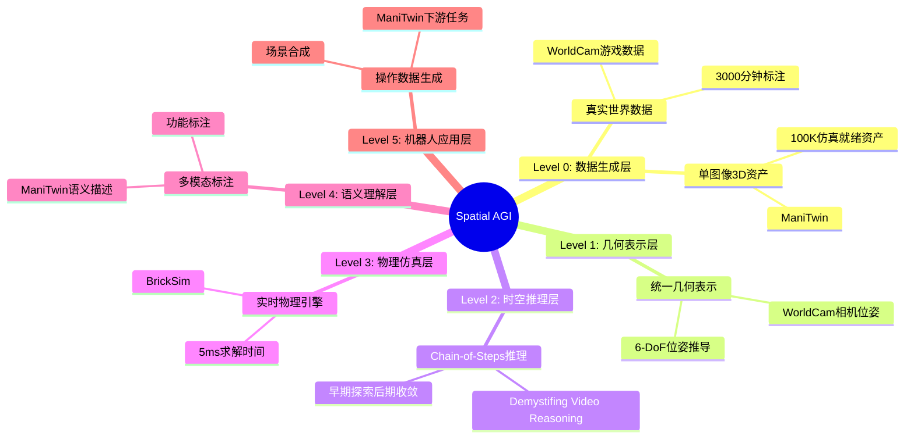

# Spatial AGI 每日思考文档规范

## 文档结构要求

### 必需部分

每个每日思考文档（`daily_thinking/YYYY-MM-DD.md`）必须包含以下部分：

1. **📅 每日总结**
   - 日期、论文数量、主题

2. **🎯 核心问题**
   - 当天研究的核心问题
   - 与昨天/前天的联系

3. **📚 论文概览**
   - 每篇论文的核心贡献、关键发现、对Spatial AGI的意义

4. **🔍 核心见解**
   - 从论文中提炼的核心见解
   - 技术发现和启发

5. **🗺️ Spatial AGI 知识图谱**
   - **知识架构思维导图**（Mermaid mindmap格式）
   - **主线技术路径**（5个发展阶段）
   - **技术成熟度评估**（表格对比）
   - **核心依赖关系图**（Mermaid graph）
   - **技术栈演进预测**（短期/中期/长期）

6. **🗺️ 与昨日思考的联系**
   - 昨天→今天的演进
   - 核心问题的延续
   - 技术栈的演进

7. **📊 知识缺口分析**
   - 已解决的知识缺口
   - 新识别的知识缺口

8. **🎓 今日收获**
   - Top 3 发现
   - 最大惊喜
   - 待解决的问题

9. **🚀 下一步演进方向**
   - 基于今天的发现预测明天的研究方向

10. **📈 研究进度追踪**
    - 本周研究进展
    - 知识演进图
    - 核心技术栈积累

11. **💡 本质思考**
    - 核心能力的本质
    - 当前方法与理想目标的差距
    - 最可能的发展路径

12. **📝 关键引用** 和 **🏷️ 关键词**

## Mermaid 思维导图格式

### 知识架构思维导图示例

## 技术成熟度评估标准

- ⭐⭐⭐⭐⭐: 生产就绪
- ⭐⭐⭐⭐: 研究验证
- ⭐⭐⭐: 概念验证
- ✅: 已解决
- ⚠️: 部分解决
- ❌: 未解决

## 检查清单

在提交每日思考文档前，检查以下内容：

- [ ] 是否包含所有必需部分？
- [ ] 知识图谱思维导图是否完整？
- [ ] 技术成熟度评估表格是否填写？
- [ ] 核心依赖关系图是否正确？
- [ ] 是否与昨天/前天的思考建立了联系？
- [ ] 是否识别了新的知识缺口？
- [ ] 是否提出了下一步的研究方向？
- [ ] Git是否已提交并推送？

## 常见问题

### Q: 思维导图部分缺失怎么办？

使用 `edit` 工具在 `## 🗺️ 与昨日思考的联系` 之前插入完整的 `## 🗺️ Spatial AGI 知识图谱` 部分。

### Q: 如何确定技术成熟度等级？

- **生产就绪** (⭐⭐⭐⭐⭐): 已在实际生产环境中部署使用
- **研究验证** (⭐⭐⭐⭐): 已在研究论文中验证有效性
- **概念验证** (⭐⭐⭐): 已有原型实现，但未大规模验证

## 创建日期

2026-03-19

## 相关文件

- `/home/cwh/coding/auto_blog/spatial_agi/daily_thinking/2026-03-19.md` - 示例文档
- `/home/cwh/coding/auto_blog/spatial_agi/daily_thinking/2026-03-18.md` - 参考文档
