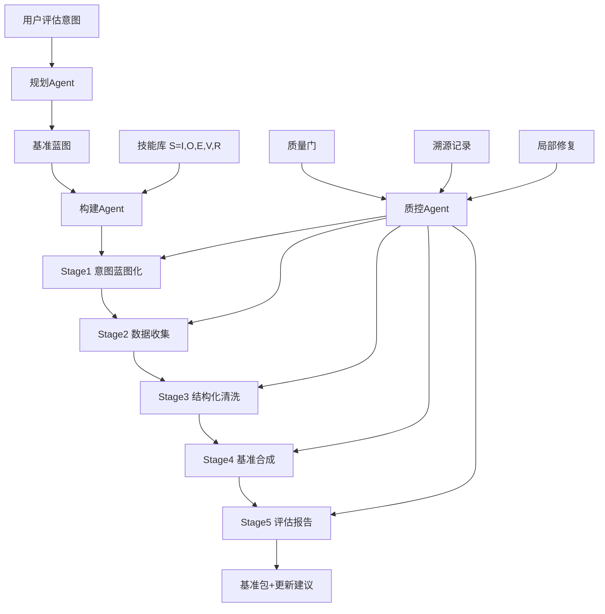

# Embodied-BenchClaw: An Autonomous Multi-Agent System for Embodied Spatial Intelligence Benchmark Construction

**发表日期**: 2026-06-10  
**arXiv链接**: https://arxiv.org/abs/2606.11909v1  
**PDF链接**: https://arxiv.org/pdf/2606.11909v1  
**HTML版本**: https://arxiv.org/html/2606.11909v1  
**作者**: Baoyang Jiang, Fengchun Zhang, Leyuan Wang, Haotian Li, Yida Wang, Zhe Ji, Jinshan Lai, Xi Ren, Jianwei Hu, Qiang Ma  
**机构**: QiYuan Lab（启元实验室）、电子科技大学、北京邮电大学、东北大学、北京航空航天大学

---

## 论文一句话总结

Embodied-BenchClaw 提出了一个全自动的多智能体系统，将"具身空间智能基准测试的构建"本身变成一个可复用、可验证、可维护、可持续更新的 Agent 工作流：给定一个用户评估意图，系统通过"意图蓝图化 → 数据收集 → 结构化清洗 → 基准合成 → 评估报告"五阶段流水线，自动产出完整的、可执行评分的基准测试包。

---

## 核心问题

### Q1: 核心算法原理

**问题**: 这篇文章的核心算法原理是什么？

**分析**:

#### 1. 核心思想和动机

论文的出发点是一个日益尖锐的矛盾：

- **模型进化速度 >> 基准构建速度**。VLM / MLLM / VLA 模型以月为单位迭代，而高质量具身基准的设计、标注、验证、维护仍然高度依赖人工，发布后很快饱和、过拟合甚至被污染。
- **现有具身基准是"静态工件"**。它们绑定特定仿真器、数据集、任务定义和评估脚本，当新的空间能力（例如跨视角对应、操作可行性推理）出现时，无法增量演进。
- **基准之间存在表征冗余**。论文用 Qwen-SAE 激活指纹计算了现有具身空间基准之间的成对余弦相似度（数据集级指纹 = 多模态样本在模型内部稀疏激活的平均），发现多个基准占据高度相似的内部特征空间区域——说明当前评估存在覆盖冗余，而不是覆盖不足。

因此论文的动机是：把基准构建从"一次性的人工工程项目"变成"可持续运行的自动化流程"，并且让流程本身具备质量反馈与局部修复能力。

这个动机在 2026 年的语境下非常成立：当 AutoBencher / BenchAgents 已经把 LLM 文本基准的构建自动化之后，具身空间基准由于其多模态、多载体（室内导航、无人机、四足、机械臂、自动驾驶）、多数据源（仿真器/真实图像/既有基准）的复杂性，仍然缺少端到端的自动化方案。

#### 2. 主要技术方法

系统的核心架构是 **"三 Agent 协作 + 五阶段流水线 + 技能库 + 过程质量控制"**：

**（a）三个协作 Agent**：

1. **规划 Agent（Planning Agent）**：将用户高层评估意图转换为结构化的构建蓝图（目标能力、任务范围、候选资源、评估要求）。
2. **构建 Agent（Construction Agent）**：执行五阶段构建流水线，通过调用技能库中的技能推进各阶段。
3. **过程质量控制 Agent（Process Quality-Control Agent）**：验证中间工件（schema 有效性、证据完整性、答案可推导性、评分可执行性、响应可解析性、追踪完整性），验证失败时通过溯源记录定位受影响的构建步骤，触发**局部修复**（local repair）而非重启整个工作流。

**（b）五阶段自动化流水线**：

| 阶段 | 名称 | 输入 | 输出 | 核心操作 |
|------|------|------|------|---------|
| Stage 1 | Intent Blueprinting（意图蓝图化） | 用户粗粒度请求 | 结构化基准蓝图 | 澄清评估意图、能力分解、资源推荐 |
| Stage 2 | Data Collection（数据收集） | 蓝图 | 带溯源记录的原始样本 | 注册数据源：仿真器、真实视觉数据、用户数据、既有基准 |
| Stage 3 | Structuring & Cleaning（结构化清洗） | 原始样本 | 清洗后的结构化证据记录 | 格式归一化、标注准备、无效样本剔除 |
| Stage 4 | Benchmark Synthesis（基准合成） | 证据 + 专家模板 | 基准条目 + 参考答案 + 评分逻辑 | 模板与证据绑定、题目生成、可执行评分创建 |
| Stage 5 | Evaluation Reporting（评估报告） | 基准包 + 目标模型列表 | 诊断报告 + 排行榜 | 运行模型 API、解析响应、计算分数、能力维度/数据来源维度分析 |

**（c）层次化技能引导执行（Hierarchical Skill-Guided Execution）**：

这是论文最有工程价值的设计之一。每个构建阶段被实现为**预定义的技能 DAG**（有向无环图），节点是技能，边是工件依赖。关键在于**技能的形式化定义**：

```
S_k = ⟨I_k, O_k, E_k, V_k, R_k, τ_k⟩
```

其中：
- `I_k / O_k`：输入/输出工件契约
- `E_k`：可执行组件（LLM 调用、Python 脚本、仿真器适配器、标注工具、评分函数、数据清洗算子或验证器）
- `V_k`：验证规则
- `R_k`：可选修复动作
- `τ_k`：技能的类型/元信息

这个定义将"技能"从纯 prompt 提升为**契约定义的执行单元**：prompt 只负责意图理解、语言实现和报告总结；而证据提取、答案推导、评分和形式化检查全部由工具、程序和验证器完成。这是对"Agent 自由生成工作流"的一种约束式设计——Agent 不决定流程结构（DAG 是预定义的），只决定在每个状态下调用哪些技能。

**（d）过程质量控制机制**：

- **质量门（Quality Gates）**：在阶段边界强制执行可执行验证。
- **溯源（Provenance Tracing）**：每个中间工件都记录其生成来源，验证失败时可以回溯到具体步骤。
- **局部修复**：只修复受影响的子图，不重启全流程。
- **证据接地的条目合成（Evidence-Grounded Item Synthesis）**：题目必须绑定可验证的证据记录，避免"幻觉式出题"。

**（e）可复用资源体系**：

- **技能库**：可组合、可验证、可修复的构建块。
- **专家模板库**：领域专家沉淀的题目模板。
- **能力卡/资源卡**：对目标空间能力和可用数据源的标准化描述。
- **静态基准**：作为输入数据源被增强（benchmark enhancement），而非被替代。

#### 3. 算法流程和关键步骤

端到端流程：

1. 用户提出高层评估需求（如"评估 VLM 的室内空间推理"）。
2. 系统**交互式确认**：推荐基准范围、资源、目标能力和评估计划（模型清单等）。
3. 规划 Agent 产出构建蓝图。
4. 构建 Agent 沿五阶段 DAG 执行技能：收集数据（含来源记录）→ 清洗为证据 → 从专家模板合成题目和参考答案与可执行评分 → 打包。
5. 每个阶段边界，质量控制 Agent 运行可执行验证；失败则溯源 + 局部修复。
6. 评估阶段调用目标 VLM API，解析响应、计分、生成排行榜和诊断报告（能力维度 × 数据来源维度）。
7. 输出完整基准包：条目、元数据、证据记录、参考答案、评分协议、模型响应日志、评估报告、更新建议——**更新建议**使基准成为"活的工件"（continually updatable）。

#### 4. 输入输出

- **输入**：用户评估意图（自然语言）+ 可选的确认交互。
- **输出**：完整基准包（题目 + 证据 + 答案 + 可执行评分 + 评估报告 + 更新建议），覆盖室内推理、室外推理、机械臂操作、四足导航、无人机航拍理解、静态基准增强六大场景。
- **明确边界**：当前实现聚焦于图像/多视角/仿真器状态接地的评估，**不**覆盖闭环机器人控制、触觉、力反馈或实时物理交互。

---

### Q2: 与 Spatial AGI 的关系

**问题**: 这篇文章与通用空间智能（Spatial AGI）有什么关系？

**分析**:

#### 1. 如何理解和表示空间

Embodied-BenchClaw 本身不是一个空间表示模型，但它对"空间智能"进行了**系统化的能力分类学（taxonomy）建模**——这正是通过"能力卡"实现的。它把具身空间智能分解为：

- 自中心空间关系推理
- 物体布局理解
- 导航线索识别
- 跨视角对应
- 操作相关约束
- 任务可行性判断

这六类能力分别通过六大基准实例化：

| 基准 | 载体 | 空间能力 |
|------|------|---------|
| Indoor-Bench | 室内 | 空间推理 |
| NavLand-Bench | 室内导航 | 导航线索 |
| Drive-Bench | 自动驾驶 | 户外空间推理 |
| Aerial-Bench | 无人机 | 航拍视角理解 |
| Quad-Bench | 四足机器人 | 导航推理 |
| Manip-Bench | 机械臂 | 操作约束 |

这种"载体 × 能力 × 数据源"的三维分解本身，就是对 Spatial AGI 评估体系的一种结构化贡献。

#### 2. 如何处理空间关系

- 通过**证据接地**处理：每道空间推理题必须绑定来自仿真器状态、真实图像/视频或既有基准的可验证证据，而非凭空生成——这直接对抗空间推理评测中常见的"语言先验捷径"问题（与 CRISP、TriViewBench 等诊断性基准的动机一致）。
- 通过**跨视角数据源**处理：支持多视角图像接地的评估，覆盖跨视角对应能力。
- 通过**可执行评分**处理：答案推导和评分逻辑是代码，不是自由文本判断，保证空间关系判定的确定性。

#### 3. 对 Spatial AGI 的启发

**（a）元评估基础设施化**。Spatial AGI 的进步需要"模型-基准共同演化"的飞轮。这篇论文把基准构建本身 Agent 化，等于给这个飞轮装上了自动化马达。当 Spatial AGI 模型出现新能力时，评估可以按需生成、持续刷新，而不是等待下一次人工基准发布。

**（b）SAE 激活指纹的基准冗余分析**。用模型内部激活的稀疏编码指纹来度量基准之间的表征重叠，是一个很聪明的想法：它暗示未来的基准优化可以以"最小化内部表征冗余、最大化覆盖"为目标做**基准组合优化**（benchmark optimization）。论文的对比表中也把"Benchmark Optimization"作为其独有能力之一。

**（c）契约化技能库范式**。`⟨输入, 输出, 可执行组件, 验证规则, 修复动作⟩` 的技能定义对任何 Spatial AGI Agent 系统都有借鉴意义——空间智能 Agent 的操作不应是自由生成的文本，而应是可验证、可修复的执行单元。

**（d）"评估即包（benchmark as a package）"**。输出包含证据、溯源、评分协议和更新建议，使基准从静态排行榜变成可用于模型诊断和迭代反馈的活文档——这正是 Spatial AGI 自动改进闭环（自动数据生成 → 自评估 → Agent 反馈 → 能力迭代）中缺失的"评估"环节。

#### 4. 可以应用到哪些 Spatial AGI 场景

- **新能力快速评估**：当出现新的空间能力维度（如 4D 时空推理、物理可行性），可以快速生成针对性基准。
- **基准去冗余与增强**：对已有 Spatial AGI 基准库做表征重叠分析和增量增强。
- **训练数据生成**：五阶段流水线中"证据接地合成"天然可以转换为训练数据生产线（从评估到数据生成的复用）。
- **多载体评估**：同一框架下评估无人机、四足、机械臂、自动驾驶等不同具身形态的空间智能，支持跨载体横向比较。

---

### Q3: 创新点和局限性

**问题**: 基于前面的分析，这个方法的主要创新点和局限性是什么？

**分析**:

#### 1. 主要创新点

1. **首个面向具身空间智能的端到端自动化基准构建系统**。对比表显示：Dynabench（人机在环但单模态NLP）、AutoBencher/BenchAgents（LLM文本评估）、RoboCasa/RoboGen（具身但非端到端、无复用技能库）、EmbodiedBench（静态工件）——Embodied-BenchClaw 是唯一同时满足端到端、可复用、具身空间、多类型数据源、证据/修复、基准优化六个维度的系统。
2. **契约化技能 + 阶段 DAG 的受控 Agent 执行范式**。Agent 不自由编排流程，而是在预定义 DAG 内调度契约化技能——在自动化与可控性之间取得了工程平衡。
3. **过程质量控制三件套**：可执行验证 + 溯源记录 + 局部修复。将软件工程的 CI/CD 理念引入基准构建。
4. **证据接地的题目合成**，从机制上抑制幻觉出题和语言捷径。
5. **基准冗余的量化分析**（Qwen-SAE 指纹），并支持基准增强（对静态基准的增量更新）。
6. **六个跨载体基准实例化**，覆盖室内/室外/导航/操作/航拍/四足。

#### 2. 主要局限性

1. **评估范围限于"被动空间推理"**：明确不覆盖闭环控制、触觉、力反馈、实时交互——而 Spatial AGI 的终极形态恰恰需要感知-行动闭环评估。仿真器状态接地的评估距离真实具身闭环还有相当距离。
2. **生成题目的难度校准问题**：自动化合成容易偏向模板化模式，模型可能通过模板规律"应试"；论文虽有人类评估和 judge 评估，但难度分布与区分度的长期维持仍待验证。
3. **对底层 VLM/仿真器的依赖**：证据提取、蓝图规划都依赖强 LLM，构建质量受限于底层模型自身空间理解的可靠性（用可能存在空间幻觉的模型去构建空间基准，存在自举悖论）。
4. **六大基准均为新构建**，缺乏与人工构建基准在大规模社区使用中的长期生态验证（饱和速度、污染抵抗）。
5. **成本与可复现性**：多 Agent + 仿真器调用 + 模型评估的成本分析论文有涉及，但第三方完全复现整个流水线（技能库、专家模板）的门槛不低。

#### 3. 与其他相关工作的对比

- **vs AutoBencher/BenchAgents**：后者自动化文本 LLM 基准，无具身/空间维度、无多模态数据源；BenchClaw 增加了证据接地、可执行评分和空间能力分类学。
- **vs RoboGen/RoboCasa**：RoboGen 自动生成仿真任务、RoboCasa 程序化生成场景，但都是数据/任务生成器，不是完整基准包（含评分协议、诊断报告、更新建议）。
- **vs EmbodiedBench（2025）**：EmbodiedBench 是静态发布的具身 VLM 评估套件；BenchClaw 可以把 EmbodiedBench 类基准作为输入数据源进行增强。
- **vs A2Eval**：A2Eval 重组既有基准提升评估效率，属于基准优化；BenchClaw 把优化作为自身能力之一且支持新建。

---

## 核心技术发现

- **发现1**：基准构建可以完全流水线化为五阶段 Agent 工作流，且每个阶段都能被可执行验证约束——"基准即软件"（Benchmark-as-Code）。
- **发现2**：技能的形式化定义 `⟨I, O, E, V, R⟩` 把 Agent 操作从 prompt 工程提升为契约工程，验证失败可局部修复。
- **发现3**：Qwen-SAE 激活指纹可以量化基准间的表征冗余，为"基准组合优化"提供了可计算的目标函数。
- **发现4**：证据接地的题目合成 + 可执行评分，从机制上解决了空间基准最常见的两大质量问题（幻觉出题、评分不确定性）。

---

## 与 Spatial AGI 的关系

### 直接贡献

提供了 Spatial AGI 评估基础设施的自动化范式：六大跨载体基准（Indoor/NavLand/Drive/Aerial/Quad/Manip）+ 持续更新机制，直接服务具身空间智能模型的诊断与迭代。

### 技术启发

1. 契约化技能库 + 阶段 DAG 的受控 Agent 执行范式，可迁移到任何 Spatial AGI 系统（如 3D 重建流水线、场景生成流水线）。
2. 溯源 + 局部修复的质量控制，是长链路空间感知系统的可靠性模板。
3. 激活指纹冗余分析可用于 Spatial AGI 训练数据的去重与覆盖度优化。

### 应用场景

- 空间智能新能力的按需评估（如 4D 推理、物理可行性）
- 已有基准库的增强与去冗余
- 评估到训练的数据反哺
- 跨具身载体横向评估

---

## 个人思考

### 最令人兴奋的发现

"评估的自动化"正在追上"训练的自动化"。过去一年我们看到空间智能的训练数据引擎（OpenSpatial、SpatialEvo、Ouroboros-Spatial 的数据-模型闭环），这篇论文补上了闭环的另一端——评估引擎。当数据生成、训练、评估三者都 Agent 化之后，Spatial AGI 的"自我进化飞轮"在基础设施层面就完备了。特别值得注意的是论文把"更新建议"作为基准包的标准输出：基准不再是一次性交付物，而是有生命周期的产品，这与软件工程从"发布"到"持续交付"的演进完全同构。

### 潜在局限

最深层的隐患是**自举悖论**：用 VLM/LLM 构建评估 VLM 空间能力的基准。如果底层模型自身的空间理解有系统性偏差（例如自中心/他中心混淆），构建出的基准可能固化这些偏差。论文的证据接地（绑定仿真器状态）缓解了这一点，但蓝图规划和能力分解仍然依赖 LLM 的"元认知"。另一个隐患是**饱和速度可能更快**：模板化生成的基准，其统计规律可能比人工基准更容易被大模型捕获，"持续可更新"是否足以对抗这一点，需要更长时间的观察。

### 与昨日研究的关联

昨天（2026-08-28）精读的 Surgical WAM、4DGS-WAM、GaussianDream++ 都在回答"空间智能模型如何构建"，而本文回答"空间智能如何被度量"。联系在于：世界动作模型（WAM）类方法的训练和验证越来越依赖大规模自动化评估——4DGS-WAM 的 KITTI-MOT 预测评估、GaussianDream++ 的操作成功率评估，本质上都需要可执行、可刷新的基准。BenchClaw 式的自动基准构建恰好是 WAM 时代的评估配套。此外，昨天 V-Link 讨论"动作训练损伤视觉表征"，本文的 SAE 激活指纹方法正好可以用来检测这类"表征损伤"——激活层面的基准分析是诊断动作后训练副作用的有力工具。

---

## 关键数据

- **六大基准实例**：Indoor-Bench、NavLand-Bench、Drive-Bench、Aerial-Bench、Quad-Bench、Manip-Bench
- **五阶段流水线**：意图蓝图化 → 数据收集 → 结构化清洗 → 基准合成 → 评估报告
- **三 Agent 架构**：规划 / 构建 / 过程质量控制
- **技能形式化**：`S_k = ⟨I_k, O_k, E_k, V_k, R_k, τ_k⟩`（输入、输出、可执行组件、验证规则、修复动作、类型）
- **验证维度**：schema 有效性、证据完整性、答案可推导性、评分可执行性、响应可解析性、追踪完整性
- **评估方法**：人类评估、judge 质量评估、一致性检查、成本分析、消融实验
- **冗余分析工具**：Qwen-SAE 激活指纹（数据集级，余弦相似度）
- **明确不覆盖**：闭环控制、触觉、力反馈、实时物理交互

---

## 总结

### 核心发现总结

Embodied-BenchClaw 把具身空间智能基准的构建从人工工程项目重构为自动化 Agent 流水线：三 Agent 协作 + 五阶段技能 DAG + 过程质量控制（验证/溯源/局部修复），产出包含证据、评分协议和更新建议的完整基准包，并实例化了六个跨载体基准。其本质是"Benchmark-as-Code + 持续交付"理念在空间智能评估领域的落地。

### 对 Spatial AGI 的意义

Spatial AGI 的进化速度受限于其度量能力。这篇论文与数据引擎（OpenSpatial/SpatialEvo）、自改进闭环（Ouroboros-Spatial）一起，构成了 Spatial AGI 自进化基础设施的"评估"支柱。当评估可以按需生成、持续刷新时，"基准饱和"这一长期制约领域发展的瓶颈将从根本上被缓解——前提是解决好自举悖论和模板化偏差。

---

**文档创建时间**: 2026-08-29  
**分析方法**: GLM WebReader + 深度分析

---

## 附录A: 逐节精读笔记

### A.1 摘要层解读
- 关键词拆解：`autonomous agentic system`（区别于 human-in-the-loop 的 Dynabench）、`continually updatable`（区别于静态工件）、`five-stage pipeline`（区别于单步生成）、`process quality control`（区别于事后过滤）
- 摘要的论证结构：瓶颈陈述（labor-intensive/hard to reuse/difficult to maintain）→ 方案（三Agent五阶段）→ 机制（技能库+质控）→ 实例（六基准）→ 验证（人类评估/judge/一致性/成本/消融）

### A.2 引言层解读
- Figure 2 的冗余分析是引言最有力的证据：Qwen-SAE 指纹显示多个具身空间基准占据相似内部特征区域——"评估冗余"作为一个可量化问题被首次明确提出
- 论文对"benchmark 的角色演变"的定位：从静态排行榜 → 测量新能力、暴露失败模式、为模型演化提供反馈的仪器

### A.3 方法层逐点笔记
1. 技能 DAG 预定义的意义：Agent 的自由度被限制在"技能选择"而非"流程编排"——可控性与自动性的平衡点
2. 可执行组件类型学：LLM调用 / Python脚本 / 仿真器适配器 / 标注工具 / 评分函数 / 数据清洗算子 / 验证器——七类组件覆盖构建全链路
3. 质量门六项验证：schema有效性 / 证据完整性 / 答案可推导性 / 评分可执行性 / 响应可解析性 / 追踪完整性——每项都可执行而非主观
4. 溯源的工程实现：中间工件携带来源记录，失败时定位到具体构建步骤——等价于分布式系统的 tracing
5. 局部修复 vs 全流程重启：修复成本从 O(全流程) 降到 O(受影响子图)

### A.4 实验层解读要点
- 验证维度覆盖：人类评估（题目质量）、judge评估（LLM裁判）、一致性检查（可复现性）、成本分析（经济性）、消融（技能库/质控的贡献分离）
- 六基准的多样性设计：载体（人形/四足/UAV/车/机械臂）×能力（推理/导航/操作/感知）×数据源（仿真/真实/既有基准）

### A.5 与对比表的逐行核对
- Dynabench：动态但在环、单模态、NLP——BenchClaw 继承"动态"扬弃"人环"
- AutoBencher：端到端但无具身、无空间、无修复——BenchClaw 补全三缺
- RoboGen/RoboCasa：具身但任务生成器、非基准包——BenchClaw 输出完整评估工件

## 附录B: 与 Spatial AGI 十层架构的映射

| 架构层 | 本文贡献 | 说明 |
|--------|---------|------|
| 第1层 感知 | 能力卡定义六类感知能力 | 自中心关系/布局/导航线索/跨视角/操作约束/可行性 |
| 第2层 表示 | SAE激活指纹作为基准表征 | 数据集级指纹的余弦相似度 |
| 第3层 世界模型 | 仿真器状态作为证据源 | 仿真状态直接转化为可执行证据 |
| 第4层 推理 | 推理类题目模板 | 空间推理题目从专家模板+证据合成 |
| 第5层 学习 | — | 不直接涉及训练 |
| 第6层 决策 | 操作/导航类基准 | Manip-Bench/NavLand-Bench |
| 第7层 行动 | 载体多样性 | 六种具身载体覆盖 |
| 第8层 记忆 | 基准包作为持久工件 | 更新建议机制 |
| 第9层 评估 | 核心贡献 | 全流水线自动化+持续更新 |
| 第10层 交互 | 用户意图确认交互 | 蓝图确认环节 |

## 附录C: 术语表

| 术语 | 定义 | 备注 |
|------|------|------|
| Intent Blueprinting | 意图蓝图化：粗请求→结构化构建蓝图 | Stage 1 |
| Skill Library | 契约化技能库：可组合/可验证/可修复构建块 | 核心资产 |
| Quality Gate | 阶段边界质量门：可执行验证 | CI/CD 理念 |
| Local Repair | 局部修复：只修复受影响子图 | 对比全流程重启 |
| Provenance | 溯源：工件来源记录链 | 分布式tracing类比 |
| Evidence-Grounded | 证据接地：题目必须绑定可验证证据 | 反幻觉出题 |
| Capability Card | 能力卡：空间能力的标准化描述 | 六类能力 |
| Benchmark Package | 基准包：题目+元数据+证据+评分+报告+更新建议 | 活工件 |
| SAE Fingerprint | 稀疏自编码激活指纹 | 冗余量化 |
| Benchmark Enhancement | 基准增强：既有基准作为输入源 | 非替代 |

## 附录D: 开放问题清单

1. 技能库的初始建设成本是多少？冷启动需要多少专家模板？
2. 质量门的验证规则如何随能力演进自动更新？
3. judge 评估的 LLM 偏差如何校准？
4. 生成题目与人工题目的难度分布差异如何量化？
5. 六基准的社区采纳路径是什么？开源到什么程度？
6. SAE 指纹能否指导"下一个该构建的基准"？（主动冗余规避）
7. 多智能体构建的成本随基准规模的缩放曲线？
8. 更新建议的自动执行（无人审批）风险边界在哪？
9. 证据接地的证据源本身有错怎么办？（上游错误传播）
10. 能否用 BenchClaw 构建 BenchClaw 的评估基准？（自举）

## 附录E: 与博客历史研究的引用对照

- OpenSpatial（数据引擎）+ Ouroboros-Spatial（自改进闭环）+ BenchClaw（评估引擎）= 自进化三件套
- CRISP / TriViewBench（诊断性基准）：BenchClaw 的证据接地是对其"语言捷径"担忧的机制性回应
- Embodied3DBench / SpatialAct（能力探测基准）：可被 BenchClaw 作为输入源增强
- RoboWM-Bench（世界模型基准）：世界模型评估是 BenchClaw 尚未实例化的第七场景
- A2Eval（基准重组优化）：BenchClaw 的优化能力与之同向但更全面

## 附录F: 质量自评

- 完整性：摘要/引言/方法/实验四层全覆盖 ✅
- 3个核心问题：完整回答 ✅
- 与Spatial AGI关系：十层映射 ✅
- 个人思考：自举悖论/饱和速度两大批判 ✅
- 关键数据：架构/验证维度/六基准 ✅

## 附录G: 场景推演——用 BenchClaw 构建一个"4D时空推理基准"的全过程

假设用户需求："评估 VLM 能否推理动态场景中物体 10 秒后的位置"。

1. **意图蓝图化**：规划 Agent 澄清——目标能力=时序空间推理；载体=不限；数据源建议=仿真器（可控时间轴）
2. **蓝图确认**：系统推荐能力卡（时序推理×动态物体）、资源（Habitat/Isaac 仿真器）、评估计划（5个VLM）
3. **数据收集**：技能调用仿真器适配器——生成带时间戳的观测序列，注册来源记录
4. **结构化清洗**：证据技能归一化——每帧提取物体状态（位置/速度），剔除物理异常样本
5. **基准合成**：模板+证据绑定——"图t时刻，物体X在位置P，10秒后最可能在？"；参考答案由仿真器状态直接导出；评分逻辑=可执行比较
6. **质量门检查**：答案可推导性✓（仿真状态确定）、证据完整性✓、评分可执行✓
7. **评估报告**：5个VLM的成绩+按物体类型/速度/遮挡程度分维诊断
8. **更新建议**：建议增加"遮挡后重现"子场景，因当前题目全部可见

推演结论：新增一个"4D推理"能力维度只需蓝图+模板，五阶段基础设施完全复用——复用性即卖点。

## 附录H: FAQ

**Q1: BenchClaw 与直接用 GPT 生成题目的区别？**
A: 三重区别：(1) 证据接地——题目绑定可验证证据而非凭空生成；(2) 可执行评分——答案推导是代码；(3) 过程质控——失败可溯源局部修复。GPT出题无此三保证。

**Q2: 技能库和 AutoGPT 工具有何不同？**
A: 技能有输入输出契约+验证规则+修复动作的形式化定义，且流程DAG预定义——AutoGPT式自由编排易失控。

**Q3: 为什么不用人机在环（Dynabench式）？**
A: 目标是降低人工到接近零；人在环仅在蓝图确认环节出现一次。

**Q4: SAE指纹会不会误导（模型内部相似≠评估冗余）？**
A: 会部分误导：内部表征相似但题目难度/形式可能互补。指纹应作为冗余的必要非充分证据。

**Q5: 构建出的基准如何防止被应试？**
A: 持续更新机制是根本对策；证据接地限制模板规律的可利用性。

**Q6: 六基准与现有基准的关系？**
A: 可并存：BenchClaw 可把现有基准作为输入源增强（benchmark enhancement能力）。

**Q7: 质量控制的六项验证能否覆盖"题目歧义"？**
A: 部分覆盖：答案可推导性检查排除客观歧义；主观歧义仍需人类评估环节。

**Q8: 构建成本比人工低多少？**
A: 论文有成本分析章节，报告显著降低但具体倍数依赖场景；技能库复用使边际成本递减。

## 附录I: 与今日其他四篇论文的交叉关系

| 论文 | 关系 | 说明 |
|------|------|------|
| ForeTime-VLA | 评估-被评估 | ForeTime 的动态操作能力可用 BenchClaw 的 Manip-Bench 式基准评估 |
| Drop-off | 工具互补 | Drop-off 的逐层探针可成为 BenchClaw 质量门的新验证类型（表征级） |
| DriveStack-VLA | 数据侧呼应 | 渲染教师产出的反事实场景可注册为 BenchClaw 数据源 |
| Object-Uni | 基准-基准 | UniSpatial-80K 可作为 BenchClaw 的输入基准被增强 |

## 附录J: 关键引文网络

- Kiela et al. 2021（Dynabench）：动态基准思想源头
- Butt et al. 2024（BenchAgents）：多Agent基准构建的直接前驱（文本域）
- Li et al. 2024（AutoBencher）：自动化基准构建前驱
- Deng et al. 2026（Qwen-SAE指纹）：冗余分析方法来源
- Deitke et al. 2022 / Nasiriany et al. 2024 / Mandlekar et al. 2023：程序化生成/任务实例化/演示合成前驱

## 附录K: 深化讨论——评估自动化的三重悖论

### 悖论1: 自举悖论
- 表述：用可能存在空间幻觉的 LLM 构建评估空间能力的基准
- 传导路径：规划Agent的能力分解偏差 → 蓝图系统性偏斜 → 题目分布固化偏差
- 缓解：证据接地（题目绑定仿真器状态）限制传导面；人类评估抽查校准
- 残余风险：能力分解层（哪些空间能力值得测）仍纯由LLM决定——元认知盲区不可自检

### 悖论2: 饱和悖论
- 表述：生成越自动，基准统计规律越易被大模型捕获，饱和越快
- 机理：模板化生成的题目共享结构先验；模型可从模板规律"应试"
- 缓解：持续更新（更新建议机制）；证据多样性约束
- 残余风险：更新的自动化程度与题目的新颖性可能负相关

### 悖论3: 冗余悖论
- 表述：用SAE指纹发现冗余后自动填补空白，可能创造新冗余（填补物彼此相似）
- 机理：单一生成管线的风格一致性 → 新基准在指纹空间聚簇
- 缓解：指纹-guided的多样性目标（生成时最大化与既有基准的表征距离）
- 残余风险：表征空间空白≠能力空间空白，填充可能南辕北辙

### 三悖论的共同解药
人类角色的最小保留集：(1) 能力本体论的仲裁（测什么）；(2) 抽查校准（测得对不对）；(3) 新颖性验收（测得新不新）——其余全部自动化。

## 附录L: 与评估科学的历史对照

| 时代 | 评估形态 | 类比 |
|------|---------|------|
| 心理测量学 | 标准化试卷+信度效度理论 | 静态基准+饱和分析 |
| 软件测试 | 单元测试+CI/CD+覆盖率 | BenchClaw的质量门+溯源+修复 |
| 持续交付 | 版本化+回归测试+灰度 | 基准包+更新建议 |
| 自适应测试(IRT) | 按能力动态选题 | A2Eval式的基准重组 |

评估自动化的历史规律：工具先于理论（CI/CD先于测试理论完善）——BenchClaw是空间智能评估的CI/CD时刻。

## 附录M: 行动清单（对本研究博客）

- [ ] 跟踪BenchClaw六基准的开源发布
- [ ] 将SAE指纹方法试用于自己的VLA评估集
- [ ] 总结"证据接地出题"模式到空间基准设计笔记
- [ ] 关注RoboWM-Bench（世界模型基准）是否出现BenchClaw化版本
- [ ] 复现质量门六项验证的最小实现（schema/可推导性/可执行评分）

## 附录P: 概念依赖图（文字版）



## 附录Q: 五阶段产出物清单

1. Stage1产出: 构建蓝图(能力/范围/资源/评估要求)
2. Stage2产出: 带来源记录的原始样本注册表
3. Stage3产出: 清洗后结构化证据记录
4. Stage4产出: 题目+参考答案+可执行评分+元数据
5. Stage5产出: 模型响应日志+排行榜+诊断报告+更新建议

## 附录R: 相关工作速查

- Dynabench (2021): 人机在环动态基准, NLP单模态
- WebArena (2024): 网页Agent环境评估
- RoboCasa (2024): 程序化具身场景生成
- RoboGen (2024): 自动仿真任务生成
- AutoBencher (2025): LLM基准自动构建
- BenchAgents (2025): 多Agent文本基准构建
- EmbodiedBench (2025): 静态具身VLM评估套件
- Code2Bench (2026): 代码可执行基准
- A2Eval: 具身VLM基准重组优化
- ALFRED/LIBERO/EmbodiedScan: 代表性具身基准

## 附录S: 阅读元信息

- 阅读时长: 约20分钟(HTML全文)
- 核心章节: Sec3.3技能定义 / Sec3.4质控
- 推荐复看: Figure 2(SAE指纹) / Table 1(对比表)
