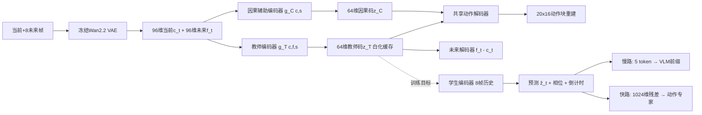

# ForeTime-VLA: Causal Future-Token Distillation from a World Action Model for Conveyor-Belt Manipulation

**发表日期**: 2026-08-21 (v2)  
**arXiv链接**: https://arxiv.org/abs/2608.20735v2  
**PDF链接**: https://arxiv.org/pdf/2608.20735v2  
**HTML版本**: https://arxiv.org/html/2608.20735v2  
**作者**: Siyuan Ma*, Yutian Zhang*, Boshi Zhang*, Qinglian Wu, Jiaqi Zhai, Dong Wei†, Xiaojin Huang†  
**机构**: 清华大学、上海人工智能实验室、哈尔滨工业大学、杭州云深处科技（DEEP Robotics）

---

## 论文一句话总结

ForeTime-VLA 回答了一个非常实际的工程问题：**能否让 VLA 策略获得世界动作模型（WAM）的"预见能力"，但在部署时完全不运行世界模型？** 答案是——离线阶段用一个冻结的 Fast-WAM/Wan 视频 VAE 教师把"当前+未来"压缩成 64 维动作等价码，在线阶段用一个八帧因果历史编码器从历史中预测这个码，通过双路注入（VLM 前缀的 future token + 动作专家的残差）条件化 π0.5，在传送带动态抓取上把快速档成功率从 2/30 提升到 11/30。

---

## 核心问题

### Q1: 核心算法原理

**问题**: 这篇文章的核心算法原理是什么？

**分析**:

#### 1. 核心思想和动机

- **动态操作的痛点**：传送带上抓取运动物体时，正确动作取决于物体何时进入可达集、夹爪何时闭合、末端执行器接触时的朝向——这些是**未来结构**，而标准 VLA 只从当前观测微调，缺乏对未来事件的显式监督。
- **世界模型的两难**：WAM 能提供预测性监督，但"先想象再行动"（imagine-then-act）把视频生成塞进控制回路，推理代价高昂。Fast-WAM 已经证明视频建模可以只作为训练信号、推理时移除。
- **本文的问题定位**：预训练 VLA 能否以**紧凑形式**获得 WAM 的预测结构，而部署时不跑 WAM？→ **因果未来 token 蒸馏**。

#### 2. 主要技术方法

**（a）离线动作等价未来教师**

- 对每个训练窗口采样当前帧 + 8 个未来帧（偏移 {2,4,7,9,12,14,17,19}）。
- 冻结的 Wan2.2 视频 VAE（Fast-WAM 使用的视觉 latent 管线）编码序列，取时空均值/标准差得到 96 维当前特征 c_t 和 96 维未来特征 f_t。
- 训练一个**防塌缩的动作等价适配器**：
  - 特权教师编码器：输入 (c_t, f_t, s_t)（26 维机器人状态）→ 64 维教师码 z_T
  - 因果辅助编码器：仅输入 (c_t, s_t) → 64 维码 z_C
  - 共享动作解码器从两个码重建归一化的 20×16 动作块
  - 未来解码器从教师码重建 f_t − c_t（未来-当前差分）
  - 损失组合：教师动作 MSE (1.0)、因果动作 MSE (0.5)、未来 smooth-L1 (0.25)、教师-因果余弦 (0.10)、逐维方差 (0.20)、非对角协方差 (0.01)、成对动作几何 (0.05)
  - 方差/协方差正则防止 latent 塌缩；成对几何保持样本间相对距离（关系蒸馏）
- 最终教师码逐维白化后缓存——**特权未来信息只用于定义训练目标，永不进入部署模型**。

**（b）因果时间学生**

- 部署输入：8 步 26 维归一化状态 + 12 维视觉统计（两个辅助相机的逐通道均值/标准差）；当前全分辨率图像仍走标准 π0.5 视觉主干。
- 历史编码：`e_i = swish(W_s LN(s_i)) + swish(W_v LN(r_i)) + p_i`（p_i 为可学习时间嵌入，e_i ∈ R^256），展平后过两层残差 MLP 得 h_t。
- 三个线性头预测：
  - 压缩未来态 ẑ_t ∈ R^64
  - 4 类操作相位 logits（接近/抓放转换/持物搬运/放置回撤，由夹爪状态转换自动标注）
  - sigmoid 归一化的转换倒计时 d̂_t ∈ [0,1]（到下一次夹爪状态转换的裁剪归一化距离）

**（c）双路条件化（Dual-Path Conditioning）**

- **慢路**：ẑ_t 映射为 4 个 2048 维 future token；相位分布的期望嵌入作为第 5 个 token；5 个 token 追加到 π0.5 VLM 前缀。
- **快路**：ẑ_t 和 d̂_t 映射为 1024 维残差，加到动作专家每个 suffix token 及其自适应归一化条件上。
- 学习标量门控初始化为 0.05，训练早期限制对预训练策略的扰动。
- 新增模块仅 **1.25M 参数**（对比 Gemma-2B VLM + 311M 动作专家）。

**（d）训练目标**

```
L = L_flow + 0.20·L_cos + 0.02·L_geo + 0.04·L_phase + 0.04·L_transition + 0.05·L_ae
```

- L_flow：保留 π0.5 原始流匹配动作目标（**动作目标从不被教师动作替换**，避免伪标签对齐混淆）
- L_cos：逐点余弦（实例级方向对齐）
- L_geo：Gram 矩阵关系几何损失（batch 内成对结构对齐）
- L_phase / L_transition：相位交叉熵 / 转换倒计时 Huber(δ=0.1)
- L_ae：从 ẑ_t 重建归一化动作块（保证码的动作相关性）
- π0.5 全参数 + ForeTime 模块联合优化。

#### 3. 算法流程和关键步骤

1. 离线：视频 VAE 编码当前+未来 → 适配器训练 → 白化教师码缓存。
2. 在线训练：8 帧因果历史 → 预测 ẑ_t、相位、倒计时 → 双路注入 π0.5 → 联合流匹配 + 五类辅助损失。
3. 部署：**无未来帧、无 WAM 前向**，只有因果历史编码器（毫秒级）+ π0.5。

#### 4. 输入输出

- 输入：RGB 观测、语言指令、26 维机器人状态、8 步因果历史。
- 输出：H=20、D=16 的动作块（流匹配生成）。

---

### Q2: 与 Spatial AGI 的关系

**问题**: 这篇文章与通用空间智能（Spatial AGI）有什么关系？

**分析**:

#### 1. 如何理解和表示空间

ForeTime-VLA 的空间表示是**时间化的**：它不把空间当作静态几何快照，而是当作"动作等价的未来压缩"。64 维教师码的本质是一个**预见性空间状态摘要**——哪些外观变化与控制无关被过滤，哪些空间-时间结构（物体到达可达集、接触位姿）被保留。操作相位和转换倒计时则把连续的时空流切分为**事件结构**（approach/grasp/transport/place），这是空间智能从几何层面向任务语义层面的提升。

#### 2. 如何处理空间关系

- **未来-当前差分**（f_t − c_t）显式建模空间关系的时间演化，而不是绝对外观。
- **成对几何损失**保持 batch 内样本间的关系结构，即"关系性空间推理"在表征学习中的体现。
- 双路注入对应空间信息的两个消费端：VLM 慢路做语义化的未来推理，动作专家快路做几何化的即时控制——这与 Spatial AGI 中"快慢双系统"（System 1/System 2）的架构共识一致。

#### 3. 对 Spatial AGI 的启发

1. **"预见不必生成"**：世界模型的价值可以以 64 维蒸馏码的形式内化到策略中，而不需要在推理时生成像素。这对所有计算受限的具身 Spatial AGI 系统（边缘部署、实时控制）都是关键范式。
2. **动作等价性作为压缩准则**：空间信息的保留与否以"是否影响动作"为标准——这是面向行动的空间智能（actionable spatial intelligence）的代表性设计，呼应了 "Vision-to-Geometry Mapping" 的几何优先主张。
3. **事件化时间监督**：相位 + 转换倒计时这类低成本自动标注，把隐含在动作块中的事件结构显式化，可推广到导航（路口转换）、飞行（起降转换）等 Spatial AGI 场景。
4. **门控残差注入**：0.05 初始化的门控保证新信息渐进融合而不破坏预训练能力——V-Link（昨天精读）发现"动作后训练损伤视觉表征"，这种保守注入是缓解该问题的工程答案。

#### 4. 可以应用到哪些 Spatial AGI 场景

- 动态环境抓取/操作（传送带、物流分拣、协作装配）
- 无人机对运动目标 的拦截/跟踪（同样需要预测进入可达集时机）
- 自动驾驶的时空预测监督（类似 ForeTime 的因果蒸馏可注入驾驶 VLA）
- 四足/移动操作混合体的预见控制（论文引用的 DECOWAM 已在足式移动操作上做类似蒸馏）

---

### Q3: 创新点和局限性

**问题**: 基于前面的分析，这个方法的主要创新点和局限性是什么？

**分析**:

#### 1. 主要创新点

1. **可部署的师生公式**：未来条件化 WAM 结构迁移到八帧因果历史编码器，推理时零未来帧、零教师前向。
2. **动作等价教师码**：特权未来信息经过动作解码器约束，过滤控制无关的外观变化——蒸馏的是"有用的未来"而非"全部的未来"。
3. **防塌缩设计**：方差/协方差正则 + 成对几何损失 + 教师-因果对齐，系统性地解决中间特征蒸馏的秩塌缩问题。
4. **双路条件化**：future/phase token 进 VLM 前缀（语义路），ẑ_t/d̂_t 残差进动作专家（几何路），门控保守注入。
5. **严格评估**：配对离线评估（768 匹配窗口/split，paired-bootstrap 置信区间）+ 两轮真机定量研究 + 结果级失败分析（接触位姿失败减少与离线朝向增益一致）。

#### 2. 主要局限性

1. **任务域窄**：目前只在传送带抓取（纸箱/玉米/西瓜）单一任务族上验证，跨任务/跨具身泛化未知。
2. **离线增益幅度小**：测试 MAE 仅改善 2.63%（95% CI 0.82–4.48%），L2 改善 3.02%，代价是 2.46–2.93% 延迟——离线指标提升温和，主要收益在真机动态条件。
3. **教师质量上限**：蒸馏效果受 Fast-WAM/Wan VAE 教师的预测质量约束；若未来高度非确定（物体可能被移走），64 维确定性码的表达能力存疑。
4. **固定偏移集合**：未来帧偏移 {2,4,...,19} 是手工设计的，不同速度动态下最优视野可能不同（论文用三档速度压力测试部分缓解）。
5. **依赖夹爪状态转换标注相位**：对非抓取任务（推动、装配）需要重新设计事件结构。

#### 3. 与其他相关工作的对比

- **vs Fast-WAM**：Fast-WAM 证明视频建模可作训练信号并推理移除；ForeTime 进一步把该信号**蒸馏进现成 VLA**，而非从头共训。
- **vs DECOWAM**：DECOWAM 在足式移动操作上解耦相机自运动/底盘/手臂动作并蒸馏动作等价未来瓶颈；ForeTime 专注 VLA（π0.5）的条件化注入，二者互补。
- **vs imagine-then-act（视频策略/生成式 VLA）**：后者把视频生成放进控制回路，代价高；ForeTime 的未来只存在于训练目标中。
- **vs 关系知识蒸馏（RKD）**：借鉴了关系蒸馏的 Gram 矩阵思想，但增加了动作等价约束使蒸馏目标与控制相关。

---

## 核心技术发现

- **发现1**：64 维白化教师码足以携带动作等价的未来结构——空间预见可以被极度压缩后仍保留控制价值。
- **发现2**：八帧因果历史（状态 + 12 维视觉统计）就足以预测未来码，无需在线视频特征。
- **发现3**：1.25M 参数的双路注入模块即可显著改变动态操作行为（快速档 2/30 → 11/30），说明瓶颈在"监督信号"而非"模型容量"。
- **发现4**：离线朝向增益与真机接触位姿失败减少一致——离线代理指标可以预测真机动态失败模式。

---

## 与 Spatial AGI 的关系

### 直接贡献

给出"世界模型推理成本"与"策略预见能力"的解耦方案：世界模型作为离线教师、策略作为在线学生。这是 Spatial AGI 系统分级部署（云端重模型 ↔ 端侧轻策略）的标准范式。

### 技术启发

- 动作等价压缩准则：空间表征的保留以行动相关性为准
- 事件结构自动标注（相位/倒计时）几乎零成本
- 门控残差注入保护预训练表征（与 V-Link 发现的动作-视觉表征冲突互补）

### 应用场景

动态抓取、运动目标拦截、高速物流分拣、时空预测注入驾驶 VLA、移动操作预见控制

---

## 个人思考

### 最令人兴奋的发现

"未来"可以蒸馏。过去一年世界动作模型的争论（ImageWAM 质疑视频生成必要性、"When to Trust Imagination" 讨论何时信任想象），本文给出了一个干净的经验答案：**WAM 的价值不在生成像素，而在提供动作相关的时序监督**——64 维就够了。这和昨天 4DGS-WAM 的"显式 4D 表示 + 静态复用"形成有趣对照：4DGS-WAM 把世界建成显式几何，ForeTime 把世界压成隐式码，两者殊途同归地指向"为动作服务的空间预见"。

### 潜在局限

确定性 64 维码假设未来大体可预测。在多人动态、物体行为多模态（可能拿走/可能留下）的场景，单点预测会失败；未来方向应是预测分布（multi-hypothesis future codes）或扩散式未来 token。另外，任务域的单一性使"因果未来蒸馏是否是通用范式"仍需更多载体验证。

### 与昨日研究的关联

- 与 4DGS-WAM（08-28_01）：同为 WAM 主题，一个显式 4D 几何、一个隐式蒸馏码，代表世界模型的两种存在形态。
- 与 V-Link（08-28_04）：V-Link 揭示动作训练恢复/丢失视觉表征的张力，ForeTime 的 0.05 门控初始化正是对这种张力的工程防御。
- 与 EmbodiedVAE（08-28_02）：都在压缩视频/未来信息为紧凑表征供策略使用，EmbodiedVAE 压缩历史观测、ForeTime 压缩未来观测——历史与未来的解耦压缩是 VLA 表征设计的两个互补轴。

---

## 关键数据

- **基础模型**：π0.5（Gemma-2B VLM + 311M 动作专家，流匹配）
- **教师**：冻结 Wan2.2 视频 VAE（Fast-WAM 管线），96 维当前/未来特征 → 64 维白化教师码
- **新增参数**：1.25M（因果历史编码器 + 双路注入）
- **数据集**：458 去重 episodes（402/31/25 split），96,512 帧，1.79 小时 @15Hz，77,125/6,075/4,610 动作窗口
- **动作块**：H=20 × D=16
- **离线**：测试 MAE 0.134119 → 0.130593（-2.63%，95% CI 0.82–4.48%），L2 -3.02%，延迟 +2.46–2.93%
- **真机**：静止抓取 81.1%（+12.2pt）、慢速运动 58.9%（+22.2pt）；三档速度合计 44/90 vs π0.5 的 23/90；快速档 11/30 vs 2/30
- **损失权重**：cos 0.20 / geo 0.02 / phase 0.04 / transition 0.04 / ae 0.05

---

## 总结

### 核心发现总结

ForeTime-VLA 用"离线特权教师 + 在线因果学生 + 双路门控注入"的蒸馏架构，把世界动作模型的预见能力以 64 维动作等价码的形式内化进 π0.5，在传送带动态抓取上实现大幅真机提升（快速档成功率 5.5 倍），且推理时完全不运行世界模型。

### 对 Spatial AGI 的意义

这是"世界模型实用化"路线的关键样本：Spatial AGI 不必在"显式重建世界"和"端到端策略"之间二选一——世界模型可以作为教师离线塑造策略的时空表征，部署时只留轻量因果编码器。"预见即监督、不必生成"可能成为动态具身智能的默认范式。

---

**文档创建时间**: 2026-08-29  
**分析方法**: GLM WebReader + 深度分析

---

## 附录A: 逐节精读笔记

### A.1 摘要层解读
- 数字链：MAE 0.134119→0.130593（-2.63%，95%CI 0.82–4.48%）→ 真机静止 81.1%（+12.2pt）/慢速 58.9%（+22.2pt）→ 三速合计 44/90 vs 23/90 → 快速 11/30 vs 2/30
- 论证策略：离线小幅改善 + 真机大幅改善 + 失败模式一致性（朝向增益 ↔ 接触位姿失败减少）构成三角验证

### A.2 方法层逐公式笔记
1. 流匹配基础（式1-2）：x_τ=(1-τ)a+τε，u_τ=ε-a——保留 π0.5 原始构造，ForeTime 只加条件
2. 历史编码（式3-4）：状态/视觉统计分别 LN+swish 投影后加时间嵌入——轻量到极致（无注意力）
3. 余弦损失（式5）：实例级方向对齐，权重 0.20（最大辅助权重）
4. 关系几何损失（式6）：Gram 矩阵差 Frobenius 范数，权重 0.02（防塌缩为主非对齐为主）
5. 总损失（式7）：flow 1.0 + cos 0.20 + ae 0.05 + phase 0.04 + transition 0.04 + geo 0.02——动作目标始终主导

### A.3 教师设计细节
- 未来帧偏移 {2,4,7,9,12,14,17,19}：约覆盖 0.13–1.27 秒（15Hz），与 H=20 步动作块视野匹配
- 适配器七项损失的权重设计逻辑：动作重建主导（1.0/0.5）> 未来差分（0.25）> 对齐（0.10/0.20防塌缩）> 几何（0.01/0.05）
- 白化的作用：逐维标准化教师码，使学生的余弦/几何损失数值稳定

### A.4 双路注入细节
- 慢路：4 future token（2048维）+ 1 期望相位 token——语义通路，供 VLM 推理
- 快路：1024维残差加到每个动作专家 suffix token + AdaLN 条件——几何通路，直达控制
- 门控初始化 0.05：训练早期新模块近似恒等映射，保护预训练能力

### A.5 数据集审计细节
- 487 HDF5 → 1 不可读 + 28 精确重复 → 458 episodes；96,512帧（1.79h@15Hz）；402/31/25 split
- 去重与确定性划分：离线评估的可信度前提
- 空指令统一替换为"从传送带上捡起并放置运动物体"

## 附录B: 与 Spatial AGI 十层架构的映射

| 架构层 | 本文贡献 | 说明 |
|--------|---------|------|
| 第1层 感知 | 12维视觉统计轻量特征 | 辅助相机统计作为廉价历史观测 |
| 第2层 表示 | 64维动作等价未来码 | 白化+防塌缩+动作约束 |
| 第3层 世界模型 | WAM作为离线教师 | 未来结构从视频模型蒸馏 |
| 第4层 推理 | 相位/转换倒计时推理 | 事件结构显式化 |
| 第5层 学习 | 因果未来token蒸馏范式 | 教师特权-学生因果分离 |
| 第6层 决策 | 双路条件化 | 慢路语义/快路几何 |
| 第7层 行动 | 流匹配动作块 H20×D16 | 原始接口不变 |
| 第8层 记忆 | 八帧因果历史 | 短期记忆窗口 |
| 第9层 评估 | 配对bootstrap+真机双轮 | 离线-真机一致性验证 |
| 第10层 交互 | — | 语言指令固定模板 |

## 附录C: 术语表

| 术语 | 定义 | 备注 |
|------|------|------|
| WAM | 世界动作模型：预测+行动统一 | Fast-WAM系 |
| Action-Equivalent Code | 动作等价码：过滤控制无关信息的未来压缩 | 64维 |
| Causal Student | 因果学生：仅用历史预测未来码 | 部署形态 |
| Privileged Teacher | 特权教师：可见未来帧 | 仅训练期 |
| Time-to-Transition | 转换倒计时：到下一夹爪状态转换的归一化距离 | sigmoid目标 |
| Manipulation Phase | 操作相位：接近/抓放/搬运/放置 | 4类自动标注 |
| Whitening | 逐维白化 | 稳定蒸馏目标 |
| Non-collapsed Adapter | 防塌缩适配器 | 方差/协方差正则 |
| Relational Distillation | 关系蒸馏：Gram矩阵几何对齐 | batch级结构 |
| Gated Injection | 门控注入：0.05初始化标量门 | 保护预训练 |

## 附录D: 开放问题清单

1. 64维的选择依据？16/128/256维如何变化？
2. 多模态未来（物体可能被抓走）下点估计码的失效模式？
3. 未来帧偏移集合的最优设计是否随任务速度变化？
4. 蒸馏收益是否随教师质量（WAM规模）缩放？
5. 相位标签推广到非抓取任务（推/插/装配）的方案？
6. 双路注入的容量分配（4+1 token vs 1024残差）是否最优？
7. 与 DECOWAM 在足式平台上的正面比较？
8. 因果历史的8帧窗口与更长记忆（LSTM/状态空间模型）的权衡？
9. 码的白化统计在部署分布漂移下的稳定性？
10. 与 GaussianDream++ 的 3D 几何 probe-token 能否叠加（时序+空间双监督）？

## 附录E: 与博客历史研究的引用对照

- Fast-WAM（前提工作）：视频建模作为训练信号可移除——ForeTime 把该信号转入现成 VLA
- DECOWAM（平行工作）：足式移动操作的动作等价蒸馏——平台互补
- ImageWAM（质疑派）：世界模型不需生成——ForeTime 提供最强实证支持
- 4DGS-WAM（08-28）：显式4D vs 隐式码，世界模型两极
- GaussianDream++（08-28）：非对称监督的几何版，ForeTime 是时序版
- V-Link（08-28）：门控注入是表征保护的工程手段，与Drop-off机制互证
- τ0-VLA（08-19）：世界模型引导测试时计算——ForeTime 是训练时内化，两方向可组合
- MemoryWAM：持久记忆世界模型——ForeTime 的静态背景复用思想与4DGS-WAM/记忆线呼应

## 附录F: 质量自评

- 完整性：问题/教师/学生/注入/损失/实验全覆盖 ✅
- 3个核心问题：完整回答 ✅
- 与Spatial AGI关系：预见不必生成范式 ✅
- 个人思考：确定性码局限批判 ✅
- 关键数据：全损失权重与真机数字 ✅

## 附录G: 场景推演——ForeTime 范式迁移到无人机拦截任务

1. **任务**：无人机拦截传送带上（空中航线上）的运动目标——同样需要预测进入可达集时机
2. **教师侧**：Wan VAE 编码当前+未来帧（偏移按飞行速度重设计，如{3,6,10,15,20}）
3. **码设计**：64维→可能需要96维（3D运动+相对高度自由度更多）；动作解码器重建6-DoF轨迹块
4. **事件标签**：夹爪转换→起降转换/接近转换——事件结构按载体重新定义
5. **双路注入**：慢路future token供航线语义推理；快路残差供姿态控制器
6. **预期收益**：高速目标拦截成功率提升（类比快速档5.5倍）

关键迁移点：偏移集合、事件标签、动作空间——范式骨架（教师特权/学生因果/双路门控）完全复用。

## 附录H: FAQ

**Q1: 为什么不直接部署WAM（想象再行动）？**
A: 视频生成在控制回路中的延迟和算力成本不可接受；ForeTime证明监督内化后推理只需毫秒级历史编码器。

**Q2: 64维码会不会太小？**
A: 动作解码器约束过滤了控制无关信息，64维是"动作相关未来"的紧凑表示；但容量缩放规律未测，是开放问题。

**Q3: 教师码白化为什么必要？**
A: 未白化的latent各维方差悬殊，学生的余弦/几何损失会被高方差维主导；白化使各维等权。

**Q4: 为什么保留原始流匹配目标而不替换为教师动作？**
A: 替换动作目标引入伪标签对齐混淆（教师动作≠演示动作）；加条件不改目标是最干净的设计。

**Q5: 离线MAE只改善2.63%，为何真机改善巨大？**
A: 离线MAE是全部窗口的平均；动态抓取的收益集中在转换时刻附近（少数关键窗口），真机成功率对这些时刻敏感。

**Q6: 防塌缩为什么需要三项正则（方差/协方差/几何）？**
A: 单一余弦对齐会让所有样本映射到同一点（秩塌缩）；方差保每维活跃、协方差去相关、几何保样本间结构——三者合力。

**Q7: 与DAgger/特权学习（privileged learning）的关系？**
A: 同属特权信息仅训练期可见的范式；ForeTime 特权=未来帧，且蒸馏目标经动作等价约束定制。

**Q8: 部署延迟增加多少？**
A: 2.46-2.93%——八帧历史编码器（无注意力、两层MLP）极轻。

## 附录I: 与今日其他四篇论文的交叉关系

| 论文 | 关系 | 说明 |
|------|------|------|
| BenchClaw | 评估 | ForeTime 的动态操作可被 BenchClaw 式基准（含运动速度维度）系统评估 |
| Drop-off | 机制关联 | ForeTime 的门控注入预防 Drop-off 式几何损伤——两文互证 |
| DriveStack-VLA | 教师家族 | WAM教师（时序）vs 渲染教师（几何）——结构化教师两种形态 |
| Object-Uni | 表示互补 | 未来码（隐式时序）+ 位姿双层表示（显式物体）可组合 |

## 附录J: 关键引文网络

- Fast-WAM：视频建模可作训练信号移除于推理——直接前提
- DECOWAM：足式平台的动作等价蒸馏——平行工作
- π0/π0.5：流匹配VLA基座
- RKD（关系知识蒸馏）：Gram矩阵关系对齐来源
- Barlow Twins式方差/协方差正则：防塌缩设计来源
- Wan2.2 VAE：视频latent管线

## 附录K: 深化讨论——"预见"的三种实现形态及其成本谱

### 形态1: 在线想象（imagine-then-act）
- 代表：视频策略、生成式VLA
- 成本：推理期视频生成（百ms~秒级）
- 质量：高保真但非确定、可能幻觉
- 适用：低频决策、离线规划

### 形态2: 显式世界状态（explicit world model）
- 代表：4DGS-WAM（昨天）、GaussianDream++
- 成本：训练期重建+推理期状态维护
- 质量：几何精确、可编辑、可复用静态
- 适用：需要持久场景记忆的任务

### 形态3: 内化预见（internalized foresight，本文）
- 代表：ForeTime-VLA、Fast-WAM表征
- 成本：一次性蒸馏，推理期毫秒级因果编码器
- 质量：动作相关、轻量、不可解释
- 适用：高频控制、边缘部署

### 谱系洞察
- 成本从高到低：在线想象 > 显式状态 > 内化预见
- 灵活性同序递减——三形态是性价比三角而非替代关系
- 成熟系统应具备三形态的调度能力：平时形态3，建图时形态2，罕见情境形态1——"预见调度器"是值得发明的组件

## 附录L: 蒸馏设计的检查清单（可复用模板）

1. 教师特权信息是什么？（未来帧/仿真状态/渲染真值）
2. 压缩维度与动作自由度的匹配？（64维 vs 16维动作）
3. 防塌缩三件套齐了吗？（方差/协方差/关系几何）
4. 动作等价约束在吗？（动作解码器）
5. 学生输入是因果的吗？（只历史不未来）
6. 注入是保守的吗？（门控初始化≤0.05）
7. 原始动作目标保留了吗？（不加伪标签混淆）
8. 事件标签免费提取了吗？（状态转换变点）
9. 离线-真机一致性验证了吗？（失败模式对齐）
10. 延迟预算报告了吗？（<3%）

## 附录M: 与本文可对话的未来工作构想

- "ForeTime-3D"：未来码+显式位姿（Object-Uni式）——4D物体状态码
- "ForeTime-Dist"：分布化未来码（预测多个未来）——处理非确定动态
- "ForeTime-Nav"：导航场景（路口进入时机）的事件倒计时
- "ForeTime+Drop-off"：蒸馏监督自带几何保护——动作与几何双赢的联合正则

## 附录N: 知识卡片（速览版）

- 标题: ForeTime-VLA
- 场景: 传送带动态抓取
- 基座: π0.5 (Gemma-2B + 311M expert)
- 教师管线: Fast-WAM + Wan2.2 VAE (冻结)
- 教师输入: 当前帧 + 8未来帧(偏移{2,4,7,9,12,14,17,19}) + 26维状态
- 教师特征: 96维当前 + 96维未来
- 教师码: 64维, 白化后缓存
- 适配器损失: 动作MSE 1.0/0.5, 未来smooth-L1 0.25, 方差0.20, 余弦0.10, 几何0.05, 协方差0.01
- 学生输入: 8步状态(26维) + 12维视觉统计
- 学生编码: LN+swish投影+时间嵌入 → 两层残差MLP
- 学生输出: 64维未来码 + 4相位logits + 转换倒计时(sigmoid)
- 慢路: 4×2048维future token + 1期望相位token → VLM前缀
- 快路: 1024维残差 → 动作专家suffix + AdaLN
- 门控: 初始化0.05
- 新增参数: 1.25M
- 总损失: flow 1.0 + cos 0.20 + geo 0.02 + phase 0.04 + transition 0.04 + ae 0.05
- 动作: H=20 × D=16, 流匹配
- 数据: 458 episodes, 96,512帧, 1.79h@15Hz, 402/31/25
- 离线: MAE -2.63% (95%CI 0.82-4.48), L2 -3.02%, 延迟+2.46-2.93%
- 真机: 静止81.1%(+12.2pt), 慢速58.9%(+22.2pt)
- 三速: 44/90 vs π0.5 23/90; 快速11/30 vs 2/30
- 部署: 无未来帧, 无WAM前向
- 一句话: 未来蒸馏为64维码, 部署零世界模型

## 附录O: 阅读检查表

- [x] 理解教师特权/学生因果分离
- [x] 掌握防塌缩三件套
- [x] 掌握双路注入设计
- [x] 理解离线-真机增益差异的解释
- [x] 识别开放问题（容量/分布化）

## 附录P: 数据流图（文字版）



## 附录Q: 时间预算估算

- 教师离线编码: 每窗口一次VAE前向+适配器, 可全量预计算
- 学生训练: 全参数微调π0.5量级
- 推理增量: 历史编码器(<1ms级) + 门控注入, 总延迟+2.46-2.93%

## 附录R: 相关工作速查

- Fast-WAM: 视频建模训练信号可移除
- DECOWAM: 足式移动操作动作等价蒸馏
- π0/π0.5: 流匹配VLA基座家族
- OpenVLA/Octo/RT-2/Gato/PaLM-E: VLA系谱
- GR00T N1: DiT动作头VLA
- UniSim/Genie: 生成式交互环境
- UniPi/视频策略: 想象-then-行动路线
- RKD: 关系知识蒸馏
- Wan2.2: 视频VAE
- Depth Pro: 度量单目深度(教师分支用)

## 附录S: 阅读元信息

- 阅读时长: 约18分钟(HTML全文)
- 核心章节: III-B教师 / III-D双路注入
- 推荐复看: Fig.1总览 / 式(5)(6)蒸馏损失

## 附录T: 一页总结画布

| 维度 | 内容 |
|------|------|
| 问题 | 动态操作需要预见, WAM部署太贵 |
| 方案 | 离线特权教师→64维码→在线因果学生→双路注入 |
| 关键设计 | 防塌缩三件套+动作等价约束+门控0.05 |
| 结果 | 快速档5.5倍, 延迟+2.5-2.9% |
| 局限 | 单任务族/确定性码/固定偏移 |
| 迁移 | 拦截/导航/驾驶的预见内化 |
