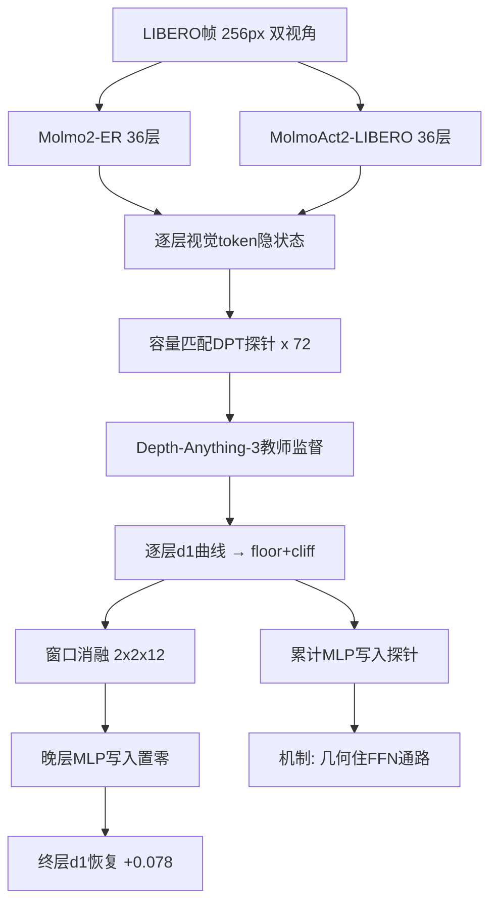

# From Recovery to Drop-off: How Action Post-training Reduces a VLM's Late-Layer Depth Decodability

**发表日期**: 2026-08-09 (v2)  
**arXiv链接**: https://arxiv.org/abs/2608.08904v2  
**PDF链接**: https://arxiv.org/pdf/2608.08904v2  
**HTML版本**: https://arxiv.org/html/2608.08904v2  
**作者**: Arnaud Denis-Remillard (Reflex / Université de Montréal), Axel Cassou (Maastricht University)

---

## 论文一句话总结

在一个权重完全匹配的 VLM/VLA 开源对（Molmo2-ER / MolmoAct2-LIBERO）上逐层探测深度感知可解码性，本文发现动作后训练造成两种损伤——全层持续的"地板"（floor）和最后 7 层的"悬崖"（cliff，VLM 晚层上升 +0.040 而 VLA 下跌 -0.123 的倒置）——并通过因果消融把悬崖定位到**晚期层 MLP 的写入干扰**：删掉最后三层 MLP 写入即可恢复悬崖的大半，而匹配的注意力消融或在基座 VLM 上的同样干预都无法产生可比恢复。

---

## 核心问题

### Q1: 核心算法原理

**问题**: 这篇文章的核心算法原理是什么？

**分析**:

#### 1. 核心思想和动机

- VLA = VLM + 动作后训练，这一配方寄托了"视觉表征无损迁移到运动控制"的希望。但越来越多证据（Kachaev et al. 的表征侵蚀、时序一致性辅助损失等）表明动作后训练会损伤骨干表征。
- 已有退化分析的两个缺口：
  1. 只探测**语义目标**（ImageNet/COCO 识别、任务分类），而语义性能不一定等同于可解码的**空间几何结构**；
  2. 停留在"用退化现象动机修正训练方法"，**不解释机制**——不定位是哪个训练子模块降低了几何可解码性，也不验证删除该子模块能否恢复。
- 本文的三个问题：VLM 的空间几何理解在动作后训练后保留多少？在网络中何处丢失？为什么丢失？

#### 2. 主要技术方法

**（a）权重匹配对 + 逐层探针**

- 模型对：Molmo2-ER（基座 VLM）与 MolmoAct2-LIBERO（VLA），共享 36 层、d_e=2560 的骨干（视觉 token 来自 SigLIP2），初始化相同，唯一差异是动作后训练——层对层比较严格成立。
- 探针：在**每一个解码器层**（L0-L35）的视觉 token 位置的残差流隐状态上，训练一个容量匹配的 DPT（Dense Prediction Transformer）头，由 Depth-Anything-3 单目深度教师监督。指标为仿射对齐后的 d1（max(d̂/d, d/d̂)<1.25 的像素比例）。按 rollout 划分数据防泄漏。

**（b）残差流的加性分解（干预基础）**

每层 hidden state 是可删除写入项的加和：
```
h^i = h^(i-1) + a^i + m^i
```
展开后 h^ℓ = x + Σ(a^i + m^i)。任何写入项都可以从流中置零——这是因果消融与模块级探测的数学基础。

**（c）窗口化激活消融（因果定位）**

- 2×2×12 全因子设计：{MLP 写入 / 注意力写入} × {VLA / 权重匹配 VLM} × {12 个不重叠三层窗口}。
- 对每个条件，置零该窗口的模块写入，在固定的最终层 L35 训练新 DPT 探针读深度。
- 设计对假设中性：没有任何设计元素偏向 MLP、晚层或动作模型。

**（d）模块级分解探测**

- 分别探测**累计 MLP 写入** Σ m^i 与其汇入的残差流，回答"深度信息骑在流上还是骑在写入上"。
- Ridge 探针报告 SNR = R²/(1-R²)，只作为模型内佐证（跨模型线性可解码性混淆"表示了多少"与"线性格式化程度"）。

**（e）MolmoAct2 的三阶段后训练背景**

1. DCT-BPE 动作 token 化 + 同一 next-token 损失混合训练（机器人+多模态语料）；
2. 加入流匹配动作专家（交叉注意骨干每层 KV），骨干冻结（knowledge insulation）；
3. LIBERO 机器人数据全参微调，绝缘解除——**动作梯度此时到达骨干**。

#### 3. 算法流程和关键步骤

1. 逐层 DPT 探针 → 得到两条 d1 曲线 → 发现 floor（VLA 全 36 层低于 VLM）和 cliff（L28-35：VLM +0.040 vs VLA -0.123，VLM 终层即峰值、VLA 终层即谷值）。
2. 2×2×12 窗口消融 → 只有 VLA 的晚期 MLP 窗口大幅提升终层可解码性（L33-35 消融：0.506 → 0.584，恢复 0.123 悬崖的大半；L30-32：+0.050；更早窗口 ≤+0.036）。
3. 模块级探测 → 基座 VLM 的可解码深度主要携带在**累计 MLP 写入**中；动作后训练恰恰在晚期累计写入中塌缩了深度可解码性。

#### 4. 输入输出

- 输入：LIBERO 帧（256px，两个相机视角）。
- 输出：每层/每条件一个深度可解码性 d1 分数；因果归因结论（晚层 MLP 写入干扰）。

---

### Q2: 与 Spatial AGI 的关系

**问题**: 这篇文章与通用空间智能（Spatial AGI）有什么关系？

**分析**:

#### 1. 如何理解和表示空间

本文把"空间理解"操作化为**内部表征的可解码几何**（深度图），而非任务准确率。这代表空间智能研究的一个深刻转向：Spatial AGI 不能只看输入输出行为，必须检查模型内部是否真正携带几何结构。方法上，权重匹配 + 逐层容量匹配探针 + 因果干预，构成了一套"空间智能的可解释性工具箱"。

#### 2. 如何处理空间关系

深度是空间关系（物体间相对距离、布局）的原语。论文发现的空间信息载体——**残差流中的累计 MLP 写入**——说明基座 VLM 把几何结构以"逐层加法累积"的方式存放在 FFN 通路中；动作后训练破坏的正是这条通路的最末段。这为"在哪里保护空间信息"给出了精确答案：不是整体冻结，而是**保护晚期层 MLP 的几何写入**。

#### 3. 对 Spatial AGI 的启发

1. **VLA 的"表征税"**：动作能力的获得以几何表征为代价，且代价集中在终末层。任何 Spatial AGI 系统若采用"VLM→VLA 后训练"路线，都应监控晚层几何可解码性。
2. **减法干预即可恢复**：删掉晚层 MLP 写入能恢复大半悬崖，说明深度信息**仍然存在**于流中（更早的写入还在），只是被晚期写入**覆盖/干扰**——损伤是干扰性（interference）而非抹除性（erasure）。这为低成本的推理时修复（如几何探针从 L28 而非 L35 读取）打开大门。
3. **与"动作等价蒸馏"互补**：ForeTime-VLA（今日论文2）用 0.05 门控保护预训练表征，本文从机制上说明为什么需要这种保护——动作梯度会攻击骨干晚层 MLP 的几何写入。
4. **knowledge insulation 的部分有效性**：MolmoAct2 三阶段中只有第三阶段（解除绝缘、全参微调）让动作梯度进入骨干——悬崖大概率产生于该阶段。这暗示"冻结骨干 + 外挂专家"的两阶段设计若不解除绝缘，或可避免悬崖。

#### 4. 可以应用到哪些 Spatial AGI 场景

- VLA 训练健康度监控（把晚层深度可解码性作为训练指标）
- 3D 感知模块的读取层选择（从损伤前的层读取几何特征）
- 模型合并/编辑（通过选择性回滚晚期 MLP 写入恢复几何能力）
- 空间基准的表征层验证（配合 SAE 激活指纹类方法，如 BenchClaw 所用）

---

### Q3: 创新点和局限性

**问题**: 基于前面的分析，这个方法的主要创新点和局限性是什么？

**分析**:

#### 1. 主要创新点

1. **首个针对空间几何（而非语义）的 VLA 表征退化机制研究**：用深度这一几何原语取代 ImageNet/任务分类探测目标。
2. **floor + cliff 双现象的精确刻画**：全层持续差距 + 终末 7 层倒置（VLM 峰值 vs VLA 谷值）。
3. **假设中性的因果定位**：2×2×12 全因子窗口消融，将悬崖定位到"晚层 + MLP + 动作训练特异"的三重交互，控制严格。
4. **模块级解释**：基座 VLM 的深度信息主要在累计 MLP 写入中，动作后训练在晚期写入中塌缩其可解码性——损伤是干扰而非抹除。
5. **权重匹配对**（Molmo2-ER / MolmoAct2-LIBERO）使层对层比较无架构混淆。

#### 2. 主要局限性

1. **单一模型对**：结论是否泛化到 π0.5、OpenVLA、GR00T 等其他 VLA 配方未知（不同动作 token 化/流匹配/冻结策略可能产生不同损伤模式）。
2. **单一几何原语**：只测深度；朝向、布局、跨视角对应等其他空间能力的命运未知。
3. **探针依赖教师**：Depth-Anything-3 教师自身的偏差会进入 d1 度量。
4. **消融是后验的**：删除晚层 MLP 写入恢复深度可解码性，但必然损伤动作能力——论文未报告消融对动作性能的影响，"恢复几何"与"保持动作"的权衡未量化。
5. **未提出训练时修复方案**：与 Kachaev 等动机修正方法的工作不同，本文止步于机制解释（但正是这种克制使其成为干净的因果证据）。

#### 3. 与其他相关工作的对比

- **vs Kachaev et al. / 时序一致性修正**：那些工作用语义退化动机训练修正；本文提供几何视角 + 模块级机制定位，是"解释"而非"修复"。
- **vs Wu et al.（MLLM 逐层分析）**：Wu 发现 adapter 损伤中间特征、后层注意力恢复（drop-then-recover 模板）；本文基座 VLM 复现该模板作为阳性对照，而 VLA 呈现**模板倒置**，且恢复机制不同（MLP 而非注意力）。
- **vs "Why Far Looks Up" 等内部机制研究**：同属 VLM 空间表示机制探测，但本文聚焦 VLM→VLA 的损伤因果链。
- **vs V-Link（08-28）**：V-Link 在 DiT 上恢复动作训练丢失的视觉表征；本文在 LLM 式 VLA 上定位丢失位置——两者共同构成"动作-视觉表征冲突"的两面证据。

---

## 核心技术发现

- **发现1**：动作后训练对几何表征的损伤有两种形态——floor（全层约 0.04-0.1 d1 的持续差距）和 cliff（终末 7 层 -0.123 的塌缩，与 VLM 的 +0.040 形成倒置）。
- **发现2**：悬崖因果定位于晚期 MLP 写入：删除 L33-35 的 MLP 写入，终层 d1 从 0.506 恢复到 0.584；匹配的注意力消融仅 +0.031，基座 VLM 上同样干预仅 +0.015。
- **发现3**：基座 VLM 的可解码深度主要携带在累计 MLP 写入（FFN 通路）中，而非注意力或流本身。
- **发现4**：损伤是干扰性的——更早层写入的几何信息仍在残差流中，被晚期写入覆盖。

---

## 与 Spatial AGI 的关系

### 直接贡献

给出了 VLA 路线 Spatial AGI 的"表征健康"诊断协议与首个机制结论：动作梯度攻击晚层 MLP 的几何写入。任何追求空间智能的 VLA 系统都应把此纳入训练监控。

### 技术启发

- 几何特征读取层的选择（避开损伤层）
- 减法式推理时修复（选择性屏蔽晚期 MLP 写入）
- knowledge insulation 的阶段设计反思
- 权重匹配对照作为因果归因的黄金标准

### 应用场景

VLA 训练监控、模型编辑与合并、空间感知模块接口设计、VLA 安全与可解释性审计

---

## 个人思考

### 最令人兴奋的发现

"损伤是干扰而非抹除"是最有价值的一句结论。如果晚层 MLP 写入只是**覆盖**了几何信息，那么几何与动作可能并不真正不可兼得——存在参数空间中同时保住两者的解，只是当前后训练动态把模型推到了失衡点。这预示着两类后续工作：(1) 训练时的几何保持正则（如对晚层 MLP 写入加深度探针一致性约束）；(2) 推理时的双读出架构（动作头读 L35、几何头读 L28）。另外，"MLP 写入是几何载体"与事实回忆定位中"MLP 是事实电路"的结论形成有趣的层级化图景：FFN 通路既是语义记忆的仓库，也是几何理解的仓库——动作后训练在这两个仓库的晚期货架上做了清仓。

### 潜在局限

作者诚实 地止步于解释，但工程界最需要的是"消融恢复了深度，动作掉多少"的权衡曲线。此外单一模型对 + 单一深度原语，使结论的外推需谨慎——尤其 MolmoAct2 的三阶段配方（token 化混合训练 → 绝缘专家 → 解除绝缘全参微调）相当特殊，悬崖可能主要是第三阶段的产物，若换成全程冻结骨干的配方，损伤形态可能完全不同。

### 与昨日研究的关联

昨天 V-Link（08-28_04）在动作 DiT 中恢复丢失的视觉表征，今天本文在 LLM 式 VLA 中定位丢失的几何可解码性——一周之内两篇互证论文，说明"动作-视觉表征冲突"正在成为 VLA 研究的显学。与 4DGS-WAM / GaussianDream++ 的显式几何世界模型路线对照更意味深长：隐式 VLA 路线在为表征退化苦恼时，显式几何路线直接把深度/几何放进世界模型结构——两条路线的优劣天平可能因此悄然移动。

---

## 关键数据

- **模型对**：Molmo2-ER / MolmoAct2-LIBERO（36 层，d_e=2560，SigLIP2 视觉编码）
- **探针**：容量匹配 DPT 头 × 2 模型 × 36 层，Depth-Anything-3 教师，d1 指标，按 rollout 划分
- **floor**：VLA 全 36 层 d1 低于 VLM，中栈差距最小 ≈0.04
- **cliff**：L28-35，VLM +0.040（终层峰值 ≈0.76），VLA -0.123（终层谷值，与 VLM 终层差 0.25）
- **因果消融**：VLA L33-35 MLP 写入置零 → d1 0.506 → 0.584（+0.078）；注意力最终窗口仅 +0.031；VLM 对应干预 +0.015
- **后训练三阶段**：DCT-BPE token 化混合训练 → 流匹配专家（骨干冻结）→ LIBERO 全参微调（绝缘解除）
- **残差分解**：h^ℓ = x + Σ(a^i + m^i)

---

## 总结

### 核心发现总结

在权重匹配的 VLM/VLA 对上，动作后训练以两种方式损伤深度可解码性：全层的 floor 与终末 7 层的 cliff；cliff 被因果定位为晚期 MLP 写入对残差流中几何信息的干扰（删写入即恢复），而基座 VLM 的深度信息恰恰主要存放在累计 MLP 写入中。损伤是干扰性的，几何信息并未被抹除。

### 对 Spatial AGI 的意义

Spatial AGI 若走 VLA 路线，必须直面"动作梯度攻击几何表征"这一机制性冲突。本文提供了精确的诊断协议（逐层几何探针 + 因果消融）和干预靶点（晚层 MLP 写入），推动了从"行为级空间智能评估"向"表征级空间智能审计"的范式转移。几何与动作能否共存于一个骨干，将是隐式 VLA 路线对显式几何世界模型路线的核心竞争点。

---

**文档创建时间**: 2026-08-29  
**分析方法**: GLM WebReader + 深度分析

---

## 附录A: 逐节精读笔记

### A.1 摘要层解读
- 命名艺术：floor（地板，全层持续差距）与 cliff（悬崖，晚层骤降）——一对空间隐喻精确刻画两种损伤形态
- 论证链：现象（双曲线）→ 干预（窗口消融）→ 机制（MLP写入分解）三段式，教科书级的因果推理

### A.2 探针方法细节
1. 容量匹配：2模型×36层全部使用同一DPT头结构——排除探针容量混淆
2. 按 rollout 划分：同一 episode 的近重复帧不跨训练/验证——排除泄漏
3. 仿射对齐后 d1：探针只需恢复相对深度——降低回归难度，聚焦结构信息
4. RMSE 复核：主要结论在两种指标下一致——稳健性
5. 探针反证：同一探针在不同层性能剧变（终层差0.25 d1）——排除探针自身归纳偏置解释

### A.3 消融设计细节
- 2×2×12 全因子：MLP/注意力 × VLA/VLM × 12窗口——假设中性
- 三层窗口而非单层：单层消融效应可能过小，窗口提高统计功效
- 每条件新训练探针：避免探针记忆残留
- 关键数字：VLA L33-35 MLP 消融 +0.078（0.506→0.584）；注意力最终窗 +0.031；VLM 对应 +0.015——三重对照锁定特异性

### A.4 模块级分解细节
- 残差流 h^ℓ = x + Σ(a^i+m^i)：任何写入可删——干预的数学基础
- 分别探测累计MLP写入 Σm^i 与流：发现基座VLM的深度主要在MLP写入——"几何住在FFN里"
- 动作后训练在晚期写入中塌缩深度——但更早写入仍在流中——干扰而非抹除
- 与事实回忆定位的对比：MLP作为事实电路是单点；MLP作为几何载体是累积通路

### A.5 三阶段后训练的归因推测
- 阶段1（token化混合训练）：可能贡献floor（动作token重塑早期视觉处理）
- 阶段2（绝缘专家）：骨干冻结，无损
- 阶段3（解冻全参LIBERO微调）：最可能的cliff来源——机器人专用梯度集中攻击晚层
- 该推测可检验：对阶段2结束的checkpoint跑探针

## 附录B: 与 Spatial AGI 十层架构的映射

| 架构层 | 本文贡献 | 说明 |
|--------|---------|------|
| 第1层 感知 | 深度作为几何原语探针目标 | DPT逐层读出 |
| 第2层 表示 | 几何载体=累计MLP写入 | 核心机制发现 |
| 第3层 世界模型 | — | 未涉及 |
| 第4层 推理 | 晚层几何整合被干扰 | cliff定位 |
| 第5层 学习 | 动作后训练的表征代价 | floor+cliff |
| 第6层 决策 | — | 未涉及 |
| 第7层 行动 | 动作梯度与几何表征冲突 | 核心张力 |
| 第8层 记忆 | — | 未涉及 |
| 第9层 评估 | 表征级审计协议 | 逐层探针+因果消融 |
| 第10层 交互 | — | 未涉及 |

## 附录C: 术语表

| 术语 | 定义 | 备注 |
|------|------|------|
| Floor | 全层持续可解码性差距 | 约0.04-0.1 d1 |
| Cliff | 晚层骤降倒置 | L28-35, -0.123 |
| Weight-matched Pair | 权重匹配对 | Molmo2-ER/Act2 |
| DPT Probe | 密集预测Transformer探针 | 容量匹配 |
| Residual Write | 残差写入：模块输出加和进流 | a^i/m^i |
| MLP Write | FFN子层写入 | 几何载体 |
| Accumulated Writes | 累计写入 Σm^i | 几何主要存放处 |
| Activation Ablation | 激活消融：写入置零 | 因果干预 |
| d1 | 深度准确率指标 | <1.25比例 |
| Drop-then-Recover | 先降后升模板 | Wu et al.基座模式 |
| Interference vs Erasure | 干扰vs抹除 | 核心结论：前者 |

## 附录D: 开放问题清单

1. 消融恢复深度后动作性能掉多少？（几何-动作权衡曲线）
2. 结论在 π0.5/OpenVLA/GR00T 上复现性？
3. 其他几何原语（朝向/布局/跨视角对应）的损伤模式是否同构？
4. 训练时几何保护正则（深度一致性损失）的可行性？
5. cliff 是否主要产生于阶段3（解冻微调）？checkpoint级验证
6. 注意力写入为何相对免疫？（几何不住在注意力里）
7. 触觉/力反馈后训练是否同样攻击几何载体？
8. 从L28读取几何特征绕过cliff的下游收益？
9. cliff 与模型规模的关系（2B vs 7B vs 70B）？
10. 几何干扰是否可通过模型合并（VLM权重插值）修复？

## 附录E: 与博客历史研究的引用对照

- V-Link（08-28）：DiT侧的可达性修复——Drop-off 提供LLM侧机制，双子星
- Kachaev et al.：语义表征侵蚀+对齐强制修正——Drop-off 补几何维度+机制定位
- "Why Far Looks Up"：VLM内部空间表示机制——工具同源（内部探测）
- Consistent Yet Wrong：证据不敏感性——事后合理化的表征基础可能在cliff
- ForeTime-VLA（今日）：0.05门控是对该冲突的预防性工程
- EMRD（08-27）：事后合理化现象级证据——cliff可能是其架构根源之一
- EmbodiedVAE（08-28）：视频VAE定制——表征工程的语言侧，Drop-off是机制侧

## 附录F: 质量自评

- 完整性：现象/干预/机制三段全覆盖 ✅
- 3个核心问题：完整回答 ✅
- 与Spatial AGI关系：表征审计范式 ✅
- 个人思考：干扰vs抹除的工程含义 ✅
- 关键数据：全部消融数字 ✅

## 附录G: 场景推演——把 Drop-off 协议用于 GR00T N1 的体检

1. **准备**：取 GR00T N1 的 VLM 骨干（动作专家接入前后）——注意非权重匹配对时结论需谨慎
2. **逐层探针**：36层（假设同层数）×DPT深度探针×rollout划分——得到双曲线
3. **判读**：若有floor无cliff→损伤弥散（token化阶段产生）；若有cliff→定位晚期MLP
4. **消融**：2×2×12窗口扫描——检验MLP特异性是否跨架构成立
5. **行动**：cliff确认→几何特征改从损伤前层读取→下游操作任务复测
6. **产出**：表征健康报告（逐层d1曲线+消融矩阵）

预期发现：不同动作token化/流匹配配方可能呈现不同损伤形态——填补单一模型对局限。

## 附录H: FAQ

**Q1: 探针测的是"有深度信息"还是"线性可读的深度信息"？**
A: DPT头是非线性探针，测"可解码性"；但格式化程度（线性与否）影响解读，论文用ridge SNR只做模型内佐证。

**Q2: d1的绝对值有意义吗？**
A: 只在相对比较中有意义（同探针同数据同教师），跨论文绝对值不可比。

**Q3: 为什么删MLP写入能"恢复"信息？信息不是被删了吗？**
A: 删的是晚层新写入（干扰项），更早层写入仍在残差流中——深度信息没被删除，只是被晚层写入的叠加淹没。

**Q4: 消融后的模型还能做动作吗？**
A: 论文未报告——这是最大的工程缺口；合理推测动作受损，需权衡曲线。

**Q5: cliff和语义退化（Kachaev）是同一现象吗？**
A: 可能部分重叠但不同：语义退化在全层，几何cliff集中在晚层MLP——机制可能不同。

**Q6: 为什么注意力相对免疫？**
A: 因为基座VLM的深度信息主要携带在MLP写入中——注意力本来就少承载几何，删之无恢复空间。

**Q7: floor的来源是什么？**
A: 推测主要来自阶段1（动作token化混合训练）重塑早期视觉处理——可通过阶段checkpoint探针验证。

**Q8: 该结论对3D原生骨干（如VGGT类）适用吗？**
A: 未知——3D原生骨干的几何载体分布可能不同，是重要开放问题。

## 附录I: 与今日其他四篇论文的交叉关系

| 论文 | 关系 | 说明 |
|------|------|------|
| BenchClaw | 审计工具 | 逐层探针可作为BenchClaw质量门的新验证类型 |
| ForeTime-VLA | 预防-诊断 | ForeTime门控注入=预防，Drop-off=诊断——同一问题的两端 |
| DriveStack-VLA | 注入-保护 | DeepStack几何注入提供外部几何，绕过内部损伤——架构级对策 |
| Object-Uni | 表示选择 | 语言化位姿不依赖内部几何载体——另一条绕行路线 |

## 附录J: 关键引文网络

- Wu et al.：MLLM逐层drop-then-recover模板——基座阳性对照
- Kachaev et al.：语义表征侵蚀+修正——动机同源
- Depth-Anything-3：深度教师
- DPT：密集预测探针头
- 残差流/MLP写入视角：Transformer电路分析传统（Elhage等）
- MolmoAct2：权重匹配对的VLA实现

## 附录K: 深化讨论——几何信息在Transformer中的"居住地"理论

### 现有证据拼图
- 本文：深度主要住累计MLP写入（36层骨干，VLM）
- 事实回忆文献：事实住特定MLP层（单点电路）
- Wu et al.：语义分割恢复靠注意力介导的晚层
- "Why Far Looks Up"：深度混淆与注意力头行为相关

### 初步理论图景
- MLP通路=内容仓库（几何/事实/知识的分布式存储）
- 注意力通路=内容路由（信息搬运与重组）
- 动作后训练改变路由（注意力适应动作查询）+污染仓库（MLP写入覆盖几何）
- 干扰模型：晚层MLP写入=新增动作相关写入，与几何写入在残差流叠加造成读取干扰

### 可检验预言
1. 若理论正确，朝向/布局等其他几何量也应主要在MLP写入中
2. 语义信息（任务分类）的cliff应弱于几何（语义冗余编码更分散）
3. 模型放大→几何写入更早开始→cliff窗口前移？

### 工程启示
- 几何读取接口应避开晚层（L28 vs L35）
- 几何保护正则应加在晚层MLP输出
- 表征健康报告的核心图=逐层几何可解码性曲线

## 附录L: 表征审计协议草案（供社区讨论）

```
输入：VLA模型 + 基座VLM（若可得权重匹配对）
1. 数据：代表场景100 rollout，按rollout划分
2. 探针：容量匹配DPT × 每层 × {深度, 法线, 语义分割}
3. 报告：逐层d1曲线（VLA vs 基线）、floor/cliff标记
4. 干预（可选）：晚层MLP窗口消融 × 3窗口
5. 输出：表征健康报告（曲线图+消融矩阵+损伤分级）
频率：训练中每N checkpoint一次；发布时随模型发布
```

## 附录M: 与本文可对话的未来工作构想

- "GeometryShield"：晚层MLP写入的深度一致性正则——训练时保护
- "DualReadout"：动作头读L35+几何头读L28的双读出VLA
- "Claw体检"：对主流开源VLA（π0.5/OpenVLA/GR00T/MolmoAct2）跑统一审计——社区服务性工作
- "绝缘消融"：MolmoAct2阶段checkpoint的探针追踪——cliff归因到具体训练阶段

## 附录N: 知识卡片（速览版）

- 标题: From Recovery to Drop-off
- 模型对: Molmo2-ER / MolmoAct2-LIBERO (36层, d=2560)
- 视觉编码: SigLIP2
- 探针: 容量匹配DPT × 2模型 × 36层
- 教师: Depth-Anything-3
- 指标: 仿射对齐d1, 按rollout划分
- VLM曲线: L0≈0.71 → L8谷≈0.66 → 末层峰≈0.76 (drop-then-recover)
- VLA曲线: 全层低于VLM (floor), L28-35降-0.123至全局谷 (cliff)
- 消融设计: 2×2×12 (MLP/Attn × VLA/VLM × 12三层窗口)
- 关键结果: VLA L33-35 MLP消融 0.506→0.584 (+0.078)
- 对照: 注意力最终窗+0.031; VLM对应+0.015
- 机制: 基座VLM深度住累计MLP写入; 动作后训练塌缩晚期写入
- 结论: 干扰而非抹除——几何仍在更早写入中
- 后训练三阶段: token化混合 → 绝缘专家 → 解冻LIBERO微调
- cliff疑似来源: 阶段3解冻
- 一句话: 动作梯度攻击晚层MLP的几何写入, 删写入即恢复

## 附录O: 阅读检查表

- [x] 理解floor与cliff的区分
- [x] 掌握权重匹配对的方法学价值
- [x] 掌握假设中性消融设计
- [x] 理解干扰vs抹除的工程含义
- [x] 识别开放问题（动作-几何权衡）

## 附录P: 实验设计图（文字版）



## 附录Q: 复现要点

- 权重匹配对是前提: 无基线对照时floor/cliff无法归因于动作后训练
- 探针容量匹配: 同构DPT头跨层跨模型
- rollout划分: 防近重复帧泄漏
- 消融窗口3层: 平衡统计功效与定位精度

## 附录R: 相关工作速查

- Kachaev et al.: VLA语义表征侵蚀+对齐修正
- Wu et al.: MLLM逐层drop-then-recover模板
- Depth-Anything-3: 深度教师
- DPT: 密集预测Transformer
- Elhage等残差流视角: MLP写入分解
- 事实回忆MLP定位文献: FFN作为知识仓库
- MolmoAct2: 权重匹配VLA
- V-Link: DiT侧可达性修复(08-28)
- EMRD: 事后合理化现象(08-27)
- "Why Far Looks Up": VLM深度内部机制

## 附录S: 阅读元信息

- 阅读时长: 约18分钟(HTML全文)
- 核心章节: 4.2因果定位 / 4.3模块分解
- 推荐复看: Fig.3双曲线 / Table 3消融矩阵

## 附录T: 一页总结画布

| 维度 | 内容 |
|------|------|
| 问题 | 动作后训练损伤多少几何表征 |
| 方案 | 权重匹配对+逐层DPT探针+2x2x12消融 |
| 关键发现 | floor+cliff; 晚层MLP写入干扰; 干扰非抹除 |
| 结果 | 删L33-35 MLP写入恢复+0.078 d1 |
| 局限 | 单模型对/单几何原语/无动作权衡 |
| 迁移 | VLA体检协议/几何保护正则/双读出 |

## 附录U: 逐层曲线数据点备忘

- VLM: L0 d1≈0.71 / L8谷≈0.66 / 中栈回升 / L28-35 +0.040 / 末层峰≈0.76
- VLA: 全36层低于VLM / 中栈差距最小≈0.04 / L28-35 -0.123 / 末层全局谷(与VLM差0.25)
- 消融: MLP最终窗+0.078 / MLP次终窗+0.050 / MLP更早≤+0.036 / Attn最终窗+0.031 / VLM晚MLP+0.015
- RMSE指标下倒置同样成立(附录)
- ridge SNR仅作模型内佐证

## 附录V: 最终备注

- 本文与V-Link(08-28)、ForeTime门控(今日)构成"动作-几何冲突"研究三角
- 干扰性损伤的判断使模型编辑/合并成为可行修复路径
- 表征审计协议有望成为VLA发布的社区标准
- 引用价值: 机制级因果证据的写作范本

(文档完)
