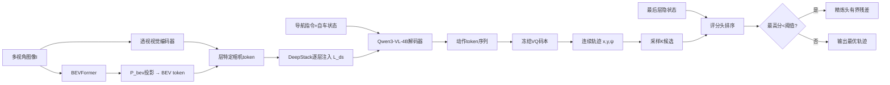

# DriveStack-VLA: Render-Teacher Alignment for BEV-Based DeepStack Vision-Language-Action Model

**发表日期**: 2026-06-23  
**arXiv链接**: https://arxiv.org/abs/2606.24051v1  
**PDF链接**: https://arxiv.org/pdf/2606.24051v1  
**HTML版本**: https://arxiv.org/html/2606.24051v1  
**作者**: Zhenru Zhao, Shuangming Lei, Hao Su, Yuehao Huang, Yijia Xie, Kai Tang, Guanglin Xu, AiXue Ye, Yukai Ma, Yong Liu  
**机构**: 浙江大学、华为2012实验室

---

## 论文一句话总结

DriveStack-VLA 在 Qwen3-VL-4B 骨干上为 VLA 驾驶补上"驾驶导向的空间智能"：通过 DeepStack 接口把 BEVFormer 生成的鸟瞰图表征逐层注入 LLM 解码器、用光栅化图像作为教师对齐真实图像的感知焦点（Render-Teacher Alignment）、再以轻量评分-精炼头对候选轨迹排序与残差修正，在 NAVSIMv1/v2 和 Bench2Drive 上取得 91.6 PDMS / 91.0 EPDMS / 79.49 DS 的 SOTA 级表现。

---

## 核心问题

### Q1: 核心算法原理

**问题**: 这篇文章的核心算法原理是什么？

**分析**:

#### 1. 核心思想和动机

论文的诊断：现有 VLA 驾驶模型**缺乏驾驶导向的空间智能**——

1. **表征缺陷**：策略主要接地在透视图像 token 和语言先验上，而精确运动规划需要度量几何、俯视场景结构和对安全关键感知线索的注意。透视 token 视角依赖、跨相机跨时刻冗余、只隐式编码规划所需的俯视几何。
2. **数据缺陷**：专家演示对罕见、安全关键、恢复型场景覆盖不足；光栅化/渲染视图可扩展地提供更干净的几何结构和反事实场景，但直接与真实图像混合会引入域间隙——关键不是合成特征像不像真实，而是**动作解码器在两个域下是否注意同样的规划相关线索**。

三大对策：BEV 几何注入（模型侧）、渲染教师对齐（数据侧）、自批评轨迹选择（轨迹侧）。

#### 2. 主要技术方法

**（a）BEV DeepStack 注入**

- BEV 编码器基于 BEVFormer，从多视角图像 + 相机参数提取俯视特征图，经与 Qwen3-VL PatchMerger 同构的投影 P_bev 生成 BEV token。
- 利用 Qwen3-VL 的 DeepStack 接口（逐层视觉记忆）：对注入层集合 L_ds 中的每层 ℓ，BEV 通路派生层特定 BEV token Z^bev_ℓ，视觉编码器提供层特定相机 token Z^cam_ℓ，拼接 V_ℓ = [Z^cam_ℓ; Z^bev_ℓ] 作为该层 DeepStack 记忆。
- 效果：相机外观线索 + 俯视几何先验在多层深度融合，为长程驾驶上下文提供稳定几何接地。

**（b）Render-Teacher Alignment（RTA）**

按 RAP 方法构建配对的光栅化图像（突出车道、智能体、信号灯），把光栅化图像当**教师模态**：

1. **掩码相机 token 对齐**：
   - 光栅化图像有大片黑色背景，直接特征对齐会被背景主导；
   - 用 render 引导的软掩码下调背景 token 权重：`w_k = clip((p̄_k+1)/2τ, 0, 1)^γ`（p̄_k 为光栅化 patch 的归一化平均像素，τ 控制前景阈值，γ 控制锐度）；
   - 掩码加权 MSE 对齐：`L_mask = Σ w_k‖z^r_k − sg(z^m_k)‖² / (Σ w_k + ε)`，教师侧 stop-gradient。
2. **动作-视觉注意力蒸馏**：对齐真实图像与光栅化图像下动作 token 对视觉 token 的注意力分布——确保动作解码在两个域中关注同样的规划线索（这是 RTA 区别于普通域适应的核心）。

**（c）三阶段训练**

| 阶段 | 目标 | 冻结 | 训练 |
|------|------|------|------|
| Stage 1: SFT | BEV 注入 + RTA（掩码对齐 + 注意力蒸馏） | 视觉编码器、BEV 编码器 | LLM 解码器 + 相机/BEV 投影层 |
| Stage 2: RFT | GRPO 对齐采样提案分布（驾驶奖励 + 格式奖励保证动作 token 严格可解码） | 投影层 | actor |
| Stage 3: 评分精炼 | 训练 critic 头 | actor | 轻量评分/精炼头 |

**（d）Actor-Critic 架构**

- **Actor**：Qwen3-VL-4B + 透视视觉编码器 + BEV 编码器；输出定长动作尾——轨迹按秒离散为 S 个 VQ 段，每段预测 scale token + traj code token，冻结的动作码本（VQAE 风格）解码为连续轨迹 τ = {(x_t, y_t, ψ_t)}，保证物理有效。
- **Critic**：复用 LLM 解码器最后层隐状态 + 候选轨迹；评分头输出标量质量分排序候选；若最高分低于阈值，精炼头（注意力块）预测有界残差修正最优轨迹。避免文本生成式 critique 的慢速迭代循环。

#### 3. 算法流程和关键步骤

多视角图像 + 导航指令 + 自车状态 → VLM 主干（逐层注入 BEV+相机 DeepStack 记忆）→ 动作 token 序列 → 冻结码本解码轨迹 → 采样 K 条候选 → 评分头排序 →（低分则）精炼头残差修正。

#### 4. 输入输出

- 输入：C 路相机图像、导航指令 x、自车状态 u。
- 输出：T 步未来轨迹（平面位移 + 航向角）。

---

### Q2: 与 Spatial AGI 的关系

**问题**: 这篇文章与通用空间智能（Spatial AGI）有什么关系？

**分析**:

#### 1. 如何理解和表示空间

DriveStack-VLA 的空间表示是**双视图融合**：透视视图保留外观语义（Qwen3-VL 的世界知识入口），BEV 视图提供度量化的俯视几何（车道拓扑、智能体相对位置、可行驶区域）。这种"外观流 + 几何流"的显式分流，正面回应了 VLA 驾驶中"语言级推理无法支撑空间决策"的问题。DeepStack 逐层注入使几何不是一次性 prefix，而是深度参与每一层推理的持续先验。

#### 2. 如何处理空间关系

- BEV 坐标系天然编码度量距离与拓扑关系；
- 注意力蒸馏保证动作 token 对安全关键空间线索（车道、智能体、信号灯）的注意在真实/渲染两个域一致——即**空间注意的可迁移性**被显式监督；
- critic 对候选轨迹的空间质量评分（安全、进度、舒适）构成空间决策的第二道防线。

#### 3. 对 Spatial AGI 的启发

1. **几何流注入优于几何后处理**：与其在 VLM 输出后接规划器，不如把 BEV 表征通过 DeepStack 逐层喂入解码器——几何先验参与而非旁观推理过程。该范式可迁移到导航 VLA（俯视地图注入）、机器人 VLA（体素/占据注入）。
2. **"渲染教师"是空间监督的新形态**：光栅化图像是场景几何的纯净投影，用它对齐真实感知的注意力焦点，相当于用"几何真值"监督"空间注意"。这与 ForeTime-VLA 用 WAM 蒸馏未来、BenchClaw 用证据接地出题一脉相承：**空间监督越来越多来自结构化的教师信号（渲染/WAM/仿真状态），而非纯人类标注**。
3. **动作 token + VQ 码本**：离散化保证语法可解码（配合格式奖励），码本保证物理有效性——动作空间的结构化设计仍是 VLA 的关键工程。
4. **测试时轨迹择优**：best-of-K 采样 + 评分 + 条件精炼，是无需求助慢速语言 critique 的 test-time scaling。

#### 4. 可以应用到哪些 Spatial AGI 场景

- 端到端自动驾驶（直接应用）
- 机器人导航 VLA（俯视/占据图 DeepStack 注入）
- 无人机航线规划（BEV → 3D 占据注入）
- 任何需要"外观语义 + 度量几何"双流的 Spatial AGI 系统

---

### Q3: 创新点和局限性

**问题**: 基于前面的分析，这个方法的主要创新点和局限性是什么？

**分析**:

#### 1. 主要创新点

1. **BEV DeepStack 注入**：首次（在 VLA 驾驶中）利用 Qwen3-VL 的逐层视觉记忆接口注入外部几何表征，相机 token 与 BEV token 层级融合。
2. **Render-Teacher Alignment**：不止对齐特征（掩码加权 MSE），更对齐**动作-视觉注意力**——把域适应的目标从"看起来像"升级为"注意得对"，且无需额外对抗域头。
3. **轻量自批评模块**：评分 + 条件精炼头复用解码器隐状态，避免文本 critique 循环的推理延迟。
4. **三阶段解耦训练**（SFT→GRPO RFT→critic 头），每阶段冻结策略清晰。
5. **双基准验证**：NAVSIMv1/v2（真实日志开环）+ Bench2Drive（闭环仿真）同时 SOTA。

#### 2. 主要局限性

1. **BEV 编码器依赖 BEVFormer**：需要相机参数、标定质量敏感；BEV 分支本身未与主干联合端到端预训练，其表征上限受限。
2. **光栅化教师的质量依赖**：RAP 光栅化基于标注真值（车道/智能体框），训练时可用但限制了完全从原始数据自监督扩展。
3. **闭环证据仍来自仿真**（Bench2Drive），真实道路闭环验证缺失；56.36% 成功率说明长尾场景仍难。
4. **critic 的阈值超参**：条件精炼的触发阈值是预设的，不同场景最优阈值可能不同。
5. **计算开销**：4B VLM + BEVFormer + K 候选评分，端侧部署压力较大（论文未详细报告延迟）。

#### 3. 与其他相关工作的对比

- **vs AutoVLA**：AutoVLA 也用动作 token + GRPO；DriveStack 增加了 BEV 几何注入和渲染教师对齐，空间接地更强。
- **vs ReCogDrive / SGDrive**：它们只对独立扩散规划器做 RL，奖励不直接优化 VLM；DriveStack 直接对 actor 做 GRPO + 格式奖励。
- **vs WAM-Diff**：WAM-Diff 用世界模型监督扩散规划器；DriveStack 用渲染几何对齐注意力——两种"用结构化教师强化空间性"的路径。
- **vs UniDriveVLA / ExploreVLA**：同为统一驾驶 VLA，DriveStack 的差异点是 DeepStack 逐层几何注入这一具体接口。

---

## 核心技术发现

- **发现1**：BEV 表征通过 DeepStack 逐层注入 LLM 解码器，可与透视 token 层级融合，为长程规划提供稳定几何先验。
- **发现2**：对齐"动作-视觉注意力"比只对齐特征更能让渲染增强真正迁移到真实域部署。
- **发现3**：掩码加权（前景主导）对齐可避免光栅化背景主导特征对齐。
- **发现4**：VQ 码本 + 格式奖励保证动作 token 严格可解码与物理有效。
- **发现5**：复用解码器隐状态的轻量评分/精炼头即可实现有效 test-time 轨迹择优。

---

## 与 Spatial AGI 的关系

### 直接贡献

给出 VLA 驾驶"空间智能补强"的完整工程范式：几何流注入（模型）+ 渲染教师对齐（数据）+ 轨迹批评（决策），三管齐下把度量几何带入语言驱动的驾驶策略。

### 技术启发

- DeepStack 式外部表征逐层注入可推广到占据图、3DGS 特征、语义地图
- 注意力层面的教师蒸馏（而非特征层面）是空间监督迁移的关键
- 域增强的评价标准应是"注意力一致性"而非"外观相似性"

### 应用场景

自动驾驶、机器人导航、无人机规划、任何双流（语义+几何）Spatial AGI 架构

---

## 个人思考

### 最令人兴奋的发现

"对齐注意力而非对齐特征"是本文最锋利的观点。域适应的传统智慧是特征对齐（缩小 embedding 距离），但 DriveStack 指出：对 VLA 而言，真正要迁移的是**动作 token 看向哪里**——如果动作在合成域注意车道而在真实域注意纹理，特征再像也无济于事。这个原则放到更大语境下：Spatial AGI 的空间监督应该在"注意力/因果通路"层面传递，而不仅仅是表征层面。这与今天论文3（晚层 MLP 写入干扰深度解码）形成有趣互补：一个说几何信息被晚期计算干扰，一个说空间注意力可以通过教师显式塑造——**空间信息在哪里、被谁读、如何保护**，正在成为空间智能机制研究的三部曲。

### 潜在局限

渲染教师的"纯净几何"是一把双刃剑：它教会模型注意正确的线索，但也可能让模型过度依赖"干净结构"，在真实世界感知噪声（遮挡、光照、恶劣天气）下退化。Bench2Drive 的 56% 成功率部分印证了长尾难度。此外，BEV 作为 2.5D 表示，对高度方向（立交、悬挂障碍）的建模天然不足——3D 占据注入可能是下一代方向。

### 与昨日研究的关联

昨天精读的 EMRD（Embodied VLMs 安全关键）关注安全关键场景评估，DriveStack 的注意力对齐正是提升安全关键线索（信号灯、横穿智能体）注意的机制性手段；AeroGround（空中-地面协作推理）与本文同属"跨视角空间理解"，BEV 注入范式可直接迁移到空地协作的俯视-地面视角融合。4DGS-WAM 的显式 4D 几何 vs 本文的 BEV 注入，是"世界作为显式模型"与"几何作为推理先验"的又一次对照。

---

## 关键数据

- **骨干**：Qwen3-VL-4B；BEV 编码器 BEVFormer；动作 VQ 码本（冻结）
- **DeepStack 注入**：逐层拼接 [相机 token; BEV token] 作为层特定视觉记忆
- **RTA**：掩码权重 `w_k = clip((p̄_k+1)/2τ,0,1)^γ`；掩码加权 MSE + 动作-视觉注意力蒸馏（教师 stop-gradient）
- **训练**：Stage1 SFT（冻视觉/BEV 编码器）→ Stage2 GRPO（驾驶奖励+格式奖励）→ Stage3 critic 头
- **NAVSIMv1**: 91.6 PDMS；**NAVSIMv2**: 91.0 EPDMS（人类惩罚过滤开启）；**Bench2Drive**: 驾驶分 79.49，成功率 56.36%
- **动作表示**：每秒一个 VQ 段（scale token + traj code token），解码为 T 步 (x, y, ψ)

---

## 总结

### 核心发现总结

DriveStack-VLA 通过 BEV DeepStack 逐层注入、渲染教师注意力对齐和轻量轨迹自批评三重设计，为 VLA 驾驶补上度量几何与安全注意的空间接地，在开环与闭环基准上同时达到 SOTA。

### 对 Spatial AGI 的意义

本文示范了 Spatial AGI 的一个通用配方：**外部几何表征不应停留在输入端，而应逐层进入推理通路；空间监督应对齐注意力而非外观；决策端应有多假设择优**。这一配方超越驾驶本身，为导航、飞行、操作等各类具身空间智能系统提供了可复用的架构模式。

---

**文档创建时间**: 2026-08-29  
**分析方法**: GLM WebReader + 深度分析

---

## 附录A: 逐节精读笔记

### A.1 摘要层解读
- 三个基准数字的分工：NAVSIMv1 91.6 PDMS（开环真实日志）、NAVSIMv2 91.0 EPDMS（含人类惩罚）、Bench2Drive 79.49/56.36%（闭环仿真）——开环+闭环双验证
- 论证结构：诊断（透视token缺度量几何+演示覆盖不足）→ 模型侧（BEV注入）→ 数据侧（渲染教师）→ 决策侧（自批评）

### A.2 BEV DeepStack 细节
1. BEVFormer 提取俯视特征图 → PatchMerger 同构投影 → BEV token
2. Qwen3-VL 的 DeepStack 接口接受逐层视觉记忆——注入层集合 L_ds 每层派生层特定 BEV token
3. V_ℓ = [相机token; BEVtoken] 拼接——外观与几何在每层融合
4. 意义：几何先验参与每一层注意力计算，而非只做输入前缀

### A.3 RTA 公式细节
- 掩码权重：w_k = clip((p̄_k+1)/2τ, 0,1)^γ——黑色背景（p̄≈-1）权重≈0，前景权重≈1
- τ 控制前景阈值、γ 控制锐度——两个超参调节软掩码形状
- 掩码加权 MSE：分母 Σw_k+ε 归一化——背景不主导对齐
- 注意力蒸馏：对齐真实/渲染两域下动作token对视觉token的注意力分布（方法源自已有蒸馏文献bib32）
- 教师stop-gradient：渲染侧不接收梯度

### A.4 三阶段训练细节
- Stage1：冻结视觉+BEV编码器，训练解码器+投影层；RTA两项损失（掩码对齐+注意力蒸馏）
- Stage2：GRPO——驾驶奖励（规划指标）+格式奖励（动作token严格可解码）；冻结投影层
- Stage3：冻结actor，训练评分头+精炼头（复用最后层隐状态）
- 动作表示：每秒一个VQ段（scale+traj双token），冻结码本保证物理有效

### A.5 自批评模块细节
- 评分头：最后层视觉隐状态+候选轨迹 → 标量质量分 → 排序
- 精炼头：最高分低于阈值时触发，注意力块预测有界残差
- 避免文本critique循环：无冗余文本生成，推理高效

## 附录B: 与 Spatial AGI 十层架构的映射

| 架构层 | 本文贡献 | 说明 |
|--------|---------|------|
| 第1层 感知 | 多视角相机+BEV双流 | 外观+几何分流 |
| 第2层 表示 | BEV俯视度量表示 | DeepStack逐层注入 |
| 第3层 世界模型 | 渲染教师提供反事实场景 | 数据侧世界增强 |
| 第4层 推理 | 几何先验参与每层推理 | DeepStack机制 |
| 第5层 学习 | 注意力蒸馏+GRPO+格式奖励 | 三阶段课程 |
| 第6层 决策 | 评分-精炼双头best-of-K | 轻量test-time scaling |
| 第7层 行动 | VQ码本轨迹解码 | 物理有效保证 |
| 第8层 记忆 | — | 未涉及显式记忆 |
| 第9层 评估 | NAVSIM+Bench2Drive双基准 | 开环+闭环 |
| 第10层 交互 | 导航指令接口 | 语言目标 |

## 附录C: 术语表

| 术语 | 定义 | 备注 |
|------|------|------|
| DeepStack | 逐层视觉记忆注入接口 | Qwen3-VL原生 |
| Render-Teacher | 光栅化图像作为教师模ality | RAP构建 |
| Masked Camera-Token Alignment | 掩码加权相机token对齐 | 前景主导 |
| Action-to-Vision Attention Distillation | 动作-视觉注意力蒸馏 | RTA核心 |
| BEV DeepStack Injection | BEV逐层注入 | 几何先验 |
| GRPO | 组相对策略优化 | RFT目标 |
| Format Reward | 格式奖励：保证动作token可解码 | 与驾驶奖励并用 |
| Action Codebook | 冻结VQ码本 | scale+traj双token |
| Scoring Head | 轨迹质量评分头 | 排序候选 |
| Refinement Head | 有界残差精炼头 | 条件触发 |
| EPDMS | NAVSIMv2带人类惩罚指标 | — |
| PDMS | NAVSIMv1规划指标 | — |

## 附录D: 开放问题清单

1. BEV编码器与主干联合预训练的收益上限？
2. 无标注自监督渲染（如从视频重建栅格）能否替代RAP？
3. 注意力对齐的因果性验证（激活修补而非注意力图）？
4. BEV的2.5D局限：立交/悬挂障碍需要3D占据注入？
5. critic阈值的事件自适应？
6. 4B模型的端侧部署延迟与功耗？
7. RTA对真实域感知噪声（雨雾/遮挡）的鲁棒性验证？
8. DeepStack注入层数L_ds的最优选择？
9. 与4DGS世界模型监督的叠加（BEV注入+4DGS渲染教师）？
10. GRPO格式奖励在流匹配动作头上的迁移？

## 附录E: 与博客历史研究的引用对照

- AutoVLA：动作token+GRPO同路——DriveStack 补几何注入与注意力对齐
- WAM-Diff：世界模型监督扩散规划器——渲染教师是另一类结构化教师
- UniDriveVLA / ExploreVLA：统一驾驶VLA家族——DeepStack注入是差异化接口
- Occ-VLM：占据接地VLM——占据与BEV是场景几何表示的近亲
- EMRD（08-27）：注意力对齐直接对症"证据不敏感"
- ForeTime-VLA（今日）：WAM教师 vs 渲染教师——结构化教师家族
- Object-Uni（今日）：物体级位姿 vs 场景级BEV——两级几何表示互补

## 附录F: 质量自评

- 完整性：架构/训练/RTA/评估全覆盖 ✅
- 3个核心问题：完整回答 ✅
- 与Spatial AGI关系：注意力对齐原则 ✅
- 个人思考：渲染教师双刃剑批判 ✅
- 关键数据：三基准数字+损失设计 ✅

## 附录G: 场景推演——DriveStack 配方迁移到室内导航 VLA

1. **BEV→占据图**：室内导航的俯视先验从BEV换成2D占据栅格/3D体素（层高信息重要）
2. **渲染教师**：从占据地图渲染拓扑俯视图（房间/门/走廊），作为教师对齐真实相机注意力
3. **动作表示**：轨迹码本换成导航路径点序列（SE2）
4. **自批评**：候选路径按碰撞风险/进度/社会距离评分
5. **三阶段**：SFT（RTA）→GRPO（导航指标奖励+格式奖励）→评分精炼头
6. **预期**：长程导航的任务成功率和路径质量提升——几何注入对拓扑推理的增益

迁移难点：室内视角多为第一人称水平视角，BEV先验的获取需依赖地图或记忆构建。

## 附录H: FAQ

**Q1: DeepStack是这篇论文发明的吗？**
A: 不是，DeepStack是Qwen3-VL的原生接口（逐层视觉记忆注入）；本文首次将其用于注入外部BEV几何。

**Q2: BEVFormer为何冻结？**
A: Stage1冻结视觉与BEV编码器以稳定SFT；BEV表征上限因此受限——联合训练是改进方向。

**Q3: 光栅化图像怎么来的？**
A: 基于RAP方法从标注真值（车道线/物体框/信号灯）可控渲染——训练时可用，部署时不需要。

**Q4: 注意力蒸馏具体对齐什么？**
A: 动作token对视觉token的注意力分布，在真实/渲染两个域之间做分布对齐（教师渲染侧stop-gradient）。

**Q5: 格式奖励为什么必要？**
A: GRPO的驾驶奖励不管输出格式；没有格式奖励，动作token序列可能不可解码——奖励工程的必要配套。

**Q6: 精炼头何时触发？**
A: 最高评分低于预设阈值时——保守策略：只有不确定时才修正。

**Q7: EPDMS与PDMS的区别？**
A: EPDMS是NAVSIMv2的指标，含人类司机惩罚项（对过于激进/保守的惩罚），更接近真实驾驶偏好。

**Q8: Bench2Drive 56%成功率说明什么？**
A: CARLA闭环的长尾场景（他车非常规行为）仍是难点；开环高分≠闭环无忧。

## 附录I: 与今日其他四篇论文的交叉关系

| 论文 | 关系 | 说明 |
|------|------|------|
| BenchClaw | 评估 | Drive-Bench即驾驶载体实例——评估闭环 |
| ForeTime-VLA | 教师家族 | 渲染教师（几何）+WAM教师（时序）可叠加 |
| Drop-off | 保护对策 | 外部BEV注入绕过内部几何损伤——架构级免疫 |
| Object-Uni | 表示分层 | 场景BEV+物体位姿两层几何表示的组合蓝图 |

## 附录J: 关键引文网络

- DeepStack（Qwen3-VL接口）：逐层注入机制来源
- BEVFormer：BEV编码器
- RAP：光栅化图像构建
- AutoVLA：动作token+GRPO范式
- π0：流匹配动作生成（对照）
- UniAD/VAD/SparseDrive/DiffusionDrive：端到端驾驶系谱
- NAVSIM v1/v2、Bench2Drive：评估基准

## 附录K: 深化讨论——空间注入接口的分类学

### 注入方式谱系
1. **输入前缀式**（最常见）：BEV/地图token作为序列前缀——一次性，参与度浅
2. **交叉注意式**：外部表征作为KV被主干查询——参与度中，接口清晰
3. **DeepStack逐层式**（本文）：每层注入层特定外部记忆——参与度深，与推理共进化
4. **probe-token式**（G++/V-Link）：可学习探针token提取监督——训练期专用
5. **残差注入式**（ForeTime）：外部信息直接加到特定token残差——轻量直达

### 设计维度
- 注入深度（哪些层）：浅注入省算力、深注入强耦合
- 注入时机（训练阶段）：早期注入塑造表征、后期注入保持骨干
- 通路分工（慢/快路）：语义推理走深路、几何控制走捷径

### 选择启发法
- 外部表征可信且稳定（地图/BEV）→ DeepStack逐层
- 外部表征需学习对齐（未来码/探针）→ 门控残差
- 只在训练期需要（监督信号）→ probe-token+推理期删除

## 附录L: 注意力对齐的技术细节推演

- 度量选择：KL散度 vs JS散度 vs 余弦——论文用蒸馏文献的分布对齐（推测KL）
- 对齐范围：动作token→全部视觉token的注意力行分布
- 层选择：晚期层的动作-视觉注意力最有决策意义
- 与特征对齐的比例：掩码MSE+注意力蒸馏的权重平衡未详——消融方向
- 推广：任何"教师域→学生域"迁移都可用双对齐（特征+注意力）模板

## 附录M: 与本文可对话的未来工作构想

- "OccStack"：3D占据token的DeepStack注入——立交/悬挂障碍
- "SelfRender"：从视频自监督重建栅格（无标注渲染教师）
- "DriveStack×ForeTime"：BEV注入+WAM未来蒸馏的驾驶组合
- "AttentionAudit"：已训练驾驶VLA的注意力-几何显著性重叠度审计

## 附录N: 知识卡片（速览版）

- 标题: DriveStack-VLA
- 骨干: Qwen3-VL-4B
- BEV: BEVFormer + PatchMerger同构投影
- 注入: DeepStack逐层, V_ℓ=[相机token; BEVtoken]
- 渲染教师: RAP光栅化(车道/智能体/信号灯)
- RTA-1: 掩码MSE, w_k=clip((p̄+1)/2τ,0,1)^γ, 教师sg
- RTA-2: 动作-视觉注意力蒸馏
- 动作: 每秒VQ段(scale+traj双token), 冻结码本, T步(x,y,ψ)
- Stage1: SFT+RTA (冻视觉/BEV编码器)
- Stage2: GRPO(驾驶+格式奖励) (冻投影)
- Stage3: 评分头+条件精炼头 (冻actor)
- NAVSIMv1: 91.6 PDMS
- NAVSIMv2: 91.0 EPDMS (人类惩罚过滤)
- Bench2Drive: 79.49 DS, 56.36% SR
- 一句话: BEV逐层注入+注意力对齐, 空间接地的驾驶VLA

## 附录O: 阅读检查表

- [x] 理解DeepStack逐层注入机制
- [x] 掌握注意力对齐vs特征对齐的区别
- [x] 掌握掩码软权重设计
- [x] 理解三阶段解耦训练
- [x] 识别开放问题（BEV冻结上限/自监督渲染）

## 附录P: 架构数据流（文字版）

## 附录Q: 三阶段冻结策略表

| 阶段 | 冻结 | 训练 | 目标 |
|------|------|------|------|
| SFT | 视觉+BEV编码器 | 解码器+投影 | RTA两项损失+动作LM损失 |
| RFT | 投影层 | actor(GRPO) | 驾驶奖励+格式奖励 |
| Critic | actor | 评分+精炼头 | 排序+残差回归 |

## 附录R: 相关工作速查

- UniAD/VAD: 统一端到端驾驶
- SparseDrive/DiffusionDrive/GoalFlow: 稀疏/生成轨迹规划
- AutoVLA: 动作token+GRPO
- ReCogDrive/SGDrive: 扩散规划器RL
- WAM-Diff: 世界模型监督扩散规划
- BEVFormer: BEV编码器
- Qwen3-VL DeepStack: 逐层视觉记忆接口
- RAP: 3D光栅化增强
- NAVSIM v1/v2 / Bench2Drive: 评估基准
- UniDriveVLA/ExploreVLA: 统一驾驶VLA家族

## 附录S: 阅读元信息

- 阅读时长: 约18分钟(HTML全文)
- 核心章节: III-C RTA / III-B BEV注入
- 推荐复看: Fig.2架构 / Table 1对比

## 附录T: 一页总结画布

| 维度 | 内容 |
|------|------|
| 问题 | VLA驾驶缺度量几何接地 |
| 方案 | BEV DeepStack注入+渲染教师注意力对齐+轨迹自批评 |
| 关键设计 | 掩码软权重+注意力蒸馏+GRPO格式奖励 |
| 结果 | NAVSIMv1 91.6 PDMS / B2D 79.49 DS |
| 局限 | BEV冻结/标注渲染/2.5D局限 |
| 迁移 | 室内导航占据注入/自监督渲染 |

## 附录U: 基准数字备忘

- NAVSIMv1: 91.6 PDMS(本文) 
- NAVSIMv2: 91.0 EPDMS(人类惩罚过滤开启)
- Bench2Drive: 79.49 DS / 56.36% SR(闭环)
- 对比系: AutoVLA(动作token+GRPO) / ReCogDrive(扩散RL) / WAM-Diff(GSPO)
- 结论定位: 真实日志开环+仿真闭环双SOTA

## 附录V: 最终备注

- 注意力对齐原则可推广至一切结构化教师迁移
- DeepStack注入为外部几何表征与LLM推理耦合提供标准接口
- 渲染教师家族(光栅/WAM/仿真)是空间监督的新基础设施
- 引用价值: 域适应目标升级(特征→注意力)的论证范本

(文档完)
