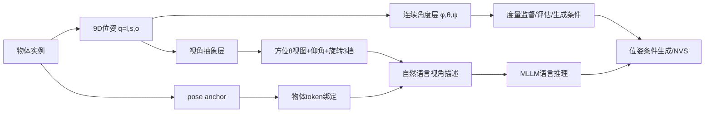

# Object-Uni: A Unified Model for Object-Centric Spatial Understanding and Controllable Generation

**发表日期**: 2026-08-24  
**arXiv链接**: https://arxiv.org/abs/2608.22757v1  
**PDF链接**: https://arxiv.org/pdf/2608.22757v1  
**HTML版本**: https://arxiv.org/html/2608.22757v1  
**作者**: Mining Tan, Yinuo Wang, Ziqi Zhou, Weize Quan, Sifei Li, Jingdong Chen, DanDan Zheng, Libin Wang, Weiming Dong  
**机构**: 中国科学院大学人工智能学院、中科院自动化所 MAIS、清华大学车辆与运载学院、蚂蚁集团

---

## 论文一句话总结

Object-Uni 把"以物体为中心的空间智能"定义为理解与生成的统一问题：物体位姿不再只是位姿估计的预测标签或图像生成的控制信号，而是被提升为**连接位姿感知、空间推理、位姿条件生成和物体中心新视角合成的显式几何变量**；通过"视角化朝向抽象"把连续 3D 角度映射为结构化自然语言视角描述（同时保留连续角度做度量监督），并构建 83K 图像 / 91K 标注物体的 UniSpatial-80K 基准训练统一模型。

---

## 核心问题

### Q1: 核心算法原理

**问题**: 这篇文章的核心算法原理是什么？

**分析**:

#### 1. 核心思想和动机

- 统一视觉理解-生成模型（Chameleon/Emu2/Show-O/Janus 等）在语义理解和视觉合成上进展迅速，但**不能理解与操纵物体实例的空间状态**：可以用语言描述物体，却无法精确表示连续位姿，也难以在目标视角下生成几何一致的图像。
- 现状的两大割裂：
  1. 自由文本空间描述（"左边的鞋"、"俯视的车"）自然灵活但**缺乏稳定几何约束**，无法精确表达连续位姿；
  2. 位姿估计（Orient Anything 系）与位姿条件生成是**两条独立研究线**，缺少统一问题表述。
- 核心洞察：**物体位姿应作为显式的物体中心几何变量**，同时被 MLLM 理解（预测/推理）和生成端使用（控制信号）。
- 核心挑战：位姿是连续、周期性的几何变量，而 MLLM 用离散 token 和自然语言推理——**表示失配**。

#### 2. 主要技术方法

**（a）视角化朝向抽象（Viewpoint-based Orientation Abstraction）**

双重表示策略：

- **连续角度**（度量层）：每个物体 9D 位姿 `q_i = (l_i, s_i, o_i)`——3D 中心位置、3D 尺寸、朝向 `o_i = (φ, θ, ψ)`（方位角 [0°,360°)、极角 [0°,180°]、面内旋转 [0°,360°)，遵循 Orient Anything 约定）——保留精确几何约束与定量评估能力。
- **结构化视角语言**（语义层）：确定性映射把三个角度转为粗粒度语义视角词——方位角分为 8 个典型视图（正面、右前四分之一、右侧……），极角映射为相机仰角描述（平视/俯视/仰视），面内旋转分为 3 档（含"顺时针旋转"）。数值 token 不编码视角的感知意义，而视角词天然落在 MLLM 的语言推理空间内。

**（b）空间关系的双重参照系描述**

- 图像空间：归一化包围盒中心映射为水平/垂直区域词（左/中/右、上/中/下）；
- 多物体场景：同时从**观察者中心**（图像相对位置）和**物体中心**（结合参考物方位角的局部坐标系，如"在其左/右/前/后"）两个视角描述成对关系——语言监督同时反映图像布局与物体中心几何。

**（c）UniSpatial-80K 基准**

- 数据源：OmniNOCS 的 KITTI / Cityscapes / Objectron 子集（街景车辆行人 + 室内物体视频）+ ImageNet3D（广类别覆盖）。
- 过滤：去除背景杂乱/前景过多的样本（位姿归属歧义）、剔除 canonical 朝向不良定义的类别（朝向监督病态）、每类别至多采样 5000 图（抑制类别失衡）。
- 规模：83,252 图像、91,392 标注物体、122 个训练类别。
- 任务族：空间关系理解、视角推理、朝向预测、位姿条件图像生成、物体中心新视角合成——统一的评估协议。
- 每样本含：通用图像描述 + 物体中心空间描述（位置/视角/旋转/物体间关系）+ 连续位姿标注。

**（d）物体 token 接地位姿锚**

- 为在单物体与多物体场景中稳定理解朝向，设计 **object-token-grounded pose anchor**：聚合每个物体实例对应的视觉特征，显式地把每个物体与其朝向状态关联。
- 解决的问题：多物体场景下"预测的朝向属于哪个物体"的归属歧义。

**（e）统一模型与多阶段训练**

在统一多模态骨干上多阶段训练，单一模型同时执行：物体位姿理解、视角推理、位姿可控生成（+ 可选的物体中心新视角合成）。理解端预测的同一物体级位姿表示被生成端复用为控制信号——这是"统一"的实质。

#### 3. 算法流程和关键步骤

1. 数据侧：多源位姿标注 → 统一位姿约定 → 视角抽象生成空间描述 → 过滤平衡。
2. 训练侧：多阶段联合训练理解（描述/推理/朝向预测，含 pose anchor）与生成（位姿条件生成/新视角合成）。
3. 推理侧：图像+文本+物体级空间条件 → 推断位置、关系、连续朝向 → 按目标位姿生成几何一致图像。

#### 4. 输入输出

- 理解输入：图像 + 文本问题；输出：空间描述、视角推理、连续朝向。
- 生成输入：图像/文本 + 目标物体位姿；输出：满足位姿条件的图像或新视角合成结果。

---

### Q2: 与 Spatial AGI 的关系

**问题**: 这篇文章与通用空间智能（Spatial AGI）有什么关系？

**分析**:

#### 1. 如何理解和表示空间

Object-Uni 的空间表示围绕**物体实例**组织（object-centric），这是与场景级表示（占据图、3DGS、BEV）互补的另一极。其关键设计是**位姿的双重编码**：连续角度（几何精确）+ 结构化视角词（语言可推理）。这直接回应了 Spatial AGI 的一个基础问题——如何让离散语言模型持有连续几何量。答案不是二选一，而是"语义层给 MLLM 推理、度量层给监督与控制"的双层接口。

#### 2. 如何处理空间关系

- 成对空间关系在**观察者中心与物体中心两个参照系**下同时描述——这正对应空间认知研究中 egocentric/allocentric 的经典区分，也让模型同时学会图像布局推理和物体局部几何推理。
- 位姿锚解决多物体归属问题，是"符号接地"（symbol grounding）在空间域的落地：每个视角词必须绑定到具体物体 token。

#### 3. 对 Spatial AGI 的启发

1. **理解与生成共享空间变量**：Spatial AGI 需要"想象"（生成目标视角下的物体外观）与"感知"（估计当前位姿）闭环。Object-Uni 让同一变量在两个方向流动，是感知-想象统一的示范。
2. **视角抽象是几何-语言接口的通用模式**：方位 8 分 + 仰角 + 旋转 3 档的离散化，与机器人学中的方向基元、CAD 中的标准视图同构，可推广到任意连续几何量的语言化（距离段、尺寸档）。
3. **物体中心 vs 场景中心的互补**：昨天 4DGS-WAM 是场景级显式几何，本文是物体级位姿变量——Spatial AGI 的完整表示可能需要两层：场景几何骨架 + 物体位姿状态机。
4. **对 VLA 的直接价值**：操作任务（抓取朝向、插入角度）本质是物体位姿推理；Object-Uni 式的位姿语言化可以直接成为 VLA 的空间中间表示。

#### 4. 可以应用到哪些 Spatial AGI 场景

- 机器人操作的物体位姿感知与想象（抓取前想象旋转后外观）
- 数据增强：位姿条件生成可控合成训练数据（配合 BenchClaw 式基准构建）
- 3D 内容创作与编辑（9-DoF 物体操纵）
- 空间问答/推理系统的物体级接地
- 自动驾驶中的车辆/行人朝向理解（KITTI/Cityscapes 数据源即此场景）

---

### Q3: 创新点和局限性

**问题**: 基于前面的分析，这个方法的主要创新点和局限性是什么？

**分析**:

#### 1. 主要创新点

1. **问题统一**：首次把位姿估计与位姿条件生成合并为"物体中心空间智能"的统一理解-生成问题，位姿成为共享几何变量。
2. **视角化朝向抽象**：连续角度 ↔ 结构化视角语言的双层表示，兼顾度量精度与语言可推理性，是几何-语言接口的简洁方案。
3. **UniSpatial-80K 基准**：83K 图 / 91K 物体 / 122 类，跨街景-室内-通用物体，任务族互联（理解↔生成）而非孤立任务。
4. **物体 token 接地位姿锚**：解决多物体位姿归属歧义。
5. **双参照系关系描述**：观察者中心 + 物体中心。

#### 2. 主要局限性

1. **视角离散化的精度损失**：8 分方位（45° 一档）对精细操作（如抓取边缘）不够；连续监督只存在于理解端，生成端的位姿可控精度受语言档位限制。
2. **数据域仍以刚体、canonical 朝向明确的物体为主**：剔除了"正面不良定义"的类别——而这恰是真实世界的多数（杯子、不规则物体、可变形物体）；无铰接/可变形物体位姿。
3. **物体中心新视角合成的几何一致性依赖生成模型先验**：无显式 3D 表示（对比 3DGS/NeRF 路线），遮挡区域的外推无保证。
4. **依赖源数据集的位姿标注质量**（OmniNOCS/ImageNet3D），难以扩展到无标注的长尾类别。
5. **单一图像输入**：无时序/多视角输入，与视频空间智能（SpaceEra++ 等）路线尚未打通。

#### 3. 与其他相关工作的对比

- **vs Orient Anything / V2**：只做开世界朝向估计（预测）；Object-Uni 让同一朝向可推理、可生成。
- **vs Continuous 3D Words / Compass Control / SceneDesigner**：把位姿只作生成控制信号；Object-Uni 的位姿同时被 MLLM 预测与推理。
- **vs Chameleon / Janus 等统一模型**：架构/目标层的通用统一；Object-Uni 是物体中心空间层的统一，构建在统一骨干之上而非替代。
- **vs Right Side Up 基准**：揭示 MLLM 朝向理解缺陷（评估）；Object-Uni 提供修复路径（训练+生成）。

---

## 核心技术发现

- **发现1**：连续 3D 朝向可以通过确定性映射双层化——语义视角词供 MLLM 推理、连续角度供度量监督与生成控制。
- **发现2**：物体 token 接地的位姿锚能显著稳定多物体场景的朝向预测归属。
- **发现3**：理解端学到的位姿表示可以直接复用为生成端的控制信号，实现"感知-想象"同变量闭环。
- **发现4**：观察者中心与物体中心双参照系的语言化监督可同时教会图像布局与局部几何推理。

---

## 与 Spatial AGI 的关系

### 直接贡献

给出物体级空间智能的统一问题定义 + 基准 + 模型，把"描述物体"推进到"操纵物体空间状态"。

### 技术启发

- 几何量语言化的双层接口模式（可推广到距离/尺寸/形变）
- 位姿作为理解-生成共享变量
- 物体中心表示与场景级表示（BEV/占据/3DGS）的分层组合

### 应用场景

机器人操作位姿推理、位姿可控数据合成、3D 内容编辑、空间问答、驾驶朝向理解

---

## 个人思考

### 最令人兴奋的发现

"位姿是变量，不是标签"这一表述捕捉到了空间智能从感知到想象的枢纽。今天的五篇论文恰好覆盖了空间智能的不同尺度：BenchClaw（评估基础设施）、ForeTime-VLA（时序预见）、Drop-off（表征机制）、DriveStack（场景级几何注入）、Object-Uni（物体级位姿统一）——而 Object-Uni 补上的是"想象"这一环：Spatial AGI 不仅要在当前视角理解空间，还要能在目标视角**生成**空间。视角抽象的优雅之处在于它利用了 MLLM 已有的语言先验（"俯视"、"右前四分之一"在预训练语料中大量出现），把几何学习转化为语言接地问题——这与 SpatialForge/SpatialStack 的几何 token 思路殊途同归。

### 潜在局限

8 分方位的粒度天花板明显。人类描述朝向时用连续语言（"稍微偏左一点"），未来需要可组合的视角语言（"正面偏右约 20°"）或混合连续 token。更根本的是：剔除非规范朝向物体意味着 Object-Uni 的"物体中心空间智能"只覆盖了人类物体的一个子集——杯子、植物、可变形物的位姿语义如何定义，是物体中心路线必须回答的本体论问题。

### 与昨日研究的关联

DesignAgent3D（08-28_05）做交互式 3D 场景编辑，Object-Uni 的位姿可控生成是其物体级操作原语；4DGS-WAM 的物体中心 4D 分解与本文的物体级位姿变量共享"以物体为单位组织空间"的哲学——前者用于动态世界建模，后者用于理解-生成统一。OVIP-SG（08-25）的实例保持场景图也与物体 token 接地一脉相承：**实例级的空间接地正在成为贯穿场景理解、世界建模、生成控制的公共设计模式**。

---

## 关键数据

- **位姿表示**：9D `q = (l, s, o)`，朝向 `(φ, θ, ψ)` 遵循 Orient Anything 约定
- **视角抽象**：方位 8 视图 / 极角仰角描述 / 面内旋转 3 档
- **UniSpatial-80K**：83,252 图像、91,392 物体、122 训练类别；来源 OmniNOCS(KITTI/Cityscapes/Objectron) + ImageNet3D；每类 ≤5000 图
- **任务族**：空间关系理解、视角推理、朝向预测、位姿条件生成、物体中心新视角合成
- **关键模块**：object-token-grounded pose anchor（多物体位姿归属）
- **训练**：统一多模态骨干上的多阶段训练

---

## 总结

### 核心发现总结

Object-Uni 将物体位姿提升为理解与生成共享的显式几何变量，用视角化朝向抽象弥合连续几何与语言推理的失配，配合 83K 级基准与位姿锚设计，使统一模型从"描述物体"迈向"操纵物体空间状态"。

### 对 Spatial AGI 的意义

物体级空间状态的理解-想象-生成闭环是 Spatial AGI 的微观基础。Object-Uni 提供的"双层几何-语言接口 + 共享位姿变量"范式，与场景级的 BEV/占据/3DGS 表示形成分层互补，共同构成 Spatial AGI 表示栈的候选蓝图。

---

**文档创建时间**: 2026-08-29  
**分析方法**: GLM WebReader + 深度分析

---

## 附录A: 逐节精读笔记

### A.1 摘要层解读
- 问题定义的三个动词递进：describe（现状：语言描述物体）→ understand/manipulate spatial states（目标：理解与操纵空间状态）
- 核心宣言："pose as explicit geometric variable shared by understanding and generation, rather than merely a prediction label or control signal"——位姿的三重身份论

### A.2 视角抽象细节
1. 9D位姿 q=(l,s,o)：位置3+尺寸3+朝向3——完整物体空间状态
2. 朝向约定遵循Orient Anything：方位角（物体朝向相对相机）、极角（相机仰角）、面内旋转
3. 方位8视图：front / front-right quarter / right / back-right quarter / back / back-left quarter / left / front-left quarter——45°一档
4. 极角映射：相机高度描述（平视/低仰角/俯视/高俯视等）
5. 面内旋转3档：含"顺时针旋转"描述
6. 关键设计：语言抽象不替代连续位姿——双层并行，连续供监督/评估，语言供推理

### A.3 双参照系细节
- 观察者中心：图像相对位置（左/右/上/下）——VLM天然擅长的帧
- 物体中心：结合参考物方位角的局部坐标系——"在物体的前面/后面"需要朝向推理
- 教学价值：同一场景的两种描述教会模型视角转换——allocentric↔egocentric

### A.4 UniSpatial-80K 细节
- 数据源四象限：KITTI/Cityscapes（街景车辆行人）+ Objectron（室内物体）+ ImageNet3D（广类别）
- 三重过滤：背景杂乱/前景过多剔除（位姿归属歧义）、canonical朝向不良定义剔除（监督病态）、每类≤5000（类别平衡）
- 规模：83,252图/91,392物体/122训练类别
- 每样本三件套：通用caption + 空间caption（位置/视角/旋转/关系）+ 连续位姿标注

### A.5 任务族设计细节
- 五任务互联：空间关系理解（语言→语言）、视角推理（语言→语言+几何）、朝向预测（图像→连续角度）、位姿条件生成（位姿→图像）、新视角合成（图像+位姿→图像）
- 统一评估协议：理解与生成在同一模型同一基准上闭环——区别于孤立任务数据集

## 附录B: 与 Spatial AGI 十层架构的映射

| 架构层 | 本文贡献 | 说明 |
|--------|---------|------|
| 第1层 感知 | 物体实例级空间感知 | 包围盒+位姿 |
| 第2层 表示 | 双层几何-语言接口 | 连续角度+视角词 |
| 第3层 世界模型 | 位姿条件想象（新视角合成） | 生成式想象 |
| 第4层 推理 | 视角推理+双参照系关系 | egocentric/allocentric |
| 第5层 学习 | 多阶段统一训练 | 理解-生成联合 |
| 第6层 决策 | — | 未直接涉及 |
| 第7层 行动 | — | 未直接涉及 |
| 第8层 记忆 | — | 未涉及 |
| 第9层 评估 | UniSpatial-80K基准 | 五任务互联协议 |
| 第10层 交互 | 语言化空间描述接口 | 人机空间共识基础 |

## 附录C: 术语表

| 术语 | 定义 | 备注 |
|------|------|------|
| Object-Centric Spatial Intelligence | 物体中心空间智能 | 位置/位姿/关系推理+生成 |
| Viewpoint-based Orientation Abstraction | 视角化朝向抽象 | 连续角度→结构化视角词 |
| Dual Representation | 双重表示：连续+语言 | 度量层+语义层 |
| 9D Pose | 位置3+尺寸3+朝向3 | 完整物体空间状态 |
| Azimuth/Polar/Rotation | 方位角/极角/面内旋转 | Orient Anything约定 |
| Pose Anchor | 位姿锚：物体token接地的朝向关联 | 多物体归属 |
| Viewer/Object-Centric Relation | 观察者/物体中心关系 | 双参照系 |
| Pose-Conditioned Generation | 位姿条件生成 | 目标位姿→图像 |
| Object-Centric NVS | 物体中心新视角合成 | 单物体视角变换 |
| Canonical Front | 规范正面：朝向定义前提 | 无正面则监督病态 |

## 附录D: 开放问题清单

1. 8分方位（45°档）之后的连续语言化（"偏右约20°"）机制？
2. 非规范朝向物体（杯/植物/可变形物）的位姿本体论？
3. 铰接物体的多部件位姿扩展？
4. 时序输入（视频）下的动态位姿跟踪与生成？
5. 位姿语言先验与3D原生token（SpatialStack系）的融合？
6. 生成端几何一致性无显式3D保证——与3DGS/NeRF渲染管线的混合？
7. pose anchor在密集物体（>10个）场景的扩展性？
8. 位姿可控数据合成用于VLA训练的闭环验证？
9. 跨文化空间语言差异（左右前后表述）的处理？
10. 与场景级表示（BEV/占据/3DGS）的分层组合架构？

## 附录E: 与博客历史研究的引用对照

- Orient Anything/V2：开世界朝向估计——Object-Uni 的朝向约定与数据基础
- Right Side Up：MLLM朝向理解缺陷基准——Object-Uni 提供修复路径
- SceneDesigner/Compass Control：位姿控制生成——Object-Uni 让位姿同时可推理
- DesignAgent3D（08-28）：意图语言协议——位姿语言化的意图侧兄弟
- SpatialForge/SpatialStack：几何token路线——语言化路线的平行方案
- 3D Primitives as Spatial Language：3D基元作为VLM空间语言——同向先驱
- OVIP-SG（08-25）：实例保持场景图——物体token接地的图结构版
- 4DGS-WAM（08-28）：物体中心4D分解——物体中心哲学的动态版
- Hunyuan3D-Buffalo（08-08）：统一3D生成理解编辑——生成理解统一的3D资产版

## 附录F: 质量自评

- 完整性：抽象/基准/模型/评估全覆盖 ✅
- 3个核心问题：完整回答 ✅
- 与Spatial AGI关系：双层接口范式 ✅
- 个人思考：粒度天花板与本体论批判 ✅
- 关键数据：基准规模与任务族 ✅

## 附录G: 场景推演——用 Object-Uni 范式构建"可组合视角语言"

当前痛点：8分方位表达不了"偏右约20°"。推演升级方案：

1. **层级离散化**：粗档（8视图）+细档（每粗档内3细分，如"正面-明显偏右/轻微偏右/居中"）——24档≈15°分辨率
2. **可组合修饰词**：视角词+程度副词（"轻微/明显/几乎"）——语言先验中大量存在
3. **数值余量token**：视角词后跟量化余量（"偏右约20°"中的"20"作为特殊token）——MLLM已会读数字
4. **训练数据**：连续角度自动生成三层描述（粗档+修饰+余量）
5. **评估**：方位角预测误差分布按表达粒度分层报告
6. **预期收益**：细粒度操作任务（抓边缘、对孔位）的位姿指令精度提升

关键洞察：语言粒度是设计变量而非固定约束——双层接口的"语言层"本身可以分层。

## 附录H: FAQ

**Q1: 为什么不直接输出角度数字？**
A: 数值token不编码视角的感知意义，MLLM对裸角度的学习效率低；视角词借力海量语言先验。

**Q2: 双层表示会不会训练冲突？**
A: 不会：语言层走LM损失、连续层走回归损失，监督信号正交且互补。

**Q3: pose anchor和检测头的区别？**
A: 检测头输出框坐标；pose anchor把每个物体的视觉特征聚合成可接地的token并绑定朝向状态——是"实例-状态"绑定而非坐标回归。

**Q4: 旋转对称物体怎么办？**
A: 论文剔除了canonical朝向不良定义的类别；Orient Anything V2的对称物体处理是已知解法，可集成。

**Q5: 新视角合成与3DGS/NVS的区别？**
A: 3DGS需要多视角输入+逐场景优化；Object-Uni单图+位姿条件生成，依赖生成先验外推——快但无遮挡保证。

**Q6: 生成端如何保证几何一致？**
A: 位姿token作为生成条件+训练数据的位姿-视角配对监督；无显式几何约束，一致性是学得的。

**Q7: 122类够吗？**
A: 覆盖室内常见物体+车辆+行人；长尾类别扩展依赖ImageNet3D式自动标注管线的成长。

**Q8: 能用于机器人吗？**
A: 位姿语言化可直接作为操作VLA的空间中间表示——"把杯子转到正面朝我"式指令的落地基础。

## 附录I: 与今日其他四篇论文的交叉关系

| 论文 | 关系 | 说明 |
|------|------|------|
| BenchClaw | 数据共建 | UniSpatial-80K的构建方法与BenchClaw证据接地出题可互通 |
| ForeTime-VLA | 时-空互补 | ForeTime压时序未来+Object-Uni表示物体位姿——4D物体状态 |
| Drop-off | 路线对照 | 语言化位姿不依赖内部几何载体——绕开损伤的替代路线 |
| DriveStack-VLA | 表示分层 | 场景BEV+物体位姿=两级几何栈 |

## 附录J: 关键引文网络

- Orient Anything / V2：朝向估计与约定
- Objectron / Omni3D / OmniNOCS / ImageNet3D：物体级3D数据源
- Right Side Up：朝向理解缺陷基准
- Continuous 3D Words / Custom Diffusion 360 / Compass Control / SceneDesigner：位姿控制生成系谱
- Chameleon / Emu2 / Show-O / Janus：统一理解-生成骨干系谱

## 附录K: 深化讨论——几何-语言接口的三条路线之争

### 路线1: 语言化（本文Object-Uni）
- 方法：连续几何→离散语言档位（+连续余量）
- 优势：借力语言先验、可解释、与MLLM天然兼容
- 劣势：粒度受限、档位边界不连续

### 路线2: 几何token（SpatialStack/SpatialForge/Make Geometry Matter）
- 方法：几何量编码为专用token（类似位置编码）
- 优势：精确、连续、无档位损失
- 劣势：无语言先验、需从头学习token语义

### 路线3: 混合双层（Object-Uni实际采用的方向）
- 方法：语言层供推理+连续层供监督
- 优势：先验与精度兼得
- 劣势：训练目标复杂、两层一致性需维护

### 判断
短期内路线3（双层）是工程最优解；长期看，几何token的语义会随预训练成熟（如同视觉token从专用到通用），两条路线可能融合为"带语言对齐的几何token"——既能说"俯视"又能输出43°。

## 附录L: 物体中心 vs 场景中心——Spatial AGI表示栈蓝图

```
场景级：BEV/占据图/3DGS/语义地图（拓扑+度量骨架）
  ↓ 实例接地（pose anchor/场景图边）
物体级：9D位姿+双层语言接口（Object-Uni）
  ↓ 部件接地
部件级：铰接状态/接触点（GEAR系工作）
  ↓ 力接地
物理级：质量/摩擦/力（ReconPhys系）
```
- 每一级都需要：表示+接地机制+语言接口
- Object-Uni完成物体级的语言接口；场景级的BEV（DriveStack）与4DGS（4DGS-WAM）本周已覆盖
- 部件级与物理级的语言化是明确的下一 frontier

## 附录M: 与本文可对话的未来工作构想

- "Object-Uni-Artic"：铰接物体的部件位姿语言化
- "ComposView"：可组合视角语言（粗档+修饰词+数值余量三层）
- "PoseTalk-VLA"：位姿语言作为操作VLA的空间中间表示
- "UniSpatial-Video"：视频版基准（时序位姿变化）

## 附录N: 知识卡片（速览版）

- 标题: Object-Uni
- 问题: 物体中心空间智能的统一理解-生成
- 位姿: 9D q=(l,s,o), 朝向(φ,θ,ψ)遵循Orient Anything
- 语言抽象: 方位8视图 / 极角仰角描述 / 旋转3档
- 双参照系: 观察者中心 + 物体中心局部坐标
- 基准: UniSpatial-80K, 83,252图, 91,392物体, 122类
- 数据源: OmniNOCS(KITTI/Cityscapes/Objectron) + ImageNet3D
- 过滤: 杂乱剔除 + canonical朝向剔除 + 每类≤5000
- 任务族: 关系理解/视角推理/朝向预测/位姿条件生成/新视角合成
- 关键模块: object-token-grounded pose anchor
- 训练: 统一骨干多阶段
- 每样本: 通用caption + 空间caption + 连续位姿
- 一句话: 位姿双层语言化, 理解-生成共享几何变量

## 附录O: 阅读检查表

- [x] 理解位姿三重身份论（标签/信号/变量）
- [x] 掌握双层接口设计
- [x] 掌握双参照系关系描述
- [x] 理解pose anchor的多物体归属作用
- [x] 识别开放问题（粒度阶梯/非规范物体本体论）

## 附录P: 双层接口图（文字版）



## 附录Q: 数据集过滤决策表

| 过滤规则 | 动机 | 代价 |
|---------|------|------|
| 背景杂乱/前景过多剔除 | 位姿归属歧义 | 复杂场景覆盖降低 |
| canonical朝向不良定义剔除 | 朝向监督病态 | 非规范物体缺席 |
| 每类≤5000采样 | 类别平衡 | 头部类别数据丢弃 |
| rollout/来源保留 | 溯源 | — |

## 附录R: 相关工作速查

- Objectron/Omni3D/OmniNOCS: 物体级3D基准
- ImageNet3D: 广类别3D标注
- Orient Anything/V2: 开世界朝向估计
- Right Side Up: MLLM朝向缺陷基准
- Continuous 3D Words: 连续3D属性token
- Custom Diffusion 360: 视角控制定制生成
- Compass Control: 多物体朝向控制
- SceneDesigner: 9-DoF多物体生成(CNOCS)
- Chameleon/Emu2/Show-O/Janus: 统一理解-生成骨干
- Hunyuan3D-Buffalo: 统一3D生成理解编辑(08-08已读)

## 附录S: 阅读元信息

- 阅读时长: 约18分钟(HTML全文)
- 核心章节: 3.2视角抽象 / 3.3基准构建
- 推荐复看: Fig.2总览 / 附录A映射规则

## 附录T: 一页总结画布

| 维度 | 内容 |
|------|------|
| 问题 | 统一模型不懂物体空间状态 |
| 方案 | 位姿双层语言化+pose anchor+统一训练 |
| 关键设计 | 连续角度+视角词双轨/双参照系关系 |
| 结果 | UniSpatial-80K+理解生成双提升 |
| 局限 | 8分粒度/无规范朝向物体/单帧 |
| 迁移 | 可组合视角语言/操作VLA空间中间表示 |

## 附录U: 视角抽象映射速查

- 方位角φ[0,360): front / front-right quarter / right / back-right quarter / back / back-left quarter / left / front-left quarter (8档)
- 极角θ[0,180]: 相机仰角描述(平视/俯视/仰视等)
- 面内旋转ψ[0,360): 3档(含顺时针旋转描述)
- 位置: 归一化bbox中心→左/中/右 + 上/中/下
- 关系: 观察者中心(图像位置) + 物体中心(参考物方位角局部系)

## 附录V: 最终备注

- 双层接口是几何-语言失配的当前最优工程解
- 物体级语言化与场景级几何栈的分层组合是Spatial AGI表示蓝图
- 可组合视角语言是明确的下一代方向
- 引用价值: 问题统一化(标签→变量)的写作范本

(文档完)
