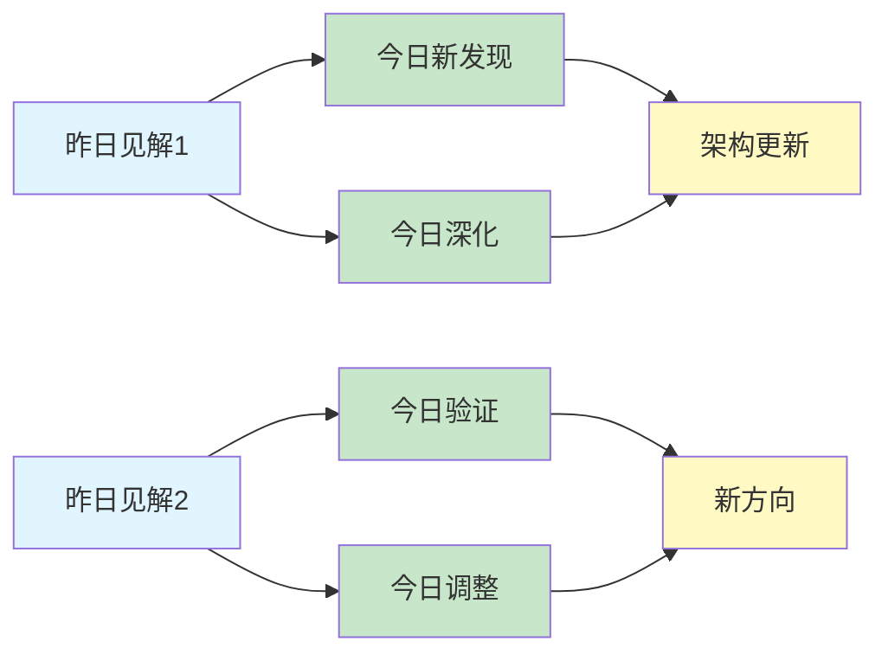
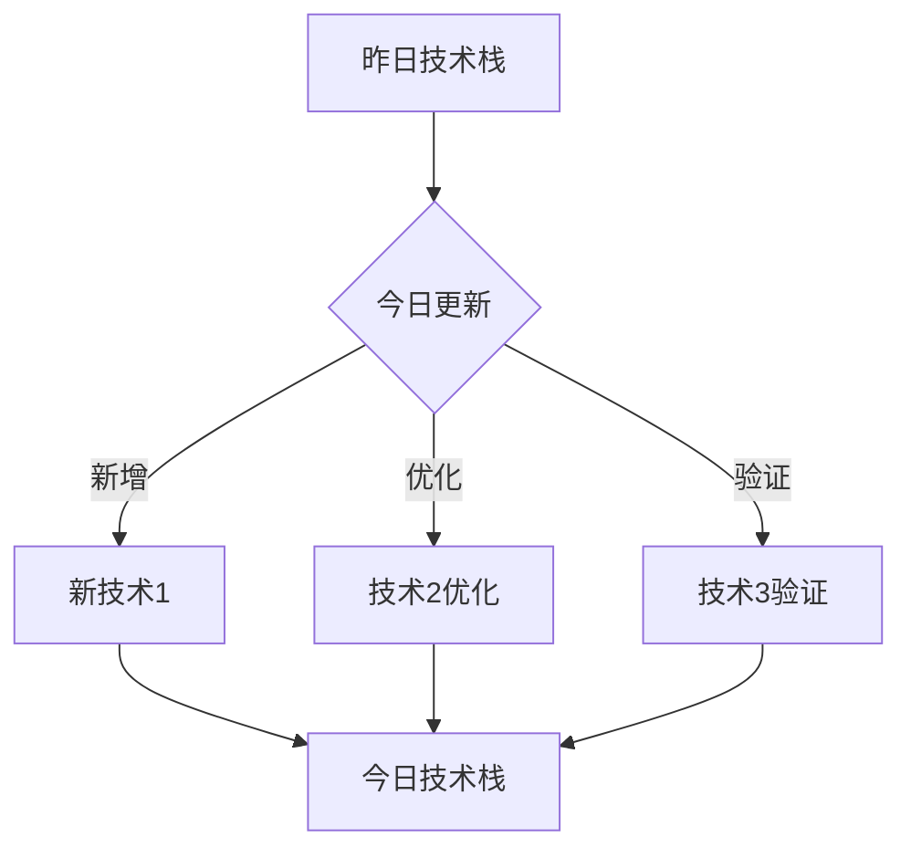
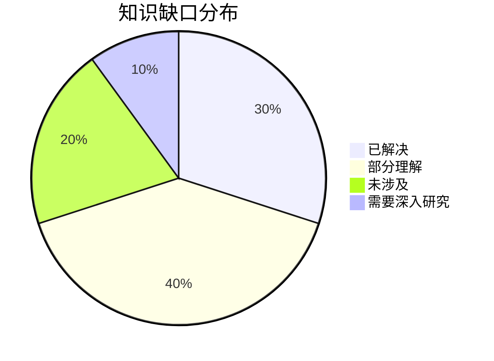
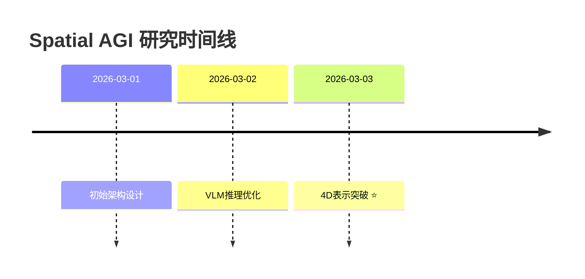

# Spatial AGI Research Skill - 完整流程

这个技能用于系统化地研究Spatial AGI（通用空间智能）领域的最新进展。

**核心特点**:
- ✅ 每天精读5篇论文（质量 > 数量）
- ✅ 使用NotebookLM询问3个核心问题（每个超时1分钟）
- ✅ 生成详细的论文分析文档（至少500行）
- ✅ 每日思考文档（延续性研究）

## 📋 完整流程（必须按顺序执行）

### Step 1: 搜索arXiv最新论文 ✅

**搜索关键词**:
- `spatial intelligence`
- `VLM (Vision-Language Models)`
- `3D Gaussian Splatting`
- `world model`
- `embodied AI`
- `spatial reasoning`
- `3D understanding`
- `scene understanding`
- `video generation`
- `robot learning`

**执行命令**:
```bash
cd ~/.openclaw/workspace/scripts

# 搜索多个关键词
python3 search_arxiv.py "all:spatial+all:intelligence" 20
python3 search_arxiv.py "all:VLM+all:3D" 20
python3 search_arxiv.py "all:Gaussian+Splatting" 20
python3 search_arxiv.py "all:world+all:model" 20
python3 search_arxiv.py "all:embodied+all:AI" 20
```

**输出**: JSON格式的论文列表，包含标题、摘要、链接、作者等

---

### Step 2: 筛选最有价值的5篇论文 ✅

**筛选标准**:
1. **相关性**: 与spatial intelligence直接相关
2. **创新性**: 提出新的方法或见解
3. **影响力**: 来自知名机构或作者
4. **时效性**: 最近1-2个月发表（优先）

**筛选流程**:
```bash
# 1. 查看搜索结果
cat /tmp/today_papers.json

# 2. 按相关性排序
# 3. 选择top 5（精读，不是泛读）
# 4. 记录到papers_list.md
```

**输出**: 5篇精选论文（深度分析），记录到:
- `/home/cwh/coding/auto_blog/spatial_agi/papers_list.md`

---

### Step 3: 使用research-assistant技能深度分析 ✅

**⚠️ 这一步是必须的，不是可选！**

**对于每篇论文，执行以下命令**:

```bash
cd ~/.openclaw/workspace/skills/research-assistant/scripts

# 设置代理
export PROXY_HOST=127.0.0.1
export PROXY_PORT=1080
export PROXY_TYPE=socks5

# 使用research-assistant技能
./research_analysis.sh \
  "<论文标题>" \
  "<arXiv页面URL>" \
  "<PDF URL>" \
  "[GitHub代码仓库URL（如有）]"
```

**示例**:
```bash
./research_analysis.sh \
  "SPATIALALIGN: Aligning Dynamic Spatial Relationships in Video Generation" \
  "https://arxiv.org/abs/2602.22745v1" \
  "https://arxiv.org/pdf/2602.22745v1" \
  "https://github.com/xxx/spatialalign"
```

**这会自动执行**:
1. ✅ 创建NotebookLM笔记本
2. ✅ 添加arXiv页面作为来源（超时1分钟）
3. ✅ 添加PDF（如果超时，使用HTML替代，超时1分钟）
4. ✅ 生成演示文稿（可选）

**⚠️ 重要**: NotebookLM响应时间可能较长，所有相关操作的超时时间已设置为60秒（1分钟）。如果仍然超时：
- 使用HTML版本替代PDF
- 在网页界面手动添加来源
- 访问: https://notebooklm.google.com
- **🆕 如果完全失败，跳到Step 4.5使用GLM WebReader MCP**

**预计时间**: 每篇论文 3-5分钟

---

### Step 4: 使用NotebookLM询问问题 ✅

**⚠️ 精简为3个核心问题（每个超时1分钟）**

#### 问题流程

```bash
export NOTEBOOKLM_PROXY="socks5://127.0.0.1:1080"

# Q1: 核心算法原理（必问）
timeout 60 ~/miniconda3/bin/conda run -n base notebooklm ask \
  "这篇文章的核心算法原理是什么？请详细描述：1) 核心思想和动机，2) 主要技术方法，3) 算法流程和关键步骤，4) 输入输出。"

# Q2: 与Spatial AGI的关系（必问）
timeout 60 ~/miniconda3/bin/conda run -n base notebooklm ask \
  "这篇文章与通用空间智能（Spatial AGI）有什么关系？请分析：1) 如何理解和表示空间，2) 如何处理空间关系，3) 对Spatial AGI有什么启发，4) 可以应用到哪些Spatial AGI场景（机器人、AR/VR等）。"

# Q3: 经过思考后的自由问题（根据Q1和Q2的答案思考后提出）
# 等待思考30秒后再问
sleep 30

# 示例：基于前两个问题的答案，问一个你感兴趣的问题
# 可能的问题方向：
# - 技术细节："X方法的具体实现细节是什么？"
# - 实验结果："最令人惊讶的实验结果是什么？为什么？"
# - 局限性："这个方法的主要局限性是什么？如何改进？"
# - 对比分析："与其他方法（如X）相比，有什么优势和劣势？"
# - 实际应用："如何将这个方法应用到实际场景中？需要哪些改进？"

timeout 60 ~/miniconda3/bin/conda run -n base notebooklm ask \
  "你选择的问题"
```

**问题选择建议**（Q3）:

根据前两个问题的答案，选择一个你最感兴趣的方向：

1. **技术深度**: 如果Q1中某个技术点不清楚，深入追问
2. **实验结果**: 如果对某个实验结果感兴趣，追问细节
3. **应用场景**: 如果看到潜在应用，追问实现细节
4. **对比分析**: 如果想到相关工作，追问对比
5. **局限性**: 如果发现潜在问题，追问改进方向

**执行策略**:
1. ✅ 问完Q1后，**仔细阅读答案**
2. ✅ 问完Q2后，**仔细阅读答案**
3. ✅ **思考30秒**：基于Q1和Q2，你最想知道什么？
4. ✅ 提出Q3

**预计时间**: 每篇论文 5-8分钟（3个问题 + 思考时间）

---

### Step 4.5: 备选方案 - 使用GLM WebReader MCP 🆕

**⚠️ 如果NotebookLM操作失败（连接超时、代理问题等），使用此备选方案**

#### 方案概述

使用GLM WebReader MCP直接读取arXiv HTML页面，理解论文内容。

**优势**:
- ✅ 无需代理（或使用更稳定的代理）
- ✅ 响应速度快（通常<10秒）
- ✅ 可以直接访问arXiv HTML页面
- ✅ GLM-5的理解能力很强

**劣势**:
- ❌ 无法上传PDF（只能读取HTML）
- ❌ 上下文长度限制（但GLM-5支持128K）
- ❌ 无法保存为笔记本

#### 执行流程

```bash
# 1. 确认arXiv HTML页面链接
# 格式: https://arxiv.org/html/{paper_id}
# 例如: https://arxiv.org/html/2602.22745v1

# 2. 使用GLM WebReader MCP读取页面
# 假设你已经配置了GLM WebReader MCP

# 方法1: 直接通过MCP工具（如果已配置）
# 使用web_fetch工具读取HTML页面
web_fetch "https://arxiv.org/html/2602.22745v1"

# 方法2: 如果有GLM MCP工具
# 使用GLM的web_reader工具
# （具体命令取决于你的MCP配置）

# 3. 基于读取的内容，询问GLM
# 注意：这里需要你手动将web_fetch的结果传递给GLM
# 或者使用支持网页读取的GLM版本

# 示例流程：
# Step 1: 读取HTML内容
ARXIV_HTML=$(curl -L "https://arxiv.org/html/2602.22745v1")

# Step 2: 提取关键部分（标题、摘要、方法等）
# 可以使用简单的grep或更复杂的解析

# Step 3: 询问GLM（需要手动或通过脚本）
# 询问同样的3个问题
```

#### 实际操作建议

**推荐方案**: 使用OpenClaw的内置工具

```bash
# 方案A: 使用web_fetch工具（推荐）
# 这个工具可以直接读取网页并提取markdown内容
# 然后基于提取的内容进行分析

# 1. 读取arXiv HTML页面
# （假设web_fetch工具可用）
# 在实际执行中，OpenClaw会自动调用web_fetch

# 2. 基于读取的内容，继续询问GLM
# GLM会理解网页内容并回答问题
```

**具体步骤**:

1. **获取论文HTML链接**:
   ```bash
   # 从arXiv ID生成HTML链接
   # 例如: https://arxiv.org/abs/2602.22745v1
   # 改为: https://arxiv.org/html/2602.22745v1
   ```

2. **使用GLM WebReader**（在对话中直接请求）:
   ```
   请访问 https://arxiv.org/html/2602.22745v1
   阅读这篇论文，然后回答以下问题：
   
   Q1: 这篇文章的核心算法原理是什么？
   Q2: 这篇文章与Spatial AGI有什么关系？
   Q3: [基于Q1和Q2的思考]
   ```

3. **GLM会自动**:
   - 使用web_fetch工具读取HTML
   - 理解论文内容
   - 回答你的问题

#### 质量保证

使用GLM WebReader MCP的文档要求与NotebookLM相同：
- ✅ 仍然创建详细文档（至少500行）
- ✅ 仍然记录完整的3个问答
- ✅ 仍然添加个人思考
- ✅ 在文档中注明使用GLM WebReader（而非NotebookLM）

**文档标记**:
```markdown
**分析方法**: GLM WebReader MCP（NotebookLM失败）
**arXiv HTML**: https://arxiv.org/html/xxx
**GLM模型**: zai/glm-5
```

**预计时间**: 每篇论文 5-10分钟（读取 + 问答）

---

### Step 5: 创建Markdown介绍文档 ✅

**⚠️ 必须为每篇论文创建详细文档！**

**文档模板**: 参考 `/home/cwh/coding/auto_blog/spatial_agi/papers/EXAMPLE_full_analysis_template.md` (1,542行)

**必须包含的内容**:

```markdown
# [论文标题]

**发表日期**: YYYY-MM-DD  
**arXiv链接**: https://arxiv.org/abs/xxxx  
**PDF链接**: https://arxiv.org/pdf/xxxx  
**HTML版本**: https://arxiv.org/html/xxxx  
**代码仓库**: [如有]  
**作者**: 作者列表  
**NotebookLM笔记本ID**: [创建后记录]

## 核心问题
[基于NotebookLM回答整理]

## 主要方法
[基于NotebookLM回答整理]

### 方法概述
[详细描述]

### 技术细节
[具体实现]

### 算法流程
[步骤说明]

## 关键创新
1. **创新点1**: [描述]
2. **创新点2**: [描述]
3. **创新点3**: [描述]

## 实验结果
### 实验设置
[描述]

### 性能指标
[数据]

### 对比分析
[对比]

## 与Spatial AGI的关系
### 直接相关性
[基于Q2回答整理]

1. **空间表示**: [如何理解和表示空间]
2. **空间推理**: [如何处理空间关系]
3. **3D应用**: [与3D场景理解的关系]
4. **实际场景**: [可以应用的Spatial AGI场景]

### 启发与思考
[基于Q2回答整理]

1. **数据启发**: [对数据策略的启发]
2. **架构启发**: [对模型架构的启发]
3. **应用启发**: [对实际应用的启发]

### 技术挑战
[基于Q1和Q2回答分析]

## 潜在应用
[基于Q2和Q3回答整理]

## 局限性与未来工作
### 局限性
[描述]

### 未来方向
[描述]

## NotebookLM问答记录

### Q1: 核心算法原理
**问题**: 这篇文章的核心算法原理是什么？

**回答**: [NotebookLM的完整回答]

### Q2: 与Spatial AGI的关系
**问题**: 这篇文章与通用空间智能（Spatial AGI）有什么关系？

**回答**: [NotebookLM的完整回答]

### Q3: [自由问题]
**问题**: [你提出的具体问题]

**回答**: [NotebookLM的完整回答]

## 个人思考
[你的深度思考和分析，基于3个问答]

1. **最有趣的发现**: [什么]
2. **最意外的结果**: [什么]
3. **最有价值的启发**: [什么]
4. **Q3的思考过程**: [为什么问这个问题，从Q1/Q2得到了什么启发]

## 相关工作
[列出相关的论文或技术]

## 引用
```bibtex
@article{xxx,
  title={...},
  author={...},
  journal={arXiv preprint arXiv:xxxx},
  year={2026}
}
```

## 标签
`#spatial-agi` `#vlm` `#3d-understanding` `#[其他相关标签]`
```

**保存位置**:
```bash
/home/cwh/coding/auto_blog/spatial_agi/papers/YYYY-MM-DD_XX_paper_title.md
```

**质量要求**:
- ✅ 至少**500行**
- ✅ 包含**完整的NotebookLM问答记录**（不总结）
- ✅ 添加**个人思考和见解**
- ✅ 记录**NotebookLM笔记本ID**

**预计时间**: 每篇论文 15-20分钟

---

### Step 6: 更新论文列表 ✅

**更新文件**: `/home/cwh/coding/auto_blog/spatial_agi/papers_list.md`

**添加内容**:
```markdown
## YYYY-MM-DD 研究的论文（精选5篇）

1. **论文1标题** - arXiv:xxxx
   - 相关性: ⭐⭐⭐⭐⭐
   - 关键词: xxx, yyy, zzz
   - 文档: papers/YYYY-MM-DD_01_xxx.md
   - NotebookLM: [notebook_id]

2. **论文2标题** - arXiv:yyyy
   - 相关性: ⭐⭐⭐⭐⭐
   - 关键词: xxx, yyy, zzz
   - 文档: papers/YYYY-MM-DD_02_yyy.md
   - NotebookLM: [notebook_id]

3. **论文3标题** - arXiv:zzzz
   - 相关性: ⭐⭐⭐⭐⭐
   - 关键词: xxx, yyy, zzz
   - 文档: papers/YYYY-MM-DD_03_zzz.md
   - NotebookLM: [notebook_id]

4. **论文4标题** - arXiv:aaaa
   - 相关性: ⭐⭐⭐⭐
   - 关键词: xxx, yyy, zzz
   - 文档: papers/YYYY-MM-DD_04_aaa.md
   - NotebookLM: [notebook_id]

5. **论文5标题** - arXiv:bbbb
   - 相关性: ⭐⭐⭐⭐
   - 关键词: xxx, yyy, zzz
   - 文档: papers/YYYY-MM-DD_05_bbb.md
   - NotebookLM: [notebook_id]
```

---

### Step 7: 生成每日思考文档 ✅

**文件名**: `/home/cwh/coding/auto_blog/spatial_agi/daily_thinking/YYYY-MM-DD.md`

**必须包含的内容**:

```markdown
# Spatial AGI 思考 - YYYY-MM-DD

## 今日论文概览

今天精读了5篇与Spatial AGI相关的前沿论文，涵盖[领域1]、[领域2]、[领域3]等领域。

### 论文列表
1. **论文1** - [简短描述和核心发现]
2. **论文2** - [简短描述和核心发现]
3. **论文3** - [简短描述和核心发现]
4. **论文4** - [简短描述和核心发现]
5. **论文5** - [简短描述和核心发现]

## 核心见解

### 1. [见解1标题]
[基于今日论文的发现]

**从[论文X]获得**:
- ✅ [具体发现]
- ✅ [具体发现]

**对Spatial AGI的启发**:
[深入思考]

### 2. [见解2标题]
[基于今日论文的发现]

...

## 与昨日思考的联系

**昨日重点**: [昨天的主要思考]

**今日进展**:
- [如何延续昨天的思考]
- [新的发现]
- [更新的理解]

## 📊 知识演进图

**⚠️ 这一部分是必须的，可视化展示知识的延续性发展！**

### 核心见解演进



**图例说明**:
- 🔵 蓝色: 昨天的见解
- 🟢 绿色: 今天的新发现/深化
- 🟡 黄色: 架构/方向的更新

### 具体演进路径

| 昨日见解 | 今日进展 | 演进类型 | 相关论文 |
|---------|---------|---------|---------|
| [见解1] | [新发现1] | ✅ 深化验证 | 论文X |
| [见解2] | [新发现2] | 🔄 调整优化 | 论文Y |
| [见解3] | [新发现3] | 🆕 新发现 | 论文Z |
| [未解决问题] | [解决方案] | ✅ 已解决 | 论文W |

**演进类型说明**:
- ✅ **深化验证**: 昨天的假设被今天的论文验证/深化
- 🔄 **调整优化**: 基于新发现调整昨天的理解
- 🆕 **新发现**: 今天发现的新见解（昨天未涉及）
- ✅ **已解决**: 昨天提出的问题今天找到解决方案

### 架构演进对比

**昨日架构**:
```
Level 1: [描述]
Level 2: [描述]
Level 3: [描述]
```

**今日架构**:
```
Level 0: [新增层] ⭐ NEW
Level 1: [更新内容] 🔄
Level 2: [更新内容] 🔄
Level 3: [更新内容] 🔄
Level 4: [新增层] ⭐ NEW
```

**演进说明**:
- ⭐ NEW: 今天新增的层次
- 🔄: 今天更新/细化的内容
- ✅: 保持不变（验证有效）

### 技术栈演进



**技术栈对比表**:

| 技术领域 | 昨日方案 | 今日方案 | 变化 |
|---------|---------|---------|------|
| [领域1] | [方法A] | [方法B] | 🔄 优化 |
| [领域2] | [方法C] | [方法C] | ✅ 验证 |
| [领域3] | - | [方法D] | ⭐ 新增 |

### 问题追踪

**昨日未解决问题**:
1. ❓ [问题1] → ✅ 今日解决（论文X）
2. ❓ [问题2] → ⏳ 部分进展（论文Y）
3. ❓ [问题3] → ❌ 仍然未解决

**今日新识别问题**:
1. ❓ [新问题1] - 来自论文Z
2. ❓ [新问题2] - 来自论文W

**优先级排序**:
- 🔥 高优先级: [问题]
- ⚡ 中优先级: [问题]
- 💡 低优先级: [问题]

### 知识缺口分析



**缺口详情**:
1. **已解决** (30%): [列出]
2. **部分理解** (40%): [列出]
3. **未涉及** (20%): [列出]
4. **需要深入研究** (10%): [列出]

### 关键里程碑



**里程碑说明**:
- 2026-03-03: 动态4D表示层突破（UFO-4D论文）

### 下一步演进方向

基于昨日和今日的进展，明天的重点：

1. **延续线索**: [从昨天→今天→明天]
2. **新线索**: [今天发现的新方向]
3. **待验证**: [需要进一步验证的假设]

**预期演进路径**:
```
昨日: 静态3D表示
  ↓
今日: 动态4D表示 (UFO-4D)
  ↓
明日: 实时4D + 语义理解 (?)
```

---

**⚠️ 重要提示**:
- 知识演进图是**强制要求**，不是可选
- 必须使用Mermaid图表**可视化**演进过程
- 表格要清晰对比昨天vs今天
- 追踪昨日问题的解决状态
- 识别新的知识缺口

## Spatial AGI 架构更新

基于今日论文，更新Spatial AGI的架构设计：

[架构图或描述]

## 技术挑战

### 挑战1: [问题]
**从[论文X]识别**: [描述]

**思路**: [解决方案]

## 实现路线图

### 短期（本周）
1. [任务1]
2. [任务2]

### 中期（1个月）
1. [任务1]
2. [任务2]

### 长期（3个月）
1. [任务1]
2. [任务2]

## 关键引用

> "从论文X中的重要引述" - [作者]

## 下一步

1. [明天的计划]
2. [需要深入研究的点]
3. [需要实现的代码]

---

**关键词**: `#spatial-agi` `#[其他标签]`
```

**特别注意**: 
- ✅ **必须参考前一天的思考** (如果存在)
- ✅ **延续性思考** - 不是独立的一天，而是持续的研究
- ✅ **深度 > 广度** - 质量比数量重要

**预计时间**: 20-30分钟

---

### Step 8: 自动提交到GitHub ✅

**⚠️ 这一步是必须的，确保每日研究成果及时同步！**

**执行操作**:
```bash
# 方法1: 执行预生成的提交脚本（推荐）
bash /tmp/spatial_agi_commit_after_research.sh

# 方法2: 手动提交（如果脚本失败）
cd /home/cwh/coding/auto_blog/spatial_agi
git add .
git commit -m "feat: Spatial AGI Research - $(date '+%Y-%m-%d')

- 分析5篇论文（arXiv最新）
- 生成论文深度分析文档
- 更新每日思考文档
- 更新论文列表

Spatial AGI Research Skill v3.1"
git push origin main
```

**提交内容**:
- ✅ 论文分析文档（papers/）
- ✅ 每日思考（daily_thinking/）
- ✅ 论文列表（papers_list.md）
- ✅ README更新（如有）

**提交时间**: 立即（在Step 7完成后）

**提交信息格式**:
```
feat: Spatial AGI Research - YYYY-MM-DD

- 分析5篇论文（arXiv最新）
- 生成论文深度分析文档
- 更新每日思考文档
- 更新论文列表

Spatial AGI Research Skill v3.1
```

**验证提交**:
```bash
# 查看最新提交
git log --oneline -1

# 查看远程仓库
# 访问: https://github.com/ahangchen/spatial_agi
```

**预计时间**: 1-2分钟

---

## 📁 完整文件结构

```
/home/cwh/coding/auto_blog/spatial_agi/
├── papers/                    # 论文介绍文档
│   ├── YYYY-MM-DD_01_paper1.md
│   ├── YYYY-MM-DD_02_paper2.md
│   ├── ...
│   ├── EXAMPLE_full_analysis_template.md  # 完整示例（1,542行）
│   └── YYYY-MM-DD_SPATIALALIGN_notebooklm_analysis.md  # 实际案例（400行）
├── daily_thinking/            # 每日思考
│   ├── YYYY-MM-DD.md
│   ├── YYYY-MM-(DD-1).md      # 前一天的思考
│   └── ...
├── papers_list.md             # 论文列表
└── README.md                  # 项目说明
```

---

## ⏱️ 时间估算

| 步骤 | 时间/论文 | 5篇总计 |
|------|----------|---------|
| 1. 搜索论文 | - | 10分钟 |
| 2. 筛选论文 | - | 10分钟 |
| 3. research-assistant | 5分钟 | 25分钟 |
| 4. 询问问题（3个） | 8分钟 | 40分钟 |
| 5. 创建文档 | 20分钟 | 100分钟 |
| 6. 更新列表 | - | 5分钟 |
| 7. 生成思考 | - | 30分钟 |
| 8. Git提交 | - | 2分钟 |
| **总计** | **~33分钟/篇** | **~3.7小时** |

**建议**:
- 可以在1天内完成（分上午/下午）
- 每天5篇论文（精读）
- 重点关注最相关的论文

---

## ✅ 质量检查清单

### 执行前
- [ ] 代理已启动 (`socks5://127.0.0.1:1080`)
- [ ] GitHub仓库已关联（git@github.com:ahangchen/spatial_agi.git）

### 执行中
- [ ] Step 1: 搜索5个关键词组合
- [ ] Step 2: 筛选出5篇最有价值的论文
- [ ] Step 3: 对每篇论文使用research-assistant
- [ ] Step 4: 询问3个核心问题（Q1算法，Q2 Spatial AGI，Q3自由）
- [ ] Step 5: 创建详细文档（至少100行）
- [ ] Step 6: 更新papers_list.md
- [ ] Step 7: 生成每日思考文档（参考前日）
- [ ] Step 8: 执行Git自动提交脚本
- [ ] NotebookLM CLI可用
- [ ] 目录已创建

### 执行中（每篇论文）
- [ ] 使用research-assistant技能
- [ ] NotebookLM笔记本创建成功
- [ ] 添加至少2个来源（arXiv页面 + PDF/HTML）
- [ ] 询问Q1（核心算法原理）
- [ ] 询问Q2（与Spatial AGI的关系）
- [ ] 思考30秒后提出Q3
- [ ] 记录笔记本ID

### 执行后（每篇论文）
- [ ] 文档至少500行
- [ ] 包含完整的NotebookLM问答记录
- [ ] 添加个人思考和见解
- [ ] 保存到正确位置
- [ ] 更新papers_list.md

### 每日完成
- [ ] 所有5篇论文完成
- [ ] papers_list.md已更新
- [ ] 每日思考文档已创建
- [ ] 参考了前一天的思考
- [ ] 有深度的延续性思考

---

## ⚠️ 常见问题与解决

### 问题1: PDF添加超时

**解决方案**:
```bash
# 使用HTML版本替代
notebooklm source add "https://arxiv.org/html/xxx"

# 或在网页界面手动添加
# 访问: https://notebooklm.google.com
```

### 问题2: NotebookLM连接超时

**解决方案**:
```bash
# 1. 检查代理
curl -x socks5://127.0.0.1:1080 https://www.google.com

# 2. 增加超时时间
timeout 120 notebooklm ask "问题"

# 3. 使用网页界面
# 访问: https://notebooklm.google.com
```

### 问题3: 代理不稳定

**解决方案**:
- 使用稳定的代理服务
- 考虑使用网页界面作为备选
- 分批执行，避免一次性处理所有论文

### 问题4: NotebookLM完全失败（推荐备选方案） 🆕

**症状**:
- 连接超时（即使60秒）
- 代理无法访问
- 添加来源失败
- 询问问题失败

**备选方案**: 使用GLM WebReader MCP

**操作步骤**:

1. **确认GLM MCP可用**
   ```bash
   # 检查GLM WebReader MCP是否配置
   cat ~/.config/mcporter/mcp_config.json | grep -A 5 "glm"
   
   # 或直接测试
   mcporter call glm webreader --help
   ```

2. **获取arXiv HTML链接**
   ```bash
   # 将PDF链接转换为HTML链接
   # PDF: https://arxiv.org/pdf/2602.22745v1
   # HTML: https://arxiv.org/html/2602.22745v1
   
   PAPER_ID="2602.22745v1"
   HTML_URL="https://arxiv.org/html/${PAPER_ID}"
   echo "HTML链接: ${HTML_URL}"
   ```

3. **使用GLM WebReader读取论文**
   ```bash
   # 方法1: 直接在对话中使用（推荐）
   # 直接告诉AI:
   "请访问 ${HTML_URL}，阅读这篇论文，然后回答以下问题：
   Q1: 核心算法原理是什么？
   Q2: 与Spatial AGI有什么关系？
   Q3: [基于Q1/Q2的思考]"
   
   # 方法2: 使用web_fetch工具
   web_fetch "${HTML_URL}" extractMode="markdown"
   # 然后基于内容回答问题
   ```

4. **记录使用GLM的文档**
   ```markdown
   # [论文标题]
   
   **分析方法**: GLM WebReader MCP（NotebookLM失败）
   **arXiv HTML**: https://arxiv.org/html/xxx
   **GLM模型**: zai/glm-5
   **日期**: YYYY-MM-DD
   
   ## 核心问题
   [基于GLM回答整理]
   
   ## 主要方法
   [基于GLM回答整理]
   
   ## 与Spatial AGI的关系
   [基于GLM回答整理]
   
   ## GLM WebReader问答记录
   
   ### Q1: 核心算法原理
   **回答**: [GLM的完整回答]
   
   ### Q2: 与Spatial AGI的关系
   **回答**: [GLM的完整回答]
   
   ### Q3: [自由问题]
   **回答**: [GLM的完整回答]
   
   ## 个人思考
   [你的深度思考]
   ```

**GLM vs NotebookLM对比**:

| 方面 | NotebookLM | GLM WebReader |
|------|-----------|---------------|
| 速度 | 慢（可能超时） | 快 |
| 稳定性 | 依赖代理 | 不依赖代理 |
| 深度 | 非常深（基于全文） | 深（基于HTML） |
| 可用性 | 可能失败 | 高可用 |
| 推荐场景 | 首选 | 备选 |

**推荐策略**:
1. **优先尝试NotebookLM**（更深度）
2. **如果失败，立即切换到GLM**（高可用）
3. **不要在同一篇论文上浪费太多时间**

**何时切换**:
- NotebookLM添加来源超时2次 → 切换
- NotebookLM询问问题超时2次 → 切换
- 代理连接失败 → 切换
- 总时间超过10分钟 → 切换

---

## 🎯 核心原则

1. **必须使用research-assistant技能** - 不是可选
2. **必须询问3个核心问题** - Q1算法原理 + Q2 Spatial AGI关系 + Q3思考后的自由问题
3. **必须创建详细文档** - 至少500行，完整问答
4. **必须参考昨日思考** - 延续性研究
5. **质量 > 数量** - 精读5篇 > 泛读10篇

---

## 📚 参考文档

1. **QUICK_START.md** - 快速开始指南
2. **EXECUTION_CHECKLIST.md** - 详细检查清单
3. **EXAMPLE_full_analysis_template.md** - 完整示例（1,542行）
4. **research-assistant技能** - `~/.openclaw/workspace/skills/research-assistant/SKILL.md`

---

## 🚀 自动化

### 定时任务

**任务名**: `spatial-agi-research`  
**执行时间**: 每天凌晨3点  
**任务ID**: `065e3692-e19c-4259-be4e-15c145c9cd1f`

**查看任务**:
```bash
cat ~/.openclaw/cron/jobs.json | grep -A 10 "spatial-agi-research"
```

**手动触发**:
```bash
openclaw cron run 065e3692-e19c-4259-be4e-15c145c9cd1f
```

---

**最后更新**: 2026-03-02 09:35  
**版本**: v3.1 (添加GLM备选方案)  
**维护者**: OpenClaw AI

**v3.0更新内容**:
- ✅ 论文数量从10篇减少到5篇（精读 > 泛读）
- ✅ NotebookLM问题从13+个简化为3个核心问题
- ✅ 所有NotebookLM操作超时时间增加到60秒
- ✅ 强调思考后再问Q3（自由问题）
- ✅ 总时间从~7.5小时减少到~3.7小时

---

**记住**: 质量 > 数量。 精读5篇论文，深度理解每个核心算法和与Spatial AGI的关系，比泛读10篇更有价值！ 当NotebookLM失败时，立即切换到GLM WebReader MCP，不要浪费时间！ 当NotebookLM失败时，立即切换到GLM WebReader MCP，不要浪费时间！
